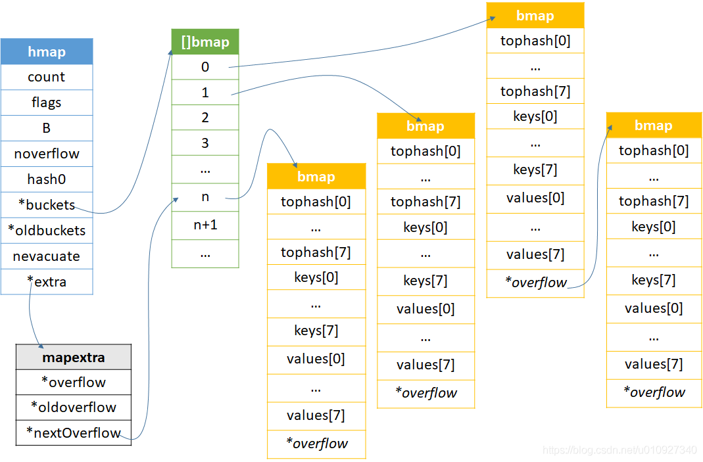

# go基础之map | 写在前面（一） 

本文是 map 源码系列第一篇，带你走进 map

<!--more-->

# 为什么分析map

在计算机编程语言当中，用的最多的数据结构估计就是map。map以他近乎o(1)的查找效率和修改效率让他在大多数场景下都比较受青睐。map的常规的实现方式都是hash+其他数据结构，如java是hash+红黑树，而我现在即将要分析的go的实现方式是hash+链表。我会分析map的几乎每段代码，并且在我的[GitHub](https://github.com/zhangshen023/zhangshen023-go_soucecode_analysis/tree/main/runtime)可以查看到我的分析，注释十分详尽，欢迎批评指正。我的打算是把一些常用的数据结构都分析一遍，如果有志同道合的人，可以联系我。

## 我的环境
为了给那些感兴趣看源码分析我的博客的同学阅读得更加清晰，列举了我的环境：
 1. **go1.14.7 amd64**；
 2. **windows和mac接口，linux没有测试，估计没问题** ；
 3. **goland,目前最好的golang ide，虽然笔者用起来感觉还是不太完美**；
 4. **着重分析map[string]string，其他类型的源码变化不大** ；
## 本篇重点
1.`go的map和java的map有区别，go中是一个关键字，而java确实可以直接查看源码，那么如何分析go的map源码？`
2.`调试过程当中，go充斥着大量指针，如何知道指针指向的内容？map的最小单位bmap除了查看tophash，怎么查看里面的其他隐藏字段？`
3.`go的map源码为何给不同的key的类型设计不同的实现？`
4.`其他一些查看源码的小技巧：内存对齐、指针偏移、类型大小等等`

## 如何找到map对应的源码
go的map的结构体是hmap，代码位于<kbd>runtime/map.go</kbd>,当编译器编译你申明使用map的源码时候，其实是使用了<kbd>runtime/map*.go</kbd>,后面对map的增删改查都是执行该代码，故要弄懂map的底层原理只需要分析该源码，也可以断点调试。
我下面有个自己测试的源码，注意我编译之后查看，就可以发现端倪：

```go
package main

import "fmt"

func main() {
	m1 := make(map[string]string)
	fmt.Println(m1)
	m2 := make(map[string]string, 8)
	fmt.Println(m2)
	m3 := make(map[string]string, 9)
	fmt.Println(m3)
	m4 := map[string]string{}
	fmt.Println(m4)
	m3["1"] = "2"
	for k, v := range m3 {
		fmt.Println(k)
		fmt.Println(v)
	}
	v1 := m3["1"]
	fmt.Println(v1)
	if v2, ok := m3["1"]; ok {
		fmt.Println(v2)
	}
}
```
上面代码有几种不同申明map的方式，对应<kbd>runtime/map.go</kbd>也不同。还有赋值和遍历查找的代码。
下面编译得到汇编指令文件，执行

```bash
go tool compile -N -l -S main.go > main.txt
```
生成了汇编指令文件:

```
"".main STEXT size=1891 args=0x0 locals=0x288
	0x0000 00000 (main.go:5)	TEXT	"".main(SB), ABIInternal, $648-0
	0x0000 00000 (main.go:5)	MOVQ	TLS, CX
	0x0009 00009 (main.go:5)	PCDATA	$0, $-2
	0x0009 00009 (main.go:5)	MOVQ	(CX)(TLS*2), CX
	0x0010 00016 (main.go:5)	PCDATA	$0, $-1
	0x0010 00016 (main.go:5)	LEAQ	-520(SP), AX
	0x0018 00024 (main.go:5)	CMPQ	AX, 16(CX)
	0x001c 00028 (main.go:5)	PCDATA	$0, $-2
	0x001c 00028 (main.go:5)	JLS	1881
	0x0022 00034 (main.go:5)	PCDATA	$0, $-1
	0x0022 00034 (main.go:5)	SUBQ	$648, SP
	0x0029 00041 (main.go:5)	MOVQ	BP, 640(SP)
	0x0031 00049 (main.go:5)	LEAQ	640(SP), BP
	0x0039 00057 (main.go:5)	PCDATA	$0, $-2
	0x0039 00057 (main.go:5)	PCDATA	$1, $-2
	0x0039 00057 (main.go:5)	FUNCDATA	$0, gclocals·ad6397d3d33bbb6a31b1320349e23274(SB)
	0x0039 00057 (main.go:5)	FUNCDATA	$1, gclocals·1bbf1965a34fa71a63e073b1cf2d752a(SB)
	0x0039 00057 (main.go:5)	FUNCDATA	$2, gclocals·658035074399f748be6dd39603d5113c(SB)
	0x0039 00057 (main.go:5)	FUNCDATA	$3, "".main.stkobj(SB)
	0x0039 00057 (main.go:6)	PCDATA	$0, $0
	0x0039 00057 (main.go:6)	PCDATA	$1, $0
	0x0039 00057 (main.go:6)	CALL	runtime.makemap_small(SB)
	0x003e 00062 (main.go:6)	PCDATA	$0, $1
	0x003e 00062 (main.go:6)	MOVQ	(SP), AX
	0x0042 00066 (main.go:6)	MOVQ	AX, "".m1+80(SP)
	0x0047 00071 (main.go:7)	PCDATA	$0, $0
	0x0047 00071 (main.go:7)	PCDATA	$1, $1
	0x0047 00071 (main.go:7)	MOVQ	AX, ""..autotmp_10+200(SP)
	0x004f 00079 (main.go:7)	PCDATA	$1, $2
	0x004f 00079 (main.go:7)	XORPS	X0, X0
	0x0052 00082 (main.go:7)	MOVUPS	X0, ""..autotmp_9+272(SP)
	0x005a 00090 (main.go:7)	PCDATA	$0, $1
	0x005a 00090 (main.go:7)	PCDATA	$1, $1
	0x005a 00090 (main.go:7)	LEAQ	""..autotmp_9+272(SP), AX
	0x0062 00098 (main.go:7)	MOVQ	AX, ""..autotmp_15+192(SP)
	0x006a 00106 (main.go:7)	TESTB	AL, (AX)
	0x006c 00108 (main.go:7)	PCDATA	$0, $2
	0x006c 00108 (main.go:7)	PCDATA	$1, $0
	0x006c 00108 (main.go:7)	MOVQ	""..autotmp_10+200(SP), CX
	0x0074 00116 (main.go:7)	PCDATA	$0, $3
	0x0074 00116 (main.go:7)	LEAQ	type.map[string]string(SB), DX
	0x007b 00123 (main.go:7)	PCDATA	$0, $2
	0x007b 00123 (main.go:7)	MOVQ	DX, ""..autotmp_9+272(SP)
	0x0083 00131 (main.go:7)	PCDATA	$0, $1
	0x0083 00131 (main.go:7)	MOVQ	CX, ""..autotmp_9+280(SP)
	0x008b 00139 (main.go:7)	TESTB	AL, (AX)
	0x008d 00141 (main.go:7)	JMP	143
	0x008f 00143 (main.go:7)	MOVQ	AX, ""..autotmp_14+520(SP)
	0x0097 00151 (main.go:7)	MOVQ	$1, ""..autotmp_14+528(SP)
	0x00a3 00163 (main.go:7)	MOVQ	$1, ""..autotmp_14+536(SP)
	0x00af 00175 (main.go:7)	PCDATA	$0, $0
	0x00af 00175 (main.go:7)	MOVQ	AX, (SP)
	0x00b3 00179 (main.go:7)	MOVQ	$1, 8(SP)
	0x00bc 00188 (main.go:7)	MOVQ	$1, 16(SP)
	0x00c5 00197 (main.go:7)	CALL	fmt.Println(SB)
	0x00ca 00202 (main.go:8)	CALL	runtime.makemap_small(SB)
	0x00cf 00207 (main.go:8)	PCDATA	$0, $1
	0x00cf 00207 (main.go:8)	MOVQ	(SP), AX
	0x00d3 00211 (main.go:8)	MOVQ	AX, "".m2+72(SP)
	0x00d8 00216 (main.go:9)	PCDATA	$0, $0
	0x00d8 00216 (main.go:9)	PCDATA	$1, $1
	0x00d8 00216 (main.go:9)	MOVQ	AX, ""..autotmp_10+200(SP)
	0x00e0 00224 (main.go:9)	PCDATA	$1, $2
	0x00e0 00224 (main.go:9)	XORPS	X0, X0
	0x00e3 00227 (main.go:9)	MOVUPS	X0, ""..autotmp_9+272(SP)
	0x00eb 00235 (main.go:9)	PCDATA	$0, $1
	0x00eb 00235 (main.go:9)	PCDATA	$1, $1
	0x00eb 00235 (main.go:9)	LEAQ	""..autotmp_9+272(SP), AX
	0x00f3 00243 (main.go:9)	MOVQ	AX, ""..autotmp_17+184(SP)
	0x00fb 00251 (main.go:9)	TESTB	AL, (AX)
	0x00fd 00253 (main.go:9)	PCDATA	$0, $2
	0x00fd 00253 (main.go:9)	PCDATA	$1, $0
	0x00fd 00253 (main.go:9)	MOVQ	""..autotmp_10+200(SP), CX
	0x0105 00261 (main.go:9)	PCDATA	$0, $3
	0x0105 00261 (main.go:9)	LEAQ	type.map[string]string(SB), DX
	0x010c 00268 (main.go:9)	PCDATA	$0, $2
	0x010c 00268 (main.go:9)	MOVQ	DX, ""..autotmp_9+272(SP)
	0x0114 00276 (main.go:9)	PCDATA	$0, $1
	0x0114 00276 (main.go:9)	MOVQ	CX, ""..autotmp_9+280(SP)
	0x011c 00284 (main.go:9)	TESTB	AL, (AX)
	0x011e 00286 (main.go:9)	JMP	288
	0x0120 00288 (main.go:9)	MOVQ	AX, ""..autotmp_16+496(SP)
	0x0128 00296 (main.go:9)	MOVQ	$1, ""..autotmp_16+504(SP)
	0x0134 00308 (main.go:9)	MOVQ	$1, ""..autotmp_16+512(SP)
	0x0140 00320 (main.go:9)	PCDATA	$0, $0
	0x0140 00320 (main.go:9)	MOVQ	AX, (SP)
	0x0144 00324 (main.go:9)	MOVQ	$1, 8(SP)
	0x014d 00333 (main.go:9)	MOVQ	$1, 16(SP)
	0x0156 00342 (main.go:9)	CALL	fmt.Println(SB)
	0x015b 00347 (main.go:10)	PCDATA	$0, $1
	0x015b 00347 (main.go:10)	LEAQ	type.map[string]string(SB), AX
	0x0162 00354 (main.go:10)	PCDATA	$0, $0
	0x0162 00354 (main.go:10)	MOVQ	AX, (SP)
	0x0166 00358 (main.go:10)	MOVQ	$9, 8(SP)
	0x016f 00367 (main.go:10)	MOVQ	$0, 16(SP)
	0x0178 00376 (main.go:10)	CALL	runtime.makemap(SB)
	0x017d 00381 (main.go:10)	PCDATA	$0, $1
	0x017d 00381 (main.go:10)	MOVQ	24(SP), AX
	0x0182 00386 (main.go:10)	PCDATA	$1, $3
	0x0182 00386 (main.go:10)	MOVQ	AX, "".m3+64(SP)
	0x0187 00391 (main.go:11)	PCDATA	$0, $0
	0x0187 00391 (main.go:11)	PCDATA	$1, $4
	0x0187 00391 (main.go:11)	MOVQ	AX, ""..autotmp_10+200(SP)
	0x018f 00399 (main.go:11)	PCDATA	$1, $5
	0x018f 00399 (main.go:11)	XORPS	X0, X0
	0x0192 00402 (main.go:11)	MOVUPS	X0, ""..autotmp_9+272(SP)
	0x019a 00410 (main.go:11)	PCDATA	$0, $1
	0x019a 00410 (main.go:11)	PCDATA	$1, $4
	0x019a 00410 (main.go:11)	LEAQ	""..autotmp_9+272(SP), AX
	0x01a2 00418 (main.go:11)	MOVQ	AX, ""..autotmp_19+176(SP)
	0x01aa 00426 (main.go:11)	TESTB	AL, (AX)
	0x01ac 00428 (main.go:11)	PCDATA	$0, $2
	0x01ac 00428 (main.go:11)	PCDATA	$1, $3
	0x01ac 00428 (main.go:11)	MOVQ	""..autotmp_10+200(SP), CX
	0x01b4 00436 (main.go:11)	PCDATA	$0, $3
	0x01b4 00436 (main.go:11)	LEAQ	type.map[string]string(SB), DX
	0x01bb 00443 (main.go:11)	PCDATA	$0, $2
	0x01bb 00443 (main.go:11)	MOVQ	DX, ""..autotmp_9+272(SP)
	0x01c3 00451 (main.go:11)	PCDATA	$0, $1
	0x01c3 00451 (main.go:11)	MOVQ	CX, ""..autotmp_9+280(SP)
	0x01cb 00459 (main.go:11)	TESTB	AL, (AX)
	0x01cd 00461 (main.go:11)	JMP	463
	0x01cf 00463 (main.go:11)	MOVQ	AX, ""..autotmp_18+472(SP)
	0x01d7 00471 (main.go:11)	MOVQ	$1, ""..autotmp_18+480(SP)
	0x01e3 00483 (main.go:11)	MOVQ	$1, ""..autotmp_18+488(SP)
	0x01ef 00495 (main.go:11)	PCDATA	$0, $0
	0x01ef 00495 (main.go:11)	MOVQ	AX, (SP)
	0x01f3 00499 (main.go:11)	MOVQ	$1, 8(SP)
	0x01fc 00508 (main.go:11)	MOVQ	$1, 16(SP)
	0x0205 00517 (main.go:11)	CALL	fmt.Println(SB)
	0x020a 00522 (main.go:12)	CALL	runtime.makemap_small(SB)
	0x020f 00527 (main.go:12)	PCDATA	$0, $1
	0x020f 00527 (main.go:12)	MOVQ	(SP), AX
	0x0213 00531 (main.go:12)	PCDATA	$0, $0
	0x0213 00531 (main.go:12)	PCDATA	$1, $6
	0x0213 00531 (main.go:12)	MOVQ	AX, "".m4+56(SP)
	0x0218 00536 (main.go:13)	PCDATA	$0, $1
	0x0218 00536 (main.go:13)	PCDATA	$1, $3
	0x0218 00536 (main.go:13)	MOVQ	"".m4+56(SP), AX
	0x021d 00541 (main.go:13)	PCDATA	$0, $0
	0x021d 00541 (main.go:13)	PCDATA	$1, $4
	0x021d 00541 (main.go:13)	MOVQ	AX, ""..autotmp_10+200(SP)
	0x0225 00549 (main.go:13)	PCDATA	$1, $5
	0x0225 00549 (main.go:13)	XORPS	X0, X0
	0x0228 00552 (main.go:13)	MOVUPS	X0, ""..autotmp_9+272(SP)
	0x0230 00560 (main.go:13)	PCDATA	$0, $1
	0x0230 00560 (main.go:13)	PCDATA	$1, $4
	0x0230 00560 (main.go:13)	LEAQ	""..autotmp_9+272(SP), AX
	0x0238 00568 (main.go:13)	MOVQ	AX, ""..autotmp_23+168(SP)
	0x0240 00576 (main.go:13)	TESTB	AL, (AX)
	0x0242 00578 (main.go:13)	PCDATA	$0, $2
	0x0242 00578 (main.go:13)	PCDATA	$1, $3
	0x0242 00578 (main.go:13)	MOVQ	""..autotmp_10+200(SP), CX
	0x024a 00586 (main.go:13)	PCDATA	$0, $3
	0x024a 00586 (main.go:13)	LEAQ	type.map[string]string(SB), DX
	0x0251 00593 (main.go:13)	PCDATA	$0, $2
	0x0251 00593 (main.go:13)	MOVQ	DX, ""..autotmp_9+272(SP)
	0x0259 00601 (main.go:13)	PCDATA	$0, $1
	0x0259 00601 (main.go:13)	MOVQ	CX, ""..autotmp_9+280(SP)
	0x0261 00609 (main.go:13)	TESTB	AL, (AX)
	0x0263 00611 (main.go:13)	JMP	613
	0x0265 00613 (main.go:13)	MOVQ	AX, ""..autotmp_22+448(SP)
	0x026d 00621 (main.go:13)	MOVQ	$1, ""..autotmp_22+456(SP)
	0x0279 00633 (main.go:13)	MOVQ	$1, ""..autotmp_22+464(SP)
	0x0285 00645 (main.go:13)	PCDATA	$0, $0
	0x0285 00645 (main.go:13)	MOVQ	AX, (SP)
	0x0289 00649 (main.go:13)	MOVQ	$1, 8(SP)
	0x0292 00658 (main.go:13)	MOVQ	$1, 16(SP)
	0x029b 00667 (main.go:13)	CALL	fmt.Println(SB)
	0x02a0 00672 (main.go:14)	PCDATA	$0, $1
	0x02a0 00672 (main.go:14)	LEAQ	type.map[string]string(SB), AX
	0x02a7 00679 (main.go:14)	PCDATA	$0, $0
	0x02a7 00679 (main.go:14)	MOVQ	AX, (SP)
	0x02ab 00683 (main.go:14)	PCDATA	$0, $1
	0x02ab 00683 (main.go:14)	MOVQ	"".m3+64(SP), AX
	0x02b0 00688 (main.go:14)	PCDATA	$0, $0
	0x02b0 00688 (main.go:14)	MOVQ	AX, 8(SP)
	0x02b5 00693 (main.go:14)	PCDATA	$0, $1
	0x02b5 00693 (main.go:14)	LEAQ	go.string."1"(SB), AX
	0x02bc 00700 (main.go:14)	PCDATA	$0, $0
	0x02bc 00700 (main.go:14)	MOVQ	AX, 16(SP)
	0x02c1 00705 (main.go:14)	MOVQ	$1, 24(SP)
	0x02ca 00714 (main.go:14)	CALL	runtime.mapassign_faststr(SB)
	0x02cf 00719 (main.go:14)	PCDATA	$0, $4
	0x02cf 00719 (main.go:14)	MOVQ	32(SP), DI
	0x02d4 00724 (main.go:14)	MOVQ	DI, ""..autotmp_24+160(SP)
	0x02dc 00732 (main.go:14)	TESTB	AL, (DI)
	0x02de 00734 (main.go:14)	MOVQ	$1, 8(DI)
	0x02e6 00742 (main.go:14)	PCDATA	$0, $-2
	0x02e6 00742 (main.go:14)	PCDATA	$1, $-2
	0x02e6 00742 (main.go:14)	CMPL	runtime.writeBarrier(SB), $0
	0x02ed 00749 (main.go:14)	JEQ	756
	0x02ef 00751 (main.go:14)	JMP	1864
	0x02f4 00756 (main.go:14)	LEAQ	go.string."2"(SB), AX
	0x02fb 00763 (main.go:14)	MOVQ	AX, (DI)
	0x02fe 00766 (main.go:14)	JMP	768
	0x0300 00768 (main.go:15)	PCDATA	$0, $1
	0x0300 00768 (main.go:15)	PCDATA	$1, $3
	0x0300 00768 (main.go:15)	MOVQ	"".m3+64(SP), AX
	0x0305 00773 (main.go:15)	PCDATA	$0, $0
	0x0305 00773 (main.go:15)	PCDATA	$1, $4
	0x0305 00773 (main.go:15)	MOVQ	AX, ""..autotmp_10+200(SP)
	0x030d 00781 (main.go:15)	PCDATA	$0, $4
	0x030d 00781 (main.go:15)	PCDATA	$1, $7
	0x030d 00781 (main.go:15)	LEAQ	""..autotmp_11+544(SP), DI
	0x0315 00789 (main.go:15)	XORPS	X0, X0
	0x0318 00792 (main.go:15)	PCDATA	$0, $0
	0x0318 00792 (main.go:15)	LEAQ	-32(DI), DI
	0x031c 00796 (main.go:15)	DUFFZERO	$273
	0x032f 00815 (main.go:15)	PCDATA	$0, $1
	0x032f 00815 (main.go:15)	LEAQ	type.map[string]string(SB), AX
	0x0336 00822 (main.go:15)	PCDATA	$0, $0
	0x0336 00822 (main.go:15)	MOVQ	AX, (SP)
	0x033a 00826 (main.go:15)	PCDATA	$0, $1
	0x033a 00826 (main.go:15)	PCDATA	$1, $8
	0x033a 00826 (main.go:15)	MOVQ	""..autotmp_10+200(SP), AX
	0x0342 00834 (main.go:15)	PCDATA	$0, $0
	0x0342 00834 (main.go:15)	MOVQ	AX, 8(SP)
	0x0347 00839 (main.go:15)	PCDATA	$0, $1
	0x0347 00839 (main.go:15)	LEAQ	""..autotmp_11+544(SP), AX
	0x034f 00847 (main.go:15)	PCDATA	$0, $0
	0x034f 00847 (main.go:15)	MOVQ	AX, 16(SP)
	0x0354 00852 (main.go:15)	CALL	runtime.mapiterinit(SB)
	0x0359 00857 (main.go:15)	JMP	859
	0x035b 00859 (main.go:15)	CMPQ	""..autotmp_11+544(SP), $0
	0x0364 00868 (main.go:15)	JNE	875
	0x0366 00870 (main.go:15)	JMP	1329
	0x036b 00875 (main.go:15)	PCDATA	$0, $1
	0x036b 00875 (main.go:15)	MOVQ	""..autotmp_11+552(SP), AX
	0x0373 00883 (main.go:15)	TESTB	AL, (AX)
	0x0375 00885 (main.go:15)	MOVQ	8(AX), CX
	0x0379 00889 (main.go:15)	MOVQ	(AX), AX
	0x037c 00892 (main.go:15)	PCDATA	$0, $0
	0x037c 00892 (main.go:15)	PCDATA	$1, $9
	0x037c 00892 (main.go:15)	MOVQ	AX, ""..autotmp_25+288(SP)
	0x0384 00900 (main.go:15)	MOVQ	CX, ""..autotmp_25+296(SP)
	0x038c 00908 (main.go:15)	PCDATA	$0, $1
	0x038c 00908 (main.go:15)	MOVQ	""..autotmp_11+544(SP), AX
	0x0394 00916 (main.go:15)	TESTB	AL, (AX)
	0x0396 00918 (main.go:15)	MOVQ	8(AX), CX
	0x039a 00922 (main.go:15)	MOVQ	(AX), AX
	0x039d 00925 (main.go:15)	PCDATA	$0, $0
	0x039d 00925 (main.go:15)	PCDATA	$1, $10
	0x039d 00925 (main.go:15)	MOVQ	AX, "".k+256(SP)
	0x03a5 00933 (main.go:15)	MOVQ	CX, "".k+264(SP)
	0x03ad 00941 (main.go:15)	MOVQ	""..autotmp_25+296(SP), AX
	0x03b5 00949 (main.go:15)	PCDATA	$0, $5
	0x03b5 00949 (main.go:15)	PCDATA	$1, $11
	0x03b5 00949 (main.go:15)	MOVQ	""..autotmp_25+288(SP), CX
	0x03bd 00957 (main.go:15)	PCDATA	$0, $0
	0x03bd 00957 (main.go:15)	PCDATA	$1, $12
	0x03bd 00957 (main.go:15)	MOVQ	CX, "".v+240(SP)
	0x03c5 00965 (main.go:15)	MOVQ	AX, "".v+248(SP)
	0x03cd 00973 (main.go:16)	MOVQ	"".k+264(SP), AX
	0x03d5 00981 (main.go:16)	PCDATA	$0, $5
	0x03d5 00981 (main.go:16)	PCDATA	$1, $13
	0x03d5 00981 (main.go:16)	MOVQ	"".k+256(SP), CX
	0x03dd 00989 (main.go:16)	PCDATA	$0, $0
	0x03dd 00989 (main.go:16)	MOVQ	CX, (SP)
	0x03e1 00993 (main.go:16)	MOVQ	AX, 8(SP)
	0x03e6 00998 (main.go:16)	CALL	runtime.convTstring(SB)
	0x03eb 01003 (main.go:16)	PCDATA	$0, $1
	0x03eb 01003 (main.go:16)	MOVQ	16(SP), AX
	0x03f0 01008 (main.go:16)	PCDATA	$0, $0
	0x03f0 01008 (main.go:16)	PCDATA	$1, $14
	0x03f0 01008 (main.go:16)	MOVQ	AX, ""..autotmp_26+152(SP)
	0x03f8 01016 (main.go:16)	PCDATA	$1, $15
	0x03f8 01016 (main.go:16)	XORPS	X0, X0
	0x03fb 01019 (main.go:16)	MOVUPS	X0, ""..autotmp_9+272(SP)
	0x0403 01027 (main.go:16)	PCDATA	$0, $1
	0x0403 01027 (main.go:16)	PCDATA	$1, $14
	0x0403 01027 (main.go:16)	LEAQ	""..autotmp_9+272(SP), AX
	0x040b 01035 (main.go:16)	MOVQ	AX, ""..autotmp_28+144(SP)
	0x0413 01043 (main.go:16)	TESTB	AL, (AX)
	0x0415 01045 (main.go:16)	PCDATA	$0, $2
	0x0415 01045 (main.go:16)	PCDATA	$1, $13
	0x0415 01045 (main.go:16)	MOVQ	""..autotmp_26+152(SP), CX
	0x041d 01053 (main.go:16)	PCDATA	$0, $3
	0x041d 01053 (main.go:16)	LEAQ	type.string(SB), DX
	0x0424 01060 (main.go:16)	PCDATA	$0, $2
	0x0424 01060 (main.go:16)	MOVQ	DX, ""..autotmp_9+272(SP)
	0x042c 01068 (main.go:16)	PCDATA	$0, $1
	0x042c 01068 (main.go:16)	MOVQ	CX, ""..autotmp_9+280(SP)
	0x0434 01076 (main.go:16)	TESTB	AL, (AX)
	0x0436 01078 (main.go:16)	JMP	1080
	0x0438 01080 (main.go:16)	MOVQ	AX, ""..autotmp_27+424(SP)
	0x0440 01088 (main.go:16)	MOVQ	$1, ""..autotmp_27+432(SP)
	0x044c 01100 (main.go:16)	MOVQ	$1, ""..autotmp_27+440(SP)
	0x0458 01112 (main.go:16)	PCDATA	$0, $0
	0x0458 01112 (main.go:16)	MOVQ	AX, (SP)
	0x045c 01116 (main.go:16)	MOVQ	$1, 8(SP)
	0x0465 01125 (main.go:16)	MOVQ	$1, 16(SP)
	0x046e 01134 (main.go:16)	CALL	fmt.Println(SB)
	0x0473 01139 (main.go:17)	MOVQ	"".v+248(SP), AX
	0x047b 01147 (main.go:17)	PCDATA	$0, $5
	0x047b 01147 (main.go:17)	PCDATA	$1, $8
	0x047b 01147 (main.go:17)	MOVQ	"".v+240(SP), CX
	0x0483 01155 (main.go:17)	PCDATA	$0, $0
	0x0483 01155 (main.go:17)	MOVQ	CX, (SP)
	0x0487 01159 (main.go:17)	MOVQ	AX, 8(SP)
	0x048c 01164 (main.go:17)	CALL	runtime.convTstring(SB)
	0x0491 01169 (main.go:17)	PCDATA	$0, $1
	0x0491 01169 (main.go:17)	MOVQ	16(SP), AX
	0x0496 01174 (main.go:17)	PCDATA	$0, $0
	0x0496 01174 (main.go:17)	PCDATA	$1, $16
	0x0496 01174 (main.go:17)	MOVQ	AX, ""..autotmp_29+136(SP)
	0x049e 01182 (main.go:17)	PCDATA	$1, $17
	0x049e 01182 (main.go:17)	XORPS	X0, X0
	0x04a1 01185 (main.go:17)	MOVUPS	X0, ""..autotmp_9+272(SP)
	0x04a9 01193 (main.go:17)	PCDATA	$0, $1
	0x04a9 01193 (main.go:17)	PCDATA	$1, $16
	0x04a9 01193 (main.go:17)	LEAQ	""..autotmp_9+272(SP), AX
	0x04b1 01201 (main.go:17)	MOVQ	AX, ""..autotmp_31+128(SP)
	0x04b9 01209 (main.go:17)	TESTB	AL, (AX)
	0x04bb 01211 (main.go:17)	PCDATA	$0, $2
	0x04bb 01211 (main.go:17)	PCDATA	$1, $8
	0x04bb 01211 (main.go:17)	MOVQ	""..autotmp_29+136(SP), CX
	0x04c3 01219 (main.go:17)	PCDATA	$0, $3
	0x04c3 01219 (main.go:17)	LEAQ	type.string(SB), DX
	0x04ca 01226 (main.go:17)	PCDATA	$0, $2
	0x04ca 01226 (main.go:17)	MOVQ	DX, ""..autotmp_9+272(SP)
	0x04d2 01234 (main.go:17)	PCDATA	$0, $1
	0x04d2 01234 (main.go:17)	MOVQ	CX, ""..autotmp_9+280(SP)
	0x04da 01242 (main.go:17)	TESTB	AL, (AX)
	0x04dc 01244 (main.go:17)	JMP	1246
	0x04de 01246 (main.go:17)	MOVQ	AX, ""..autotmp_30+400(SP)
	0x04e6 01254 (main.go:17)	MOVQ	$1, ""..autotmp_30+408(SP)
	0x04f2 01266 (main.go:17)	MOVQ	$1, ""..autotmp_30+416(SP)
	0x04fe 01278 (main.go:17)	PCDATA	$0, $0
	0x04fe 01278 (main.go:17)	MOVQ	AX, (SP)
	0x0502 01282 (main.go:17)	MOVQ	$1, 8(SP)
	0x050b 01291 (main.go:17)	MOVQ	$1, 16(SP)
	0x0514 01300 (main.go:17)	CALL	fmt.Println(SB)
	0x0519 01305 (main.go:17)	JMP	1307
	0x051b 01307 (main.go:15)	PCDATA	$0, $1
	0x051b 01307 (main.go:15)	LEAQ	""..autotmp_11+544(SP), AX
	0x0523 01315 (main.go:15)	PCDATA	$0, $0
	0x0523 01315 (main.go:15)	MOVQ	AX, (SP)
	0x0527 01319 (main.go:15)	CALL	runtime.mapiternext(SB)
	0x052c 01324 (main.go:15)	JMP	859
	0x0531 01329 (main.go:19)	PCDATA	$0, $1
	0x0531 01329 (main.go:19)	PCDATA	$1, $3
	0x0531 01329 (main.go:19)	LEAQ	type.map[string]string(SB), AX
	0x0538 01336 (main.go:19)	PCDATA	$0, $0
	0x0538 01336 (main.go:19)	MOVQ	AX, (SP)
	0x053c 01340 (main.go:19)	PCDATA	$0, $1
	0x053c 01340 (main.go:19)	MOVQ	"".m3+64(SP), AX
	0x0541 01345 (main.go:19)	PCDATA	$0, $0
	0x0541 01345 (main.go:19)	MOVQ	AX, 8(SP)
	0x0546 01350 (main.go:19)	PCDATA	$0, $1
	0x0546 01350 (main.go:19)	LEAQ	go.string."1"(SB), AX
	0x054d 01357 (main.go:19)	PCDATA	$0, $0
	0x054d 01357 (main.go:19)	MOVQ	AX, 16(SP)
	0x0552 01362 (main.go:19)	MOVQ	$1, 24(SP)
	0x055b 01371 (main.go:19)	CALL	runtime.mapaccess1_faststr(SB)
	0x0560 01376 (main.go:19)	PCDATA	$0, $1
	0x0560 01376 (main.go:19)	MOVQ	32(SP), AX
	0x0565 01381 (main.go:19)	PCDATA	$0, $2
	0x0565 01381 (main.go:19)	MOVQ	(AX), CX
	0x0568 01384 (main.go:19)	PCDATA	$0, $5
	0x0568 01384 (main.go:19)	MOVQ	8(AX), AX
	0x056c 01388 (main.go:19)	MOVQ	CX, "".v1+224(SP)
	0x0574 01396 (main.go:19)	MOVQ	AX, "".v1+232(SP)
	0x057c 01404 (main.go:20)	PCDATA	$0, $0
	0x057c 01404 (main.go:20)	MOVQ	CX, (SP)
	0x0580 01408 (main.go:20)	MOVQ	AX, 8(SP)
	0x0585 01413 (main.go:20)	CALL	runtime.convTstring(SB)
	0x058a 01418 (main.go:20)	PCDATA	$0, $1
	0x058a 01418 (main.go:20)	MOVQ	16(SP), AX
	0x058f 01423 (main.go:20)	PCDATA	$0, $0
	0x058f 01423 (main.go:20)	PCDATA	$1, $18
	0x058f 01423 (main.go:20)	MOVQ	AX, ""..autotmp_32+120(SP)
	0x0594 01428 (main.go:20)	PCDATA	$1, $19
	0x0594 01428 (main.go:20)	XORPS	X0, X0
	0x0597 01431 (main.go:20)	MOVUPS	X0, ""..autotmp_9+272(SP)
	0x059f 01439 (main.go:20)	PCDATA	$0, $1
	0x059f 01439 (main.go:20)	PCDATA	$1, $18
	0x059f 01439 (main.go:20)	LEAQ	""..autotmp_9+272(SP), AX
	0x05a7 01447 (main.go:20)	MOVQ	AX, ""..autotmp_34+112(SP)
	0x05ac 01452 (main.go:20)	TESTB	AL, (AX)
	0x05ae 01454 (main.go:20)	PCDATA	$0, $2
	0x05ae 01454 (main.go:20)	PCDATA	$1, $3
	0x05ae 01454 (main.go:20)	MOVQ	""..autotmp_32+120(SP), CX
	0x05b3 01459 (main.go:20)	PCDATA	$0, $3
	0x05b3 01459 (main.go:20)	LEAQ	type.string(SB), DX
	0x05ba 01466 (main.go:20)	PCDATA	$0, $2
	0x05ba 01466 (main.go:20)	MOVQ	DX, ""..autotmp_9+272(SP)
	0x05c2 01474 (main.go:20)	PCDATA	$0, $1
	0x05c2 01474 (main.go:20)	MOVQ	CX, ""..autotmp_9+280(SP)
	0x05ca 01482 (main.go:20)	TESTB	AL, (AX)
	0x05cc 01484 (main.go:20)	JMP	1486
	0x05ce 01486 (main.go:20)	MOVQ	AX, ""..autotmp_33+376(SP)
	0x05d6 01494 (main.go:20)	MOVQ	$1, ""..autotmp_33+384(SP)
	0x05e2 01506 (main.go:20)	MOVQ	$1, ""..autotmp_33+392(SP)
	0x05ee 01518 (main.go:20)	PCDATA	$0, $0
	0x05ee 01518 (main.go:20)	MOVQ	AX, (SP)
	0x05f2 01522 (main.go:20)	MOVQ	$1, 8(SP)
	0x05fb 01531 (main.go:20)	MOVQ	$1, 16(SP)
	0x0604 01540 (main.go:20)	CALL	fmt.Println(SB)
	0x0609 01545 (main.go:21)	XORPS	X0, X0
	0x060c 01548 (main.go:21)	MOVUPS	X0, ""..autotmp_12+336(SP)
	0x0614 01556 (main.go:21)	PCDATA	$0, $1
	0x0614 01556 (main.go:21)	LEAQ	type.map[string]string(SB), AX
	0x061b 01563 (main.go:21)	PCDATA	$0, $0
	0x061b 01563 (main.go:21)	MOVQ	AX, (SP)
	0x061f 01567 (main.go:21)	PCDATA	$0, $1
	0x061f 01567 (main.go:21)	PCDATA	$1, $0
	0x061f 01567 (main.go:21)	MOVQ	"".m3+64(SP), AX
	0x0624 01572 (main.go:21)	PCDATA	$0, $0
	0x0624 01572 (main.go:21)	MOVQ	AX, 8(SP)
	0x0629 01577 (main.go:21)	PCDATA	$0, $1
	0x0629 01577 (main.go:21)	LEAQ	go.string."1"(SB), AX
	0x0630 01584 (main.go:21)	PCDATA	$0, $0
	0x0630 01584 (main.go:21)	MOVQ	AX, 16(SP)
	0x0635 01589 (main.go:21)	MOVQ	$1, 24(SP)
	0x063e 01598 (main.go:21)	CALL	runtime.mapaccess2_faststr(SB)
	0x0643 01603 (main.go:21)	PCDATA	$0, $1
	0x0643 01603 (main.go:21)	MOVQ	32(SP), AX
	0x0648 01608 (main.go:21)	PCDATA	$0, $0
	0x0648 01608 (main.go:21)	PCDATA	$1, $20
	0x0648 01608 (main.go:21)	MOVQ	AX, ""..autotmp_35+104(SP)
	0x064d 01613 (main.go:21)	MOVBLZX	40(SP), AX
	0x0652 01618 (main.go:21)	MOVB	AL, ""..autotmp_13+55(SP)
	0x0656 01622 (main.go:21)	PCDATA	$0, $1
	0x0656 01622 (main.go:21)	PCDATA	$1, $0
	0x0656 01622 (main.go:21)	MOVQ	""..autotmp_35+104(SP), AX
	0x065b 01627 (main.go:21)	MOVQ	8(AX), CX
	0x065f 01631 (main.go:21)	MOVQ	(AX), AX
	0x0662 01634 (main.go:21)	MOVQ	AX, ""..autotmp_12+336(SP)
	0x066a 01642 (main.go:21)	MOVQ	CX, ""..autotmp_12+344(SP)
	0x0672 01650 (main.go:21)	PCDATA	$0, $0
	0x0672 01650 (main.go:21)	PCDATA	$1, $21
	0x0672 01650 (main.go:21)	MOVQ	AX, "".v2+208(SP)
	0x067a 01658 (main.go:21)	MOVQ	CX, "".v2+216(SP)
	0x0682 01666 (main.go:21)	MOVBLZX	""..autotmp_13+55(SP), AX
	0x0687 01671 (main.go:21)	MOVB	AL, "".ok+54(SP)
	0x068b 01675 (main.go:21)	CMPB	"".ok+54(SP), $0
	0x0690 01680 (main.go:21)	JNE	1687
	0x0692 01682 (main.go:21)	JMP	1862
	0x0697 01687 (main.go:22)	MOVQ	"".v2+216(SP), AX
	0x069f 01695 (main.go:22)	PCDATA	$0, $5
	0x069f 01695 (main.go:22)	PCDATA	$1, $0
	0x069f 01695 (main.go:22)	MOVQ	"".v2+208(SP), CX
	0x06a7 01703 (main.go:22)	PCDATA	$0, $0
	0x06a7 01703 (main.go:22)	MOVQ	CX, (SP)
	0x06ab 01707 (main.go:22)	MOVQ	AX, 8(SP)
	0x06b0 01712 (main.go:22)	CALL	runtime.convTstring(SB)
	0x06b5 01717 (main.go:22)	PCDATA	$0, $1
	0x06b5 01717 (main.go:22)	MOVQ	16(SP), AX
	0x06ba 01722 (main.go:22)	PCDATA	$0, $0
	0x06ba 01722 (main.go:22)	PCDATA	$1, $22
	0x06ba 01722 (main.go:22)	MOVQ	AX, ""..autotmp_36+96(SP)
	0x06bf 01727 (main.go:22)	PCDATA	$1, $23
	0x06bf 01727 (main.go:22)	XORPS	X0, X0
	0x06c2 01730 (main.go:22)	MOVUPS	X0, ""..autotmp_9+272(SP)
	0x06ca 01738 (main.go:22)	PCDATA	$0, $1
	0x06ca 01738 (main.go:22)	PCDATA	$1, $22
	0x06ca 01738 (main.go:22)	LEAQ	""..autotmp_9+272(SP), AX
	0x06d2 01746 (main.go:22)	MOVQ	AX, ""..autotmp_38+88(SP)
	0x06d7 01751 (main.go:22)	TESTB	AL, (AX)
	0x06d9 01753 (main.go:22)	PCDATA	$0, $2
	0x06d9 01753 (main.go:22)	PCDATA	$1, $0
	0x06d9 01753 (main.go:22)	MOVQ	""..autotmp_36+96(SP), CX
	0x06de 01758 (main.go:22)	PCDATA	$0, $3
	0x06de 01758 (main.go:22)	LEAQ	type.string(SB), DX
	0x06e5 01765 (main.go:22)	PCDATA	$0, $2
	0x06e5 01765 (main.go:22)	MOVQ	DX, ""..autotmp_9+272(SP)
	0x06ed 01773 (main.go:22)	PCDATA	$0, $1
	0x06ed 01773 (main.go:22)	MOVQ	CX, ""..autotmp_9+280(SP)
	0x06f5 01781 (main.go:22)	TESTB	AL, (AX)
	0x06f7 01783 (main.go:22)	JMP	1785
	0x06f9 01785 (main.go:22)	MOVQ	AX, ""..autotmp_37+352(SP)
	0x0701 01793 (main.go:22)	MOVQ	$1, ""..autotmp_37+360(SP)
	0x070d 01805 (main.go:22)	MOVQ	$1, ""..autotmp_37+368(SP)
	0x0719 01817 (main.go:22)	PCDATA	$0, $0
	0x0719 01817 (main.go:22)	MOVQ	AX, (SP)
	0x071d 01821 (main.go:22)	MOVQ	$1, 8(SP)
	0x0726 01830 (main.go:22)	MOVQ	$1, 16(SP)
	0x072f 01839 (main.go:22)	CALL	fmt.Println(SB)
	0x0734 01844 (main.go:22)	JMP	1846
	0x0736 01846 (<unknown line number>)	PCDATA	$0, $-1
	0x0736 01846 (<unknown line number>)	PCDATA	$1, $-1
	0x0736 01846 (<unknown line number>)	MOVQ	640(SP), BP
	0x073e 01854 (<unknown line number>)	ADDQ	$648, SP
	0x0745 01861 (<unknown line number>)	RET
	0x0746 01862 (main.go:21)	JMP	1846
	0x0748 01864 (main.go:14)	PCDATA	$0, $-2
	0x0748 01864 (main.go:14)	PCDATA	$1, $-2
	0x0748 01864 (main.go:14)	LEAQ	go.string."2"(SB), AX
	0x074f 01871 (main.go:14)	CALL	runtime.gcWriteBarrier(SB)
	0x0754 01876 (main.go:14)	JMP	768
	0x0759 01881 (main.go:14)	NOP
	0x0759 01881 (main.go:5)	PCDATA	$1, $-1
	0x0759 01881 (main.go:5)	PCDATA	$0, $-2
	0x0759 01881 (main.go:5)	CALL	runtime.morestack_noctxt(SB)
	0x075e 01886 (main.go:5)	PCDATA	$0, $-1
	0x075e 01886 (main.go:5)	JMP	0
	0x0000 65 48 8b 0c 25 28 00 00 00 48 8b 89 00 00 00 00  eH..%(...H......
	0x0010 48 8d 84 24 f8 fd ff ff 48 3b 41 10 0f 86 37 07  H..$....H;A...7.
	0x0020 00 00 48 81 ec 88 02 00 00 48 89 ac 24 80 02 00  ..H......H..$...
	0x0030 00 48 8d ac 24 80 02 00 00 e8 00 00 00 00 48 8b  .H..$.........H.
	0x0040 04 24 48 89 44 24 50 48 89 84 24 c8 00 00 00 0f  .$H.D$PH..$.....
	0x0050 57 c0 0f 11 84 24 10 01 00 00 48 8d 84 24 10 01  W....$....H..$..
	0x0060 00 00 48 89 84 24 c0 00 00 00 84 00 48 8b 8c 24  ..H..$......H..$
	0x0070 c8 00 00 00 48 8d 15 00 00 00 00 48 89 94 24 10  ....H......H..$.
	0x0080 01 00 00 48 89 8c 24 18 01 00 00 84 00 eb 00 48  ...H..$........H
	0x0090 89 84 24 08 02 00 00 48 c7 84 24 10 02 00 00 01  ..$....H..$.....
	0x00a0 00 00 00 48 c7 84 24 18 02 00 00 01 00 00 00 48  ...H..$........H
	0x00b0 89 04 24 48 c7 44 24 08 01 00 00 00 48 c7 44 24  ..$H.D$.....H.D$
	0x00c0 10 01 00 00 00 e8 00 00 00 00 e8 00 00 00 00 48  ...............H
	0x00d0 8b 04 24 48 89 44 24 48 48 89 84 24 c8 00 00 00  ..$H.D$HH..$....
	0x00e0 0f 57 c0 0f 11 84 24 10 01 00 00 48 8d 84 24 10  .W....$....H..$.
	0x00f0 01 00 00 48 89 84 24 b8 00 00 00 84 00 48 8b 8c  ...H..$......H..
	0x0100 24 c8 00 00 00 48 8d 15 00 00 00 00 48 89 94 24  $....H......H..$
	0x0110 10 01 00 00 48 89 8c 24 18 01 00 00 84 00 eb 00  ....H..$........
	0x0120 48 89 84 24 f0 01 00 00 48 c7 84 24 f8 01 00 00  H..$....H..$....
	0x0130 01 00 00 00 48 c7 84 24 00 02 00 00 01 00 00 00  ....H..$........
	0x0140 48 89 04 24 48 c7 44 24 08 01 00 00 00 48 c7 44  H..$H.D$.....H.D
	0x0150 24 10 01 00 00 00 e8 00 00 00 00 48 8d 05 00 00  $..........H....
	0x0160 00 00 48 89 04 24 48 c7 44 24 08 09 00 00 00 48  ..H..$H.D$.....H
	0x0170 c7 44 24 10 00 00 00 00 e8 00 00 00 00 48 8b 44  .D$..........H.D
	0x0180 24 18 48 89 44 24 40 48 89 84 24 c8 00 00 00 0f  $.H.D$@H..$.....
	0x0190 57 c0 0f 11 84 24 10 01 00 00 48 8d 84 24 10 01  W....$....H..$..
	0x01a0 00 00 48 89 84 24 b0 00 00 00 84 00 48 8b 8c 24  ..H..$......H..$
	0x01b0 c8 00 00 00 48 8d 15 00 00 00 00 48 89 94 24 10  ....H......H..$.
	0x01c0 01 00 00 48 89 8c 24 18 01 00 00 84 00 eb 00 48  ...H..$........H
	0x01d0 89 84 24 d8 01 00 00 48 c7 84 24 e0 01 00 00 01  ..$....H..$.....
	0x01e0 00 00 00 48 c7 84 24 e8 01 00 00 01 00 00 00 48  ...H..$........H
	0x01f0 89 04 24 48 c7 44 24 08 01 00 00 00 48 c7 44 24  ..$H.D$.....H.D$
	0x0200 10 01 00 00 00 e8 00 00 00 00 e8 00 00 00 00 48  ...............H
	0x0210 8b 04 24 48 89 44 24 38 48 8b 44 24 38 48 89 84  ..$H.D$8H.D$8H..
	0x0220 24 c8 00 00 00 0f 57 c0 0f 11 84 24 10 01 00 00  $.....W....$....
	0x0230 48 8d 84 24 10 01 00 00 48 89 84 24 a8 00 00 00  H..$....H..$....
	0x0240 84 00 48 8b 8c 24 c8 00 00 00 48 8d 15 00 00 00  ..H..$....H.....
	0x0250 00 48 89 94 24 10 01 00 00 48 89 8c 24 18 01 00  .H..$....H..$...
	0x0260 00 84 00 eb 00 48 89 84 24 c0 01 00 00 48 c7 84  .....H..$....H..
	0x0270 24 c8 01 00 00 01 00 00 00 48 c7 84 24 d0 01 00  $........H..$...
	0x0280 00 01 00 00 00 48 89 04 24 48 c7 44 24 08 01 00  .....H..$H.D$...
	0x0290 00 00 48 c7 44 24 10 01 00 00 00 e8 00 00 00 00  ..H.D$..........
	0x02a0 48 8d 05 00 00 00 00 48 89 04 24 48 8b 44 24 40  H......H..$H.D$@
	0x02b0 48 89 44 24 08 48 8d 05 00 00 00 00 48 89 44 24  H.D$.H......H.D$
	0x02c0 10 48 c7 44 24 18 01 00 00 00 e8 00 00 00 00 48  .H.D$..........H
	0x02d0 8b 7c 24 20 48 89 bc 24 a0 00 00 00 84 07 48 c7  .|$ H..$......H.
	0x02e0 47 08 01 00 00 00 83 3d 00 00 00 00 00 74 05 e9  G......=.....t..
	0x02f0 54 04 00 00 48 8d 05 00 00 00 00 48 89 07 eb 00  T...H......H....
	0x0300 48 8b 44 24 40 48 89 84 24 c8 00 00 00 48 8d bc  H.D$@H..$....H..
	0x0310 24 20 02 00 00 0f 57 c0 48 8d 7f e0 48 89 6c 24  $ ....W.H...H.l$
	0x0320 f0 48 8d 6c 24 f0 e8 00 00 00 00 48 8b 6d 00 48  .H.l$......H.m.H
	0x0330 8d 05 00 00 00 00 48 89 04 24 48 8b 84 24 c8 00  ......H..$H..$..
	0x0340 00 00 48 89 44 24 08 48 8d 84 24 20 02 00 00 48  ..H.D$.H..$ ...H
	0x0350 89 44 24 10 e8 00 00 00 00 eb 00 48 83 bc 24 20  .D$........H..$ 
	0x0360 02 00 00 00 75 05 e9 c6 01 00 00 48 8b 84 24 28  ....u......H..$(
	0x0370 02 00 00 84 00 48 8b 48 08 48 8b 00 48 89 84 24  .....H.H.H..H..$
	0x0380 20 01 00 00 48 89 8c 24 28 01 00 00 48 8b 84 24   ...H..$(...H..$
	0x0390 20 02 00 00 84 00 48 8b 48 08 48 8b 00 48 89 84   .....H.H.H..H..
	0x03a0 24 00 01 00 00 48 89 8c 24 08 01 00 00 48 8b 84  $....H..$....H..
	0x03b0 24 28 01 00 00 48 8b 8c 24 20 01 00 00 48 89 8c  $(...H..$ ...H..
	0x03c0 24 f0 00 00 00 48 89 84 24 f8 00 00 00 48 8b 84  $....H..$....H..
	0x03d0 24 08 01 00 00 48 8b 8c 24 00 01 00 00 48 89 0c  $....H..$....H..
	0x03e0 24 48 89 44 24 08 e8 00 00 00 00 48 8b 44 24 10  $H.D$......H.D$.
	0x03f0 48 89 84 24 98 00 00 00 0f 57 c0 0f 11 84 24 10  H..$.....W....$.
	0x0400 01 00 00 48 8d 84 24 10 01 00 00 48 89 84 24 90  ...H..$....H..$.
	0x0410 00 00 00 84 00 48 8b 8c 24 98 00 00 00 48 8d 15  .....H..$....H..
	0x0420 00 00 00 00 48 89 94 24 10 01 00 00 48 89 8c 24  ....H..$....H..$
	0x0430 18 01 00 00 84 00 eb 00 48 89 84 24 a8 01 00 00  ........H..$....
	0x0440 48 c7 84 24 b0 01 00 00 01 00 00 00 48 c7 84 24  H..$........H..$
	0x0450 b8 01 00 00 01 00 00 00 48 89 04 24 48 c7 44 24  ........H..$H.D$
	0x0460 08 01 00 00 00 48 c7 44 24 10 01 00 00 00 e8 00  .....H.D$.......
	0x0470 00 00 00 48 8b 84 24 f8 00 00 00 48 8b 8c 24 f0  ...H..$....H..$.
	0x0480 00 00 00 48 89 0c 24 48 89 44 24 08 e8 00 00 00  ...H..$H.D$.....
	0x0490 00 48 8b 44 24 10 48 89 84 24 88 00 00 00 0f 57  .H.D$.H..$.....W
	0x04a0 c0 0f 11 84 24 10 01 00 00 48 8d 84 24 10 01 00  ....$....H..$...
	0x04b0 00 48 89 84 24 80 00 00 00 84 00 48 8b 8c 24 88  .H..$......H..$.
	0x04c0 00 00 00 48 8d 15 00 00 00 00 48 89 94 24 10 01  ...H......H..$..
	0x04d0 00 00 48 89 8c 24 18 01 00 00 84 00 eb 00 48 89  ..H..$........H.
	0x04e0 84 24 90 01 00 00 48 c7 84 24 98 01 00 00 01 00  .$....H..$......
	0x04f0 00 00 48 c7 84 24 a0 01 00 00 01 00 00 00 48 89  ..H..$........H.
	0x0500 04 24 48 c7 44 24 08 01 00 00 00 48 c7 44 24 10  .$H.D$.....H.D$.
	0x0510 01 00 00 00 e8 00 00 00 00 eb 00 48 8d 84 24 20  ...........H..$ 
	0x0520 02 00 00 48 89 04 24 e8 00 00 00 00 e9 2a fe ff  ...H..$......*..
	0x0530 ff 48 8d 05 00 00 00 00 48 89 04 24 48 8b 44 24  .H......H..$H.D$
	0x0540 40 48 89 44 24 08 48 8d 05 00 00 00 00 48 89 44  @H.D$.H......H.D
	0x0550 24 10 48 c7 44 24 18 01 00 00 00 e8 00 00 00 00  $.H.D$..........
	0x0560 48 8b 44 24 20 48 8b 08 48 8b 40 08 48 89 8c 24  H.D$ H..H.@.H..$
	0x0570 e0 00 00 00 48 89 84 24 e8 00 00 00 48 89 0c 24  ....H..$....H..$
	0x0580 48 89 44 24 08 e8 00 00 00 00 48 8b 44 24 10 48  H.D$......H.D$.H
	0x0590 89 44 24 78 0f 57 c0 0f 11 84 24 10 01 00 00 48  .D$x.W....$....H
	0x05a0 8d 84 24 10 01 00 00 48 89 44 24 70 84 00 48 8b  ..$....H.D$p..H.
	0x05b0 4c 24 78 48 8d 15 00 00 00 00 48 89 94 24 10 01  L$xH......H..$..
	0x05c0 00 00 48 89 8c 24 18 01 00 00 84 00 eb 00 48 89  ..H..$........H.
	0x05d0 84 24 78 01 00 00 48 c7 84 24 80 01 00 00 01 00  .$x...H..$......
	0x05e0 00 00 48 c7 84 24 88 01 00 00 01 00 00 00 48 89  ..H..$........H.
	0x05f0 04 24 48 c7 44 24 08 01 00 00 00 48 c7 44 24 10  .$H.D$.....H.D$.
	0x0600 01 00 00 00 e8 00 00 00 00 0f 57 c0 0f 11 84 24  ..........W....$
	0x0610 50 01 00 00 48 8d 05 00 00 00 00 48 89 04 24 48  P...H......H..$H
	0x0620 8b 44 24 40 48 89 44 24 08 48 8d 05 00 00 00 00  .D$@H.D$.H......
	0x0630 48 89 44 24 10 48 c7 44 24 18 01 00 00 00 e8 00  H.D$.H.D$.......
	0x0640 00 00 00 48 8b 44 24 20 48 89 44 24 68 0f b6 44  ...H.D$ H.D$h..D
	0x0650 24 28 88 44 24 37 48 8b 44 24 68 48 8b 48 08 48  $(.D$7H.D$hH.H.H
	0x0660 8b 00 48 89 84 24 50 01 00 00 48 89 8c 24 58 01  ..H..$P...H..$X.
	0x0670 00 00 48 89 84 24 d0 00 00 00 48 89 8c 24 d8 00  ..H..$....H..$..
	0x0680 00 00 0f b6 44 24 37 88 44 24 36 80 7c 24 36 00  ....D$7.D$6.|$6.
	0x0690 75 05 e9 af 00 00 00 48 8b 84 24 d8 00 00 00 48  u......H..$....H
	0x06a0 8b 8c 24 d0 00 00 00 48 89 0c 24 48 89 44 24 08  ..$....H..$H.D$.
	0x06b0 e8 00 00 00 00 48 8b 44 24 10 48 89 44 24 60 0f  .....H.D$.H.D$`.
	0x06c0 57 c0 0f 11 84 24 10 01 00 00 48 8d 84 24 10 01  W....$....H..$..
	0x06d0 00 00 48 89 44 24 58 84 00 48 8b 4c 24 60 48 8d  ..H.D$X..H.L$`H.
	0x06e0 15 00 00 00 00 48 89 94 24 10 01 00 00 48 89 8c  .....H..$....H..
	0x06f0 24 18 01 00 00 84 00 eb 00 48 89 84 24 60 01 00  $........H..$`..
	0x0700 00 48 c7 84 24 68 01 00 00 01 00 00 00 48 c7 84  .H..$h.......H..
	0x0710 24 70 01 00 00 01 00 00 00 48 89 04 24 48 c7 44  $p.......H..$H.D
	0x0720 24 08 01 00 00 00 48 c7 44 24 10 01 00 00 00 e8  $.....H.D$......
	0x0730 00 00 00 00 eb 00 48 8b ac 24 80 02 00 00 48 81  ......H..$....H.
	0x0740 c4 88 02 00 00 c3 eb ee 48 8d 05 00 00 00 00 e8  ........H.......
	0x0750 00 00 00 00 e9 a7 fb ff ff e8 00 00 00 00 e9 9d  ................
	0x0760 f8 ff ff                                         ...
	rel 12+4 t=17 TLS+0
	rel 58+4 t=8 runtime.makemap_small+0
	rel 119+4 t=16 type.map[string]string+0
	rel 198+4 t=8 fmt.Println+0
	rel 203+4 t=8 runtime.makemap_small+0
	rel 264+4 t=16 type.map[string]string+0
	rel 343+4 t=8 fmt.Println+0
	rel 350+4 t=16 type.map[string]string+0
	rel 377+4 t=8 runtime.makemap+0
	rel 439+4 t=16 type.map[string]string+0
	rel 518+4 t=8 fmt.Println+0
	rel 523+4 t=8 runtime.makemap_small+0
	rel 589+4 t=16 type.map[string]string+0
	rel 668+4 t=8 fmt.Println+0
	rel 675+4 t=16 type.map[string]string+0
	rel 696+4 t=16 go.string."1"+0
	rel 715+4 t=8 runtime.mapassign_faststr+0
	rel 744+4 t=16 runtime.writeBarrier+-1
	rel 759+4 t=16 go.string."2"+0
	rel 807+4 t=8 runtime.duffzero+273
	rel 818+4 t=16 type.map[string]string+0
	rel 853+4 t=8 runtime.mapiterinit+0
	rel 999+4 t=8 runtime.convTstring+0
	rel 1056+4 t=16 type.string+0
	rel 1135+4 t=8 fmt.Println+0
	rel 1165+4 t=8 runtime.convTstring+0
	rel 1222+4 t=16 type.string+0
	rel 1301+4 t=8 fmt.Println+0
	rel 1320+4 t=8 runtime.mapiternext+0
	rel 1332+4 t=16 type.map[string]string+0
	rel 1353+4 t=16 go.string."1"+0
	rel 1372+4 t=8 runtime.mapaccess1_faststr+0
	rel 1414+4 t=8 runtime.convTstring+0
	rel 1462+4 t=16 type.string+0
	rel 1541+4 t=8 fmt.Println+0
	rel 1559+4 t=16 type.map[string]string+0
	rel 1580+4 t=16 go.string."1"+0
	rel 1599+4 t=8 runtime.mapaccess2_faststr+0
	rel 1713+4 t=8 runtime.convTstring+0
	rel 1761+4 t=16 type.string+0
	rel 1840+4 t=8 fmt.Println+0
	rel 1867+4 t=16 go.string."2"+0
	rel 1872+4 t=8 runtime.gcWriteBarrier+0
	rel 1882+4 t=8 runtime.morestack_noctxt+0
go.cuinfo.packagename. SDWARFINFO dupok size=0
	0x0000 6d 61 69 6e                                      main
go.string."1" SRODATA dupok size=1
	0x0000 31                                               1
go.string."2" SRODATA dupok size=1
	0x0000 32                                               2
go.loc."".main SDWARFLOC size=0
go.info."".main SDWARFINFO size=172
	0x0000 03 22 22 2e 6d 61 69 6e 00 00 00 00 00 00 00 00  ."".main........
	0x0010 00 00 00 00 00 00 00 00 00 01 9c 00 00 00 00 01  ................
	0x0020 0a 6d 34 00 0c 00 00 00 00 03 91 a8 7b 0a 6d 33  .m4.........{.m3
	0x0030 00 0a 00 00 00 00 03 91 b0 7b 0a 6d 32 00 08 00  .........{.m2...
	0x0040 00 00 00 03 91 b8 7b 0a 6d 31 00 06 00 00 00 00  ......{.m1......
	0x0050 03 91 c0 7b 0a 76 31 00 13 00 00 00 00 03 91 d0  ...{.v1.........
	0x0060 7c 15 00 00 00 00 00 00 00 00 00 00 00 00 00 00  |...............
	0x0070 00 00 0a 76 00 0f 00 00 00 00 03 91 e0 7c 0a 6b  ...v.........|.k
	0x0080 00 0f 00 00 00 00 03 91 f0 7c 00 14 00 00 00 00  .........|......
	0x0090 0a 6f 6b 00 15 00 00 00 00 03 91 a6 7b 0a 76 32  .ok.........{.v2
	0x00a0 00 15 00 00 00 00 03 91 c0 7c 00 00              .........|..
	rel 0+0 t=24 type.*[1]interface {}+0
	rel 0+0 t=24 type.*string+0
	rel 0+0 t=24 type.[1]interface {}+0
	rel 0+0 t=24 type.[]interface {}+0
	rel 0+0 t=24 type.bool+0
	rel 0+0 t=24 type.map[string]string+0
	rel 0+0 t=24 type.noalg.map.iter[string]string+0
	rel 0+0 t=24 type.string+0
	rel 0+0 t=24 type.unsafe.Pointer+0
	rel 9+8 t=1 "".main+0
	rel 17+8 t=1 "".main+1891
	rel 27+4 t=30 gofile..D:\software_installed\gopath\src\leetcode\editor\cn\main.go+0
	rel 37+4 t=29 go.info.map[string]string+0
	rel 50+4 t=29 go.info.map[string]string+0
	rel 63+4 t=29 go.info.map[string]string+0
	rel 76+4 t=29 go.info.map[string]string+0
	rel 89+4 t=29 go.info.string+0
	rel 98+8 t=1 "".main+768
	rel 106+8 t=1 "".main+1329
	rel 118+4 t=29 go.info.string+0
	rel 130+4 t=29 go.info.string+0
	rel 140+4 t=29 go.range."".main+0
	rel 149+4 t=29 go.info.bool+0
	rel 162+4 t=29 go.info.string+0
go.range."".main SDWARFRANGE size=64
	0x0000 ff ff ff ff ff ff ff ff 00 00 00 00 00 00 00 00  ................
	0x0010 09 06 00 00 00 00 00 00 36 07 00 00 00 00 00 00  ........6.......
	0x0020 46 07 00 00 00 00 00 00 48 07 00 00 00 00 00 00  F.......H.......
	0x0030 00 00 00 00 00 00 00 00 00 00 00 00 00 00 00 00  ................
	rel 8+8 t=1 "".main+0
go.debuglines."".main SDWARFMISC size=136
	0x0000 04 02 13 0a 08 73 f6 06 41 06 6a 06 5f 06 02 64  .....s..A.j._..d
	0x0010 f6 06 41 06 6a 06 5f 06 02 64 f6 06 55 06 eb 06  ..A.j._..d..U...
	0x0020 41 06 74 06 5f 06 02 64 f6 06 41 06 6a 06 41 06  A.t._..d..A.j.A.
	0x0030 02 6c f6 06 55 06 02 42 f6 06 41 06 02 3e ff 06  .l..U..B..A..>..
	0x0040 69 06 02 52 f6 06 5f 06 b9 06 41 06 02 71 f6 06  i..R.._...A..q..
	0x0050 5f 06 b9 06 41 06 02 72 fd 06 5f 06 37 06 41 06  _...A..r.._.7.A.
	0x0060 45 06 55 06 02 2d f6 06 37 06 02 72 f6 06 2d 06  E.U..-..7..r..-.
	0x0070 02 74 f6 06 5f 06 b9 06 41 02 79 fe 03 7d 1f 06  .t.._...A.y..}..
	0x0080 03 7b b5 04 01 03 7c 01                          .{....|.
runtime.nilinterequal·f SRODATA dupok size=8
	0x0000 00 00 00 00 00 00 00 00                          ........
	rel 0+8 t=1 runtime.nilinterequal+0
runtime.memequal64·f SRODATA dupok size=8
	0x0000 00 00 00 00 00 00 00 00                          ........
	rel 0+8 t=1 runtime.memequal64+0
runtime.gcbits.01 SRODATA dupok size=1
	0x0000 01                                               .
type..namedata.*interface {}- SRODATA dupok size=16
	0x0000 00 00 0d 2a 69 6e 74 65 72 66 61 63 65 20 7b 7d  ...*interface {}
type.*interface {} SRODATA dupok size=56
	0x0000 08 00 00 00 00 00 00 00 08 00 00 00 00 00 00 00  ................
	0x0010 4f 0f 96 9d 08 08 08 36 00 00 00 00 00 00 00 00  O......6........
	0x0020 00 00 00 00 00 00 00 00 00 00 00 00 00 00 00 00  ................
	0x0030 00 00 00 00 00 00 00 00                          ........
	rel 24+8 t=1 runtime.memequal64·f+0
	rel 32+8 t=1 runtime.gcbits.01+0
	rel 40+4 t=5 type..namedata.*interface {}-+0
	rel 48+8 t=1 type.interface {}+0
runtime.gcbits.02 SRODATA dupok size=1
	0x0000 02                                               .
type.interface {} SRODATA dupok size=80
	0x0000 10 00 00 00 00 00 00 00 10 00 00 00 00 00 00 00  ................
	0x0010 e7 57 a0 18 02 08 08 14 00 00 00 00 00 00 00 00  .W..............
	0x0020 00 00 00 00 00 00 00 00 00 00 00 00 00 00 00 00  ................
	0x0030 00 00 00 00 00 00 00 00 00 00 00 00 00 00 00 00  ................
	0x0040 00 00 00 00 00 00 00 00 00 00 00 00 00 00 00 00  ................
	rel 24+8 t=1 runtime.nilinterequal·f+0
	rel 32+8 t=1 runtime.gcbits.02+0
	rel 40+4 t=5 type..namedata.*interface {}-+0
	rel 44+4 t=6 type.*interface {}+0
	rel 56+8 t=1 type.interface {}+80
type..namedata.*[]interface {}- SRODATA dupok size=18
	0x0000 00 00 0f 2a 5b 5d 69 6e 74 65 72 66 61 63 65 20  ...*[]interface 
	0x0010 7b 7d                                            {}
type.*[]interface {} SRODATA dupok size=56
	0x0000 08 00 00 00 00 00 00 00 08 00 00 00 00 00 00 00  ................
	0x0010 f3 04 9a e7 08 08 08 36 00 00 00 00 00 00 00 00  .......6........
	0x0020 00 00 00 00 00 00 00 00 00 00 00 00 00 00 00 00  ................
	0x0030 00 00 00 00 00 00 00 00                          ........
	rel 24+8 t=1 runtime.memequal64·f+0
	rel 32+8 t=1 runtime.gcbits.01+0
	rel 40+4 t=5 type..namedata.*[]interface {}-+0
	rel 48+8 t=1 type.[]interface {}+0
type.[]interface {} SRODATA dupok size=56
	0x0000 18 00 00 00 00 00 00 00 08 00 00 00 00 00 00 00  ................
	0x0010 70 93 ea 2f 02 08 08 17 00 00 00 00 00 00 00 00  p../............
	0x0020 00 00 00 00 00 00 00 00 00 00 00 00 00 00 00 00  ................
	0x0030 00 00 00 00 00 00 00 00                          ........
	rel 32+8 t=1 runtime.gcbits.01+0
	rel 40+4 t=5 type..namedata.*[]interface {}-+0
	rel 44+4 t=6 type.*[]interface {}+0
	rel 48+8 t=1 type.interface {}+0
type..namedata.*[1]interface {}- SRODATA dupok size=19
	0x0000 00 00 10 2a 5b 31 5d 69 6e 74 65 72 66 61 63 65  ...*[1]interface
	0x0010 20 7b 7d                                          {}
type.*[1]interface {} SRODATA dupok size=56
	0x0000 08 00 00 00 00 00 00 00 08 00 00 00 00 00 00 00  ................
	0x0010 bf 03 a8 35 08 08 08 36 00 00 00 00 00 00 00 00  ...5...6........
	0x0020 00 00 00 00 00 00 00 00 00 00 00 00 00 00 00 00  ................
	0x0030 00 00 00 00 00 00 00 00                          ........
	rel 24+8 t=1 runtime.memequal64·f+0
	rel 32+8 t=1 runtime.gcbits.01+0
	rel 40+4 t=5 type..namedata.*[1]interface {}-+0
	rel 48+8 t=1 type.[1]interface {}+0
type.[1]interface {} SRODATA dupok size=72
	0x0000 10 00 00 00 00 00 00 00 10 00 00 00 00 00 00 00  ................
	0x0010 50 91 5b fa 02 08 08 11 00 00 00 00 00 00 00 00  P.[.............
	0x0020 00 00 00 00 00 00 00 00 00 00 00 00 00 00 00 00  ................
	0x0030 00 00 00 00 00 00 00 00 00 00 00 00 00 00 00 00  ................
	0x0040 01 00 00 00 00 00 00 00                          ........
	rel 24+8 t=1 runtime.nilinterequal·f+0
	rel 32+8 t=1 runtime.gcbits.02+0
	rel 40+4 t=5 type..namedata.*[1]interface {}-+0
	rel 44+4 t=6 type.*[1]interface {}+0
	rel 48+8 t=1 type.interface {}+0
	rel 56+8 t=1 type.[]interface {}+0
type..namedata.*[]uint8- SRODATA dupok size=11
	0x0000 00 00 08 2a 5b 5d 75 69 6e 74 38                 ...*[]uint8
type.*[]uint8 SRODATA dupok size=56
	0x0000 08 00 00 00 00 00 00 00 08 00 00 00 00 00 00 00  ................
	0x0010 a5 8e d0 69 08 08 08 36 00 00 00 00 00 00 00 00  ...i...6........
	0x0020 00 00 00 00 00 00 00 00 00 00 00 00 00 00 00 00  ................
	0x0030 00 00 00 00 00 00 00 00                          ........
	rel 24+8 t=1 runtime.memequal64·f+0
	rel 32+8 t=1 runtime.gcbits.01+0
	rel 40+4 t=5 type..namedata.*[]uint8-+0
	rel 48+8 t=1 type.[]uint8+0
type.[]uint8 SRODATA dupok size=56
	0x0000 18 00 00 00 00 00 00 00 08 00 00 00 00 00 00 00  ................
	0x0010 df 7e 2e 38 02 08 08 17 00 00 00 00 00 00 00 00  .~.8............
	0x0020 00 00 00 00 00 00 00 00 00 00 00 00 00 00 00 00  ................
	0x0030 00 00 00 00 00 00 00 00                          ........
	rel 32+8 t=1 runtime.gcbits.01+0
	rel 40+4 t=5 type..namedata.*[]uint8-+0
	rel 44+4 t=6 type.*[]uint8+0
	rel 48+8 t=1 type.uint8+0
type..namedata.*[8]uint8- SRODATA dupok size=12
	0x0000 00 00 09 2a 5b 38 5d 75 69 6e 74 38              ...*[8]uint8
type.*[8]uint8 SRODATA dupok size=56
	0x0000 08 00 00 00 00 00 00 00 08 00 00 00 00 00 00 00  ................
	0x0010 a9 89 a5 7a 08 08 08 36 00 00 00 00 00 00 00 00  ...z...6........
	0x0020 00 00 00 00 00 00 00 00 00 00 00 00 00 00 00 00  ................
	0x0030 00 00 00 00 00 00 00 00                          ........
	rel 24+8 t=1 runtime.memequal64·f+0
	rel 32+8 t=1 runtime.gcbits.01+0
	rel 40+4 t=5 type..namedata.*[8]uint8-+0
	rel 48+8 t=1 type.[8]uint8+0
runtime.gcbits. SRODATA dupok size=0
type.[8]uint8 SRODATA dupok size=72
	0x0000 08 00 00 00 00 00 00 00 00 00 00 00 00 00 00 00  ................
	0x0010 3e f9 30 b4 0a 01 01 11 00 00 00 00 00 00 00 00  >.0.............
	0x0020 00 00 00 00 00 00 00 00 00 00 00 00 00 00 00 00  ................
	0x0030 00 00 00 00 00 00 00 00 00 00 00 00 00 00 00 00  ................
	0x0040 08 00 00 00 00 00 00 00                          ........
	rel 24+8 t=1 runtime.memequal64·f+0
	rel 32+8 t=1 runtime.gcbits.+0
	rel 40+4 t=5 type..namedata.*[8]uint8-+0
	rel 44+4 t=6 type.*[8]uint8+0
	rel 48+8 t=1 type.uint8+0
	rel 56+8 t=1 type.[]uint8+0
type..namedata.*[]string- SRODATA dupok size=12
	0x0000 00 00 09 2a 5b 5d 73 74 72 69 6e 67              ...*[]string
type.*[]string SRODATA dupok size=56
	0x0000 08 00 00 00 00 00 00 00 08 00 00 00 00 00 00 00  ................
	0x0010 92 22 76 84 08 08 08 36 00 00 00 00 00 00 00 00  ."v....6........
	0x0020 00 00 00 00 00 00 00 00 00 00 00 00 00 00 00 00  ................
	0x0030 00 00 00 00 00 00 00 00                          ........
	rel 24+8 t=1 runtime.memequal64·f+0
	rel 32+8 t=1 runtime.gcbits.01+0
	rel 40+4 t=5 type..namedata.*[]string-+0
	rel 48+8 t=1 type.[]string+0
type.[]string SRODATA dupok size=56
	0x0000 18 00 00 00 00 00 00 00 08 00 00 00 00 00 00 00  ................
	0x0010 d3 a8 f3 0a 02 08 08 17 00 00 00 00 00 00 00 00  ................
	0x0020 00 00 00 00 00 00 00 00 00 00 00 00 00 00 00 00  ................
	0x0030 00 00 00 00 00 00 00 00                          ........
	rel 32+8 t=1 runtime.gcbits.01+0
	rel 40+4 t=5 type..namedata.*[]string-+0
	rel 44+4 t=6 type.*[]string+0
	rel 48+8 t=1 type.string+0
type..namedata.*[8]string- SRODATA dupok size=13
	0x0000 00 00 0a 2a 5b 38 5d 73 74 72 69 6e 67           ...*[8]string
type.*[8]string SRODATA dupok size=56
	0x0000 08 00 00 00 00 00 00 00 08 00 00 00 00 00 00 00  ................
	0x0010 ad 94 14 6f 08 08 08 36 00 00 00 00 00 00 00 00  ...o...6........
	0x0020 00 00 00 00 00 00 00 00 00 00 00 00 00 00 00 00  ................
	0x0030 00 00 00 00 00 00 00 00                          ........
	rel 24+8 t=1 runtime.memequal64·f+0
	rel 32+8 t=1 runtime.gcbits.01+0
	rel 40+4 t=5 type..namedata.*[8]string-+0
	rel 48+8 t=1 type.noalg.[8]string+0
runtime.gcbits.5555 SRODATA dupok size=2
	0x0000 55 55                                            UU
type.noalg.[8]string SRODATA dupok size=72
	0x0000 80 00 00 00 00 00 00 00 78 00 00 00 00 00 00 00  ........x.......
	0x0010 55 53 8c 3e 02 08 08 11 00 00 00 00 00 00 00 00  US.>............
	0x0020 00 00 00 00 00 00 00 00 00 00 00 00 00 00 00 00  ................
	0x0030 00 00 00 00 00 00 00 00 00 00 00 00 00 00 00 00  ................
	0x0040 08 00 00 00 00 00 00 00                          ........
	rel 32+8 t=1 runtime.gcbits.5555+0
	rel 40+4 t=5 type..namedata.*[8]string-+0
	rel 44+4 t=6 type.*[8]string+0
	rel 48+8 t=1 type.string+0
	rel 56+8 t=1 type.[]string+0
runtime.gcbits.aaaaaaaa02 SRODATA dupok size=5
	0x0000 aa aa aa aa 02                                   .....
type..namedata.*map.bucket[string]string- SRODATA dupok size=28
	0x0000 00 00 19 2a 6d 61 70 2e 62 75 63 6b 65 74 5b 73  ...*map.bucket[s
	0x0010 74 72 69 6e 67 5d 73 74 72 69 6e 67              tring]string
type..importpath.. SRODATA dupok size=3
	0x0000 00 00 00                                         ...
type..namedata.topbits- SRODATA dupok size=10
	0x0000 00 00 07 74 6f 70 62 69 74 73                    ...topbits
type..namedata.keys- SRODATA dupok size=7
	0x0000 00 00 04 6b 65 79 73                             ...keys
type..namedata.elems- SRODATA dupok size=8
	0x0000 00 00 05 65 6c 65 6d 73                          ...elems
type..namedata.overflow- SRODATA dupok size=11
	0x0000 00 00 08 6f 76 65 72 66 6c 6f 77                 ...overflow
type.noalg.map.bucket[string]string SRODATA dupok size=176
	0x0000 10 01 00 00 00 00 00 00 10 01 00 00 00 00 00 00  ................
	0x0010 de 17 3e 1a 02 08 08 19 00 00 00 00 00 00 00 00  ..>.............
	0x0020 00 00 00 00 00 00 00 00 00 00 00 00 00 00 00 00  ................
	0x0030 00 00 00 00 00 00 00 00 00 00 00 00 00 00 00 00  ................
	0x0040 04 00 00 00 00 00 00 00 04 00 00 00 00 00 00 00  ................
	0x0050 00 00 00 00 00 00 00 00 00 00 00 00 00 00 00 00  ................
	0x0060 00 00 00 00 00 00 00 00 00 00 00 00 00 00 00 00  ................
	0x0070 00 00 00 00 00 00 00 00 10 00 00 00 00 00 00 00  ................
	0x0080 00 00 00 00 00 00 00 00 00 00 00 00 00 00 00 00  ................
	0x0090 10 01 00 00 00 00 00 00 00 00 00 00 00 00 00 00  ................
	0x00a0 00 00 00 00 00 00 00 00 10 02 00 00 00 00 00 00  ................
	rel 32+8 t=1 runtime.gcbits.aaaaaaaa02+0
	rel 40+4 t=5 type..namedata.*map.bucket[string]string-+0
	rel 44+4 t=6 type.*map.bucket[string]string+0
	rel 48+8 t=1 type..importpath..+0
	rel 56+8 t=1 type.noalg.map.bucket[string]string+80
	rel 80+8 t=1 type..namedata.topbits-+0
	rel 88+8 t=1 type.[8]uint8+0
	rel 104+8 t=1 type..namedata.keys-+0
	rel 112+8 t=1 type.noalg.[8]string+0
	rel 128+8 t=1 type..namedata.elems-+0
	rel 136+8 t=1 type.noalg.[8]string+0
	rel 152+8 t=1 type..namedata.overflow-+0
	rel 160+8 t=1 type.*map.bucket[string]string+0
type.*map.bucket[string]string SRODATA dupok size=56
	0x0000 08 00 00 00 00 00 00 00 08 00 00 00 00 00 00 00  ................
	0x0010 a6 74 14 65 08 08 08 36 00 00 00 00 00 00 00 00  .t.e...6........
	0x0020 00 00 00 00 00 00 00 00 00 00 00 00 00 00 00 00  ................
	0x0030 00 00 00 00 00 00 00 00                          ........
	rel 24+8 t=1 runtime.memequal64·f+0
	rel 32+8 t=1 runtime.gcbits.01+0
	rel 40+4 t=5 type..namedata.*map.bucket[string]string-+0
	rel 48+8 t=1 type.noalg.map.bucket[string]string+0
runtime.gcbits.2c SRODATA dupok size=1
	0x0000 2c                                               ,
type..namedata.*map.hdr[string]string- SRODATA dupok size=25
	0x0000 00 00 16 2a 6d 61 70 2e 68 64 72 5b 73 74 72 69  ...*map.hdr[stri
	0x0010 6e 67 5d 73 74 72 69 6e 67                       ng]string
type..namedata.count- SRODATA dupok size=8
	0x0000 00 00 05 63 6f 75 6e 74                          ...count
type..namedata.flags- SRODATA dupok size=8
	0x0000 00 00 05 66 6c 61 67 73                          ...flags
type..namedata.B. SRODATA dupok size=4
	0x0000 01 00 01 42                                      ...B
type..namedata.noverflow- SRODATA dupok size=12
	0x0000 00 00 09 6e 6f 76 65 72 66 6c 6f 77              ...noverflow
type..namedata.hash0- SRODATA dupok size=8
	0x0000 00 00 05 68 61 73 68 30                          ...hash0
type..namedata.buckets- SRODATA dupok size=10
	0x0000 00 00 07 62 75 63 6b 65 74 73                    ...buckets
type..namedata.oldbuckets- SRODATA dupok size=13
	0x0000 00 00 0a 6f 6c 64 62 75 63 6b 65 74 73           ...oldbuckets
type..namedata.nevacuate- SRODATA dupok size=12
	0x0000 00 00 09 6e 65 76 61 63 75 61 74 65              ...nevacuate
type..namedata.extra- SRODATA dupok size=8
	0x0000 00 00 05 65 78 74 72 61                          ...extra
type.noalg.map.hdr[string]string SRODATA dupok size=296
	0x0000 30 00 00 00 00 00 00 00 30 00 00 00 00 00 00 00  0.......0.......
	0x0010 cf 6d 6c 68 02 08 08 19 00 00 00 00 00 00 00 00  .mlh............
	0x0020 00 00 00 00 00 00 00 00 00 00 00 00 00 00 00 00  ................
	0x0030 00 00 00 00 00 00 00 00 00 00 00 00 00 00 00 00  ................
	0x0040 09 00 00 00 00 00 00 00 09 00 00 00 00 00 00 00  ................
	0x0050 00 00 00 00 00 00 00 00 00 00 00 00 00 00 00 00  ................
	0x0060 00 00 00 00 00 00 00 00 00 00 00 00 00 00 00 00  ................
	0x0070 00 00 00 00 00 00 00 00 10 00 00 00 00 00 00 00  ................
	0x0080 00 00 00 00 00 00 00 00 00 00 00 00 00 00 00 00  ................
	0x0090 12 00 00 00 00 00 00 00 00 00 00 00 00 00 00 00  ................
	0x00a0 00 00 00 00 00 00 00 00 14 00 00 00 00 00 00 00  ................
	0x00b0 00 00 00 00 00 00 00 00 00 00 00 00 00 00 00 00  ................
	0x00c0 18 00 00 00 00 00 00 00 00 00 00 00 00 00 00 00  ................
	0x00d0 00 00 00 00 00 00 00 00 20 00 00 00 00 00 00 00  ........ .......
	0x00e0 00 00 00 00 00 00 00 00 00 00 00 00 00 00 00 00  ................
	0x00f0 30 00 00 00 00 00 00 00 00 00 00 00 00 00 00 00  0...............
	0x0100 00 00 00 00 00 00 00 00 40 00 00 00 00 00 00 00  ........@.......
	0x0110 00 00 00 00 00 00 00 00 00 00 00 00 00 00 00 00  ................
	0x0120 50 00 00 00 00 00 00 00                          P.......
	rel 32+8 t=1 runtime.gcbits.2c+0
	rel 40+4 t=5 type..namedata.*map.hdr[string]string-+0
	rel 44+4 t=6 type.*map.hdr[string]string+0
	rel 48+8 t=1 type..importpath..+0
	rel 56+8 t=1 type.noalg.map.hdr[string]string+80
	rel 80+8 t=1 type..namedata.count-+0
	rel 88+8 t=1 type.int+0
	rel 104+8 t=1 type..namedata.flags-+0
	rel 112+8 t=1 type.uint8+0
	rel 128+8 t=1 type..namedata.B.+0
	rel 136+8 t=1 type.uint8+0
	rel 152+8 t=1 type..namedata.noverflow-+0
	rel 160+8 t=1 type.uint16+0
	rel 176+8 t=1 type..namedata.hash0-+0
	rel 184+8 t=1 type.uint32+0
	rel 200+8 t=1 type..namedata.buckets-+0
	rel 208+8 t=1 type.*map.bucket[string]string+0
	rel 224+8 t=1 type..namedata.oldbuckets-+0
	rel 232+8 t=1 type.*map.bucket[string]string+0
	rel 248+8 t=1 type..namedata.nevacuate-+0
	rel 256+8 t=1 type.uintptr+0
	rel 272+8 t=1 type..namedata.extra-+0
	rel 280+8 t=1 type.unsafe.Pointer+0
type.*map.hdr[string]string SRODATA dupok size=56
	0x0000 08 00 00 00 00 00 00 00 08 00 00 00 00 00 00 00  ................
	0x0010 81 ba c6 bc 08 08 08 36 00 00 00 00 00 00 00 00  .......6........
	0x0020 00 00 00 00 00 00 00 00 00 00 00 00 00 00 00 00  ................
	0x0030 00 00 00 00 00 00 00 00                          ........
	rel 24+8 t=1 runtime.memequal64·f+0
	rel 32+8 t=1 runtime.gcbits.01+0
	rel 40+4 t=5 type..namedata.*map.hdr[string]string-+0
	rel 48+8 t=1 type.noalg.map.hdr[string]string+0
type..namedata.*map.iter[string]string- SRODATA dupok size=26
	0x0000 00 00 17 2a 6d 61 70 2e 69 74 65 72 5b 73 74 72  ...*map.iter[str
	0x0010 69 6e 67 5d 73 74 72 69 6e 67                    ing]string
type.*map.iter[string]string SRODATA dupok size=56
	0x0000 08 00 00 00 00 00 00 00 08 00 00 00 00 00 00 00  ................
	0x0010 13 f1 47 14 08 08 08 36 00 00 00 00 00 00 00 00  ..G....6........
	0x0020 00 00 00 00 00 00 00 00 00 00 00 00 00 00 00 00  ................
	0x0030 00 00 00 00 00 00 00 00                          ........
	rel 24+8 t=1 runtime.memequal64·f+0
	rel 32+8 t=1 runtime.gcbits.01+0
	rel 40+4 t=5 type..namedata.*map.iter[string]string-+0
	rel 48+8 t=1 type.noalg.map.iter[string]string+0
runtime.gcbits.ff SRODATA dupok size=1
	0x0000 ff                                               .
type..namedata.key- SRODATA dupok size=6
	0x0000 00 00 03 6b 65 79                                ...key
type..namedata.elem- SRODATA dupok size=7
	0x0000 00 00 04 65 6c 65 6d                             ...elem
type..namedata.t- SRODATA dupok size=4
	0x0000 00 00 01 74                                      ...t
type..namedata.h- SRODATA dupok size=4
	0x0000 00 00 01 68                                      ...h
type..namedata.bptr- SRODATA dupok size=7
	0x0000 00 00 04 62 70 74 72                             ...bptr
type..namedata.oldoverflow- SRODATA dupok size=14
	0x0000 00 00 0b 6f 6c 64 6f 76 65 72 66 6c 6f 77        ...oldoverflow
type..namedata.startBucket- SRODATA dupok size=14
	0x0000 00 00 0b 73 74 61 72 74 42 75 63 6b 65 74        ...startBucket
type..namedata.offset- SRODATA dupok size=9
	0x0000 00 00 06 6f 66 66 73 65 74                       ...offset
type..namedata.wrapped- SRODATA dupok size=10
	0x0000 00 00 07 77 72 61 70 70 65 64                    ...wrapped
type..namedata.i- SRODATA dupok size=4
	0x0000 00 00 01 69                                      ...i
type..namedata.bucket- SRODATA dupok size=9
	0x0000 00 00 06 62 75 63 6b 65 74                       ...bucket
type..namedata.checkBucket- SRODATA dupok size=14
	0x0000 00 00 0b 63 68 65 63 6b 42 75 63 6b 65 74        ...checkBucket
type.noalg.map.iter[string]string SRODATA dupok size=440
	0x0000 60 00 00 00 00 00 00 00 40 00 00 00 00 00 00 00  `.......@.......
	0x0010 b9 85 5c 12 02 08 08 19 00 00 00 00 00 00 00 00  ..\.............
	0x0020 00 00 00 00 00 00 00 00 00 00 00 00 00 00 00 00  ................
	0x0030 00 00 00 00 00 00 00 00 00 00 00 00 00 00 00 00  ................
	0x0040 0f 00 00 00 00 00 00 00 0f 00 00 00 00 00 00 00  ................
	0x0050 00 00 00 00 00 00 00 00 00 00 00 00 00 00 00 00  ................
	0x0060 00 00 00 00 00 00 00 00 00 00 00 00 00 00 00 00  ................
	0x0070 00 00 00 00 00 00 00 00 10 00 00 00 00 00 00 00  ................
	0x0080 00 00 00 00 00 00 00 00 00 00 00 00 00 00 00 00  ................
	0x0090 20 00 00 00 00 00 00 00 00 00 00 00 00 00 00 00   ...............
	0x00a0 00 00 00 00 00 00 00 00 30 00 00 00 00 00 00 00  ........0.......
	0x00b0 00 00 00 00 00 00 00 00 00 00 00 00 00 00 00 00  ................
	0x00c0 40 00 00 00 00 00 00 00 00 00 00 00 00 00 00 00  @...............
	0x00d0 00 00 00 00 00 00 00 00 50 00 00 00 00 00 00 00  ........P.......
	0x00e0 00 00 00 00 00 00 00 00 00 00 00 00 00 00 00 00  ................
	0x00f0 60 00 00 00 00 00 00 00 00 00 00 00 00 00 00 00  `...............
	0x0100 00 00 00 00 00 00 00 00 70 00 00 00 00 00 00 00  ........p.......
	0x0110 00 00 00 00 00 00 00 00 00 00 00 00 00 00 00 00  ................
	0x0120 80 00 00 00 00 00 00 00 00 00 00 00 00 00 00 00  ................
	0x0130 00 00 00 00 00 00 00 00 90 00 00 00 00 00 00 00  ................
	0x0140 00 00 00 00 00 00 00 00 00 00 00 00 00 00 00 00  ................
	0x0150 92 00 00 00 00 00 00 00 00 00 00 00 00 00 00 00  ................
	0x0160 00 00 00 00 00 00 00 00 94 00 00 00 00 00 00 00  ................
	0x0170 00 00 00 00 00 00 00 00 00 00 00 00 00 00 00 00  ................
	0x0180 96 00 00 00 00 00 00 00 00 00 00 00 00 00 00 00  ................
	0x0190 00 00 00 00 00 00 00 00 a0 00 00 00 00 00 00 00  ................
	0x01a0 00 00 00 00 00 00 00 00 00 00 00 00 00 00 00 00  ................
	0x01b0 b0 00 00 00 00 00 00 00                          ........
	rel 32+8 t=1 runtime.gcbits.ff+0
	rel 40+4 t=5 type..namedata.*map.iter[string]string-+0
	rel 44+4 t=6 type.*map.iter[string]string+0
	rel 48+8 t=1 type..importpath..+0
	rel 56+8 t=1 type.noalg.map.iter[string]string+80
	rel 80+8 t=1 type..namedata.key-+0
	rel 88+8 t=1 type.*string+0
	rel 104+8 t=1 type..namedata.elem-+0
	rel 112+8 t=1 type.*string+0
	rel 128+8 t=1 type..namedata.t-+0
	rel 136+8 t=1 type.unsafe.Pointer+0
	rel 152+8 t=1 type..namedata.h-+0
	rel 160+8 t=1 type.*map.hdr[string]string+0
	rel 176+8 t=1 type..namedata.buckets-+0
	rel 184+8 t=1 type.*map.bucket[string]string+0
	rel 200+8 t=1 type..namedata.bptr-+0
	rel 208+8 t=1 type.*map.bucket[string]string+0
	rel 224+8 t=1 type..namedata.overflow-+0
	rel 232+8 t=1 type.unsafe.Pointer+0
	rel 248+8 t=1 type..namedata.oldoverflow-+0
	rel 256+8 t=1 type.unsafe.Pointer+0
	rel 272+8 t=1 type..namedata.startBucket-+0
	rel 280+8 t=1 type.uintptr+0
	rel 296+8 t=1 type..namedata.offset-+0
	rel 304+8 t=1 type.uint8+0
	rel 320+8 t=1 type..namedata.wrapped-+0
	rel 328+8 t=1 type.bool+0
	rel 344+8 t=1 type..namedata.B.+0
	rel 352+8 t=1 type.uint8+0
	rel 368+8 t=1 type..namedata.i-+0
	rel 376+8 t=1 type.uint8+0
	rel 392+8 t=1 type..namedata.bucket-+0
	rel 400+8 t=1 type.uintptr+0
	rel 416+8 t=1 type..namedata.checkBucket-+0
	rel 424+8 t=1 type.uintptr+0
""..inittask SNOPTRDATA size=32
	0x0000 00 00 00 00 00 00 00 00 01 00 00 00 00 00 00 00  ................
	0x0010 00 00 00 00 00 00 00 00 00 00 00 00 00 00 00 00  ................
	rel 24+8 t=1 fmt..inittask+0
runtime.strhash·f SRODATA dupok size=8
	0x0000 00 00 00 00 00 00 00 00                          ........
	rel 0+8 t=1 runtime.strhash+0
type..namedata.*map[string]string- SRODATA dupok size=21
	0x0000 00 00 12 2a 6d 61 70 5b 73 74 72 69 6e 67 5d 73  ...*map[string]s
	0x0010 74 72 69 6e 67                                   tring
type.*map[string]string SRODATA dupok size=56
	0x0000 08 00 00 00 00 00 00 00 08 00 00 00 00 00 00 00  ................
	0x0010 73 20 6b d9 08 08 08 36 00 00 00 00 00 00 00 00  s k....6........
	0x0020 00 00 00 00 00 00 00 00 00 00 00 00 00 00 00 00  ................
	0x0030 00 00 00 00 00 00 00 00                          ........
	rel 24+8 t=1 runtime.memequal64·f+0
	rel 32+8 t=1 runtime.gcbits.01+0
	rel 40+4 t=5 type..namedata.*map[string]string-+0
	rel 48+8 t=1 type.map[string]string+0
type.map[string]string SRODATA dupok size=88
	0x0000 08 00 00 00 00 00 00 00 08 00 00 00 00 00 00 00  ................
	0x0010 59 a1 e7 29 02 08 08 35 00 00 00 00 00 00 00 00  Y..)...5........
	0x0020 00 00 00 00 00 00 00 00 00 00 00 00 00 00 00 00  ................
	0x0030 00 00 00 00 00 00 00 00 00 00 00 00 00 00 00 00  ................
	0x0040 00 00 00 00 00 00 00 00 00 00 00 00 00 00 00 00  ................
	0x0050 10 10 10 01 0c 00 00 00                          ........
	rel 32+8 t=1 runtime.gcbits.01+0
	rel 40+4 t=5 type..namedata.*map[string]string-+0
	rel 44+4 t=6 type.*map[string]string+0
	rel 48+8 t=1 type.string+0
	rel 56+8 t=1 type.string+0
	rel 64+8 t=1 type.noalg.map.bucket[string]string+0
	rel 72+8 t=1 runtime.strhash·f+0
type..importpath.fmt. SRODATA dupok size=6
	0x0000 00 00 03 66 6d 74                                ...fmt
gclocals·ad6397d3d33bbb6a31b1320349e23274 SRODATA dupok size=8
	0x0000 18 00 00 00 00 00 00 00                          ........
gclocals·1bbf1965a34fa71a63e073b1cf2d752a SRODATA dupok size=248
	0x0000 18 00 00 00 49 00 00 00 00 00 00 00 00 00 00 00  ....I...........
	0x0010 00 00 00 00 04 00 00 00 00 00 00 00 00 00 04 10  ................
	0x0020 00 00 00 00 00 00 02 00 00 00 00 00 00 00 00 00  ................
	0x0030 02 00 04 00 00 00 00 00 00 00 02 00 04 10 00 00  ................
	0x0040 00 00 00 00 03 00 00 00 00 00 00 00 00 00 02 00  ................
	0x0050 04 00 00 00 00 e0 1f 00 02 00 00 00 00 00 00 e0  ................
	0x0060 1f 00 02 00 00 20 00 00 00 e0 1f 00 02 00 00 22  ..... ........."
	0x0070 00 00 00 e0 1f 00 02 00 00 02 00 00 00 e0 1f 00  ................
	0x0080 02 00 80 02 00 00 00 e0 1f 00 02 00 80 00 00 00  ................
	0x0090 00 e0 1f 00 02 10 80 00 00 00 00 e0 1f 00 02 10  ................
	0x00a0 80 10 00 00 00 e0 1f 00 02 04 00 00 00 00 00 e0  ................
	0x00b0 1f 00 02 04 00 10 00 00 00 e0 1f 00 02 01 00 00  ................
	0x00c0 00 00 00 00 00 00 02 01 00 10 00 00 00 00 00 00  ................
	0x00d0 40 00 00 00 00 00 00 00 00 00 00 00 08 00 00 00  @...............
	0x00e0 00 00 00 00 20 00 00 00 00 00 00 00 00 00 20 00  .... ......... .
	0x00f0 00 10 00 00 00 00 00 00                          ........
gclocals·658035074399f748be6dd39603d5113c SRODATA dupok size=14
	0x0000 06 00 00 00 07 00 00 00 00 01 03 07 40 02        ............@.
"".main.stkobj SRODATA size=40
	0x0000 02 00 00 00 00 00 00 00 90 fe ff ff ff ff ff ff  ................
	0x0010 00 00 00 00 00 00 00 00 a0 ff ff ff ff ff ff ff  ................
	0x0020 00 00 00 00 00 00 00 00                          ........
	rel 16+8 t=1 type.[1]interface {}+0
	rel 32+8 t=1 type.noalg.map.iter[string]string+0

```
东西有点多，但是我们只分析几个重点
 - <kbd>main.go</kbd>的第6行、第8行和第12行的map申明分别对应着<kbd>main.txt</kbd>23行、57行和132行，都是调用的<kbd>runtime.makemap_small</kbd>方法
 - <kbd>main.go</kbd>的第10行对应着<kbd>main.txt</kbd>的97行<kbd>runtime.makemap</kbd>方法
 - <kbd>main.go</kbd>的第14行的赋值对应着<kbd>main.txt</kbd>的184行<kbd>runtime.mapassign_faststr</kbd>方法
 - <kbd>main.go</kbd>的第15行的循环对应着<kbd>main.txt</kbd>第224行的<kbd>runtime.mapiterinit</kbd>方法初始化得到迭代器
 -  <kbd>main.go</kbd>的第19行和第21行分别对着<kbd>main.txt</kbd>2个不同的方法<kbd>runtime.mapaccess1_faststr</kbd>和<kbd>runtime.mapaccess2_faststr</kbd>

<kbd>runtime/map.go</kbd>的方法包括上面列举的方法：<kbd>runtime.makemap_small</kbd>、<kbd>runtime.makemap</kbd>和<kbd>runtime.mapiterinit</kbd>方法

由于我的示例代码的map的key是string类型，故<kbd>runtime.mapassign_faststr</kbd>、<kbd>runtime.mapaccess1_faststr</kbd>和<kbd>runtime.mapaccess2_faststr</kbd>方法在<kbd>runtime/map_faststr.go</kbd>代码里面，该文件优化了string类型的key的操作：


## go的map对应的结构体hmap
go的map的基础结构体是hmap,在<kbd>runtime/map.go</kdb>中，	

```go
// A header for a Go map.
type hmap struct {
	// Note: the format of the hmap is also encoded in cmd/compile/internal/gc/reflect.go.
	// Make sure this stays in sync with the compiler's definition.
	// map存储的键值对个数
	count     int // # live cells == size of map.  Must be first (used by len() builtin)
	// 表示map的一些标志位
	flags     uint8
	// map的桶的2的对数就是B值
	B         uint8  // log_2 of # of buckets (can hold up to loadFactor * 2^B items)
	// 溢出桶个数，是个近似数，不完全相等
	noverflow uint16 // approximate number of overflow buckets; see incrnoverflow for details
	// hash种子
	hash0     uint32 // hash seed

	// 桶，真正存数据的地方，2^B个桶
	buckets    unsafe.Pointer // array of 2^B Buckets. may be nil if count==0.

	// 保存一些即将迁移的桶
	oldbuckets unsafe.Pointer // previous bucket array of half the size, non-nil only when growing
	// 从oldbuckets迁移到新的buckets的进度
	nevacuate  uintptr        // progress counter for evacuation (buckets less than this have been evacuated)

	// 当key不是指针类型的数据的时候，里面会存溢出桶，这样会避免go的扫描
	extra *mapextra // optional fields
}
```
既然是map结构体，为何注释说是一个header呢？这是因为buckets和oldbuckets这2个字段并没有真正存取数据，只是存了一个指针，指向存取buckets的地址，故我们在使用过程中拷贝hmap的时候，并没有真正拷贝map的数据，只是拷贝了hmap这个结构体的一些数据。
在看看hmap的字段mapextra:

```go
// mapextra holds fields that are not present on all maps.
type mapextra struct {
	// If both key and elem do not contain pointers and are inline, then we mark bucket
	// 如果key和value都不包括指针并且内敛，然后我们就标记bucket没有指针
	// type as containing no pointers. This avoids scanning such maps.
	// 这样会避免gc扫描
	// However, bmap.overflow is a pointer. In order to keep overflow buckets
	// 但是，虽然key和value不包括指针，但是逸出桶却是个指针，为了让逸出桶一直
	// alive, we store pointers to all overflow buckets in hmap.extra.overflow and hmap.extra.oldoverflow.
	// 存在，所以就把逸出桶和需要迁移的逸出桶的指针存到hamp的extra字段里面
	// overflow and oldoverflow are only used if key and elem do not contain pointers.
	// 如果key和elme包含指针，overflow和oldoverflow就不会被使用了
	// overflow contains overflow buckets for hmap.buckets.
	// oldoverflow contains overflow buckets for hmap.oldbuckets.
	// The indirection allows to store a pointer to the slice in hiter.
	overflow    *[]*bmap
	oldoverflow *[]*bmap

	// nextOverflow holds a pointer to a free overflow bucket.
	nextOverflow *bmap
}
```
如mapextra结构体为啥说有些字段并不会在所有map里面全部都有呢？mapextra是一个为了优化bucket而设计的，当key或value是指针的时候，此时overflow和oldoverflow就不会被使用，只有nextOverflow会被使用，该字段保存了预先申请的逸出桶，在没有发生扩容的时候，而一个桶或者说bmap的8个tophash都被使用完了，那么就要考虑使用逸出桶。
当key和value都没有指针的时候bucket的bmap的_type的ptrdata就是0，意味着该结构体是没有指针的，申请bmap内存的时候，会申请一个没有指针的span，这样会避免gc扫描该内存，会提高效率，但是bmap的最后一个内存块是确确实实存放指针的，所以用uintptr存储着该map的逸出桶的地址，但是由于没有指向下一个逸出桶，可能会被gc回收掉，所以就需要overflow存取指向该逸出桶的指针避免被gc回收掉。
overflow和oldoverflow的用处差不多，只是oldoverflow为了迁移使用，后面的系列会详说。
## bucket的结构体bmap
bmap就是真正存数据的结构体了,bmap在源码中定义十分简单：

```go
// A bucket for a Go map.
type bmap struct {
	// tophash generally contains the top byte of the hash value
	// for each key in this bucket. If tophash[0] < minTopHash,
	// tophash[0] is a bucket evacuation state instead.
	tophash [bucketCnt]uint8
	// Followed by bucketCnt keys and then bucketCnt elems.
	// NOTE: packing all the keys together and then all the elems together makes the
	// code a bit more complicated than alternating key/elem/key/elem/... but it allows
	// us to eliminate padding which would be needed for, e.g., map[int64]int8.
	// Followed by an overflow pointer.
}
```
但其实真正的在内存中分配的结构体是这样的：

```go
// A bucket for a Go map.
type bmap struct {
	// tophash generally contains the top byte of the hash value
	// for each key in this bucket. If tophash[0] < minTopHash,
	// tophash[0] is a bucket evacuation state instead.
	tophash [bucketCnt]uint8
	keys [bucketCnt]string // 由于我举例的key是string，故我这里写string
	values [bucketCnt]string // 由于上面我的例子的value的类型是string，故这里也是string
	pointer unsafe.pointer  // 由于key和value都是指针，所以这里是一个指针
	// Followed by bucketCnt keys and then bucketCnt elems.
	// NOTE: packing all the keys together and then all the elems together makes the
	// code a bit more complicated than alternating key/elem/key/elem/... but it allows
	// us to eliminate padding which would be needed for, e.g., map[int64]int8.
	// Followed by an overflow pointer.
}
```
隐藏的字段在map源码中都是靠地址偏移来得到，tophash我们能轻易找到位置，但是如何找到keys、values和pointer呢？
在map中是这么做的：

```go
	dataOffset = unsafe.Offsetof(struct {
		b bmap
		v int64
	}{}.v)
```
在64位机器上，需要对齐8个字节，这里int64正好也是8个字节，所以恰好解决内存对齐的问题，找到v的起始地址也就是values的起始地址:
```go
dataOffset+bucketCnt*2*sys.PtrSize // string16个字节，相当于2个指针，bucketCnt等于8
```
pointer的起始地址

```go
dataOffset+bucketCnt*2*sys.PtrSize+sys.PtrSize
```
tophash存的是key的hash高8位，为了方便查找key，为什么keys和values分别存在一堆呢？不是k|v|k|v这种呢？由于key和value的变量类型可能不一样，对齐系数不一致，可能导致内存不紧凑而浪费内存，所以把8个keys存到一堆，8个values存到一堆，然后最后在pointer之前对齐就可以了。所以此时也能算出来整个bmap的大小:

```bash
bucketCnt*(uint8的字节为1)+bucketCnt*(string的字节16)+bucketCnt*(string的字节16)+指针大小8字节 = 272
```
在真正调试的时候如查看bucket里面的具体的key和value呢？这里给大家展示一个小技巧，如果大家有其他方法，可以留言讨论：

```go
type dmap struct {
	tophash        [bucketCnt]uint8
	debugKeys      [bucketCnt]string
	debugElems     [bucketCnt]string
	//debugOverflows unsafe.Pointer
	debugOverflows uintptr
}
```
这是我定义的调试结构体，将该代码和bmap的结构体放到一堆，当你获取到bmap桶的地址的时候，就可以如下转换，就可以查看bmap的具体值了：

```go
		b0 := (*dmap)(add(buckets, uintptr(0)*uintptr(t.bucketsize)))
		println(b0.debugOverflows)
```
buckets假设是桶数组的起始地址，加上bucketsize就会得到第二个桶的起始地址，然后直接转型为*dmap,最后你可以可以打印出来你想查看的真实的值了。

## map的整体结构



如果申请内存桶的时候又多余的溢出桶，那么mapextra的nextOverflow就会指向[]bmap其中的某块桶的地址，地址后之后的桶都是溢出桶。在一个桶装不下的时候，会去溢出桶拿桶然后bmap的overflow指向溢出桶。

## 总结

上面大概介绍了map的数据结构，后面系列map的具体代码分析，包括增、删、改、查、扩容等都会分篇细解，如有不足之处，请共同讨论学习。


