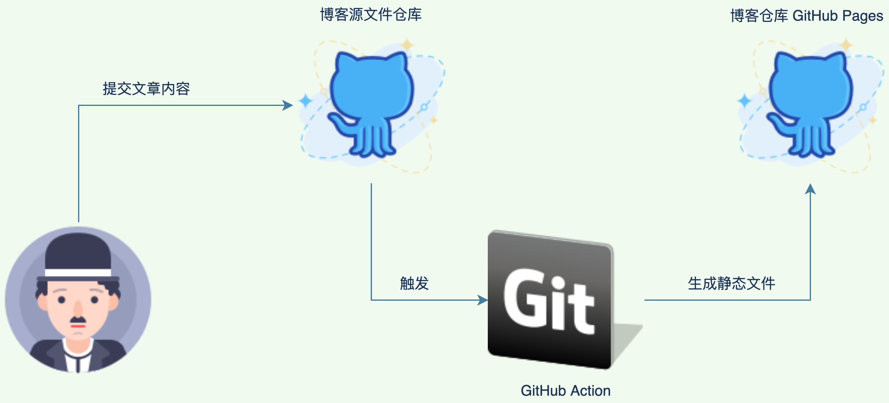
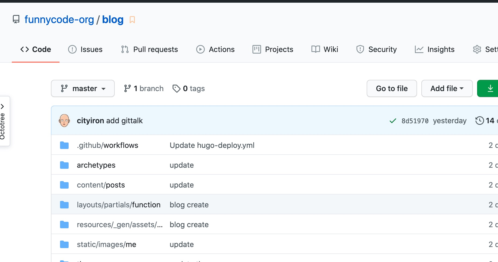
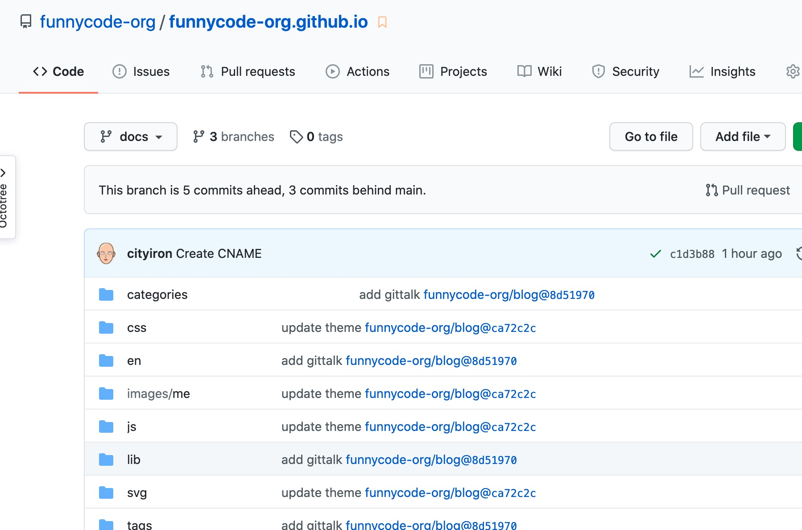
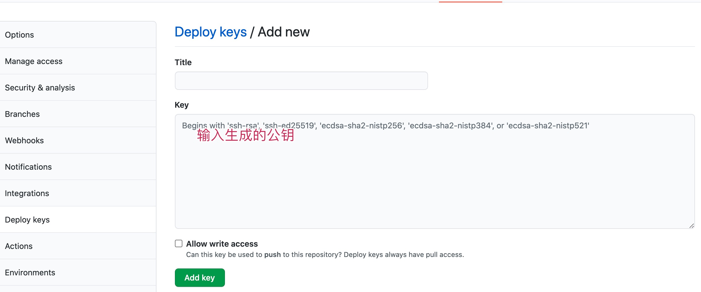
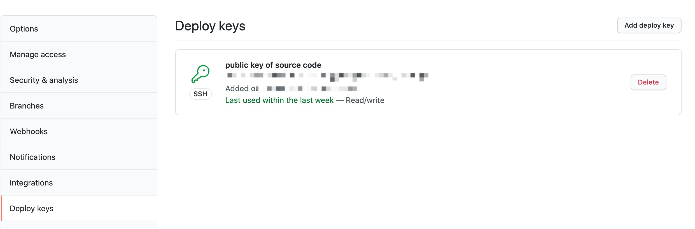
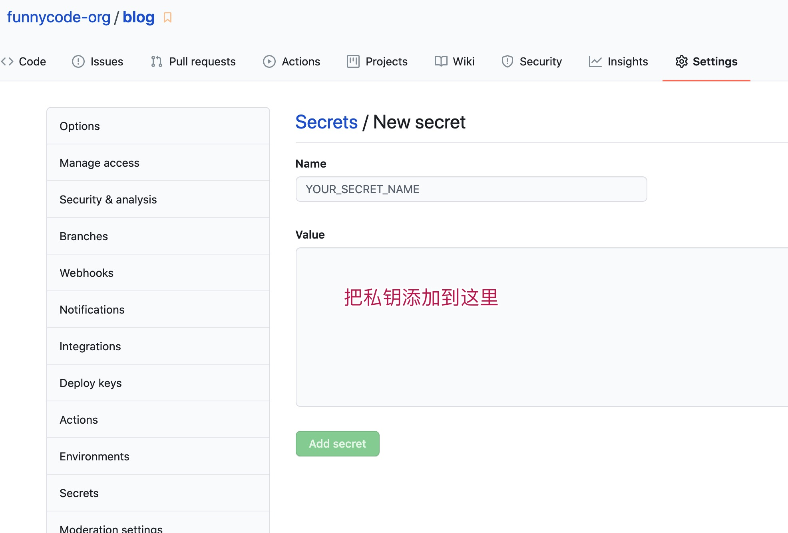
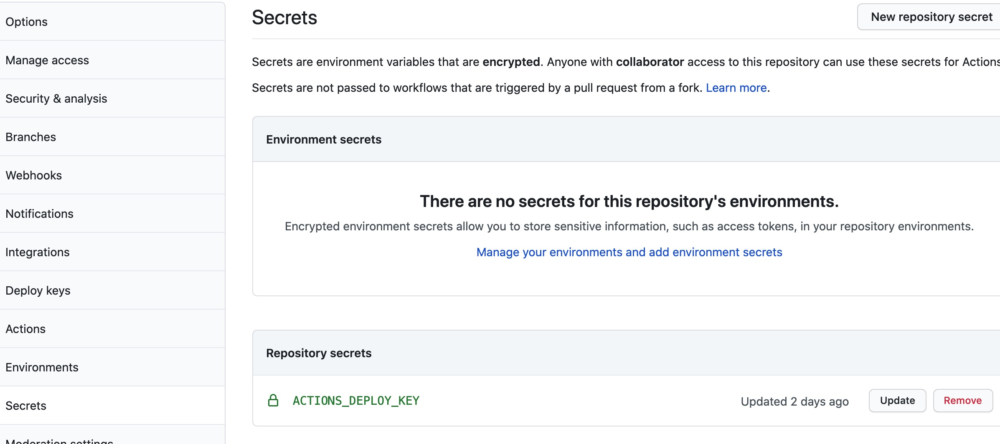
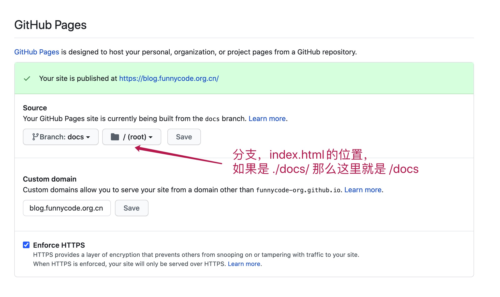
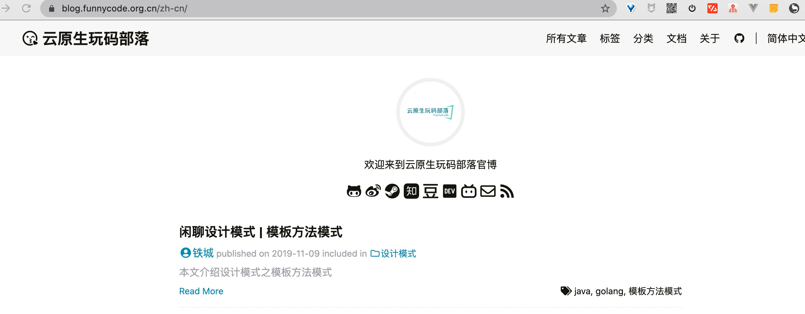

# Hugo 白话文 | GitHub Action 自动部署


<!--more-->

## 一、前言

使用 Hugo 有一些时间了，把内容上传到 GitHub Pages，从一开始的手动操作，到脚本操作，终于来到了自动化部署。 

**部署的流程**：



本地通过 Hugo 命令创建文件，编写博客，编写好后把改变的内容上传到 GitHub 博客源文件仓库。通过 GitHub Action 自动触发脚本构建，然后把静态文件通过 GitHub Deploy 到博客仓库。

## 二、具体步骤

### 2.1 创建两个仓库

- 创建博客源仓库



- 创建博客静态资源仓库



### 2.2 创建 SSH

需要生成一对 SSH Key，生成的 Public Key 和 Private Key 都会用到。

```ssh
ssh-keygen -t rsa -b 4096 -C "ironcity.hz@gmail.com"
Generating public/private rsa key pair.
Enter file in which to save the key (/Users/tc/.ssh/id_rsa): 
```

输入你需要指定的文件，比如 `/Users/tc/.ssh/id_rsa_hugo_deploy`

> 只是为了防止覆盖之前创建的默认文件

### 2.2 配置博客静态资源仓库的 Deploy Keys

- 添加公钥到 funnycode-org.github.io 仓库的 Deploy Keys



- 添加后



### 2.3 配置博客源内容仓库的 Secrets

- 添加私钥到 blog 仓库的 Secrets



- 添加后



> 注意这个 secrets 的名称

### 2.4 编写博客

- 克隆 blog 项目到本地

```
# 选取一个目录
cd ~/Desktop/

# 克隆 source 仓库
git clone git@github.com:funnycode-org/blog.git

# 进入仓库
cd blog
```

- 创建 hugo 博客

```bash
# 创建博客，多语言模式
hugo new /posts/[blog-name]/index.zh-cn.md 

# 运行预览效果
hugo serve -D
```


如果没有什么问题就可以准备提交代码了

```bash
git add .
git commit -m "update commit"
git push -u origin master
```

### 2.5 GitHub Actions 说明

Actions 内容：

```bash
name: Deploy Hugo Site to Github Pages on Master Branch

on:
  push:
    branches:
      - master

jobs:
  build-deploy:
    runs-on: ubuntu-18.04
    steps:
      - uses: actions/checkout@v2
        with:
          submodules: true  # Fetch Hugo themes (true OR recursive)
          fetch-depth: 0    # Fetch all history for .GitInfo and .Lastmod

      - name: Setup Hugo
        uses: peaceiris/actions-hugo@v2
        with:
          hugo-version: '0.76.0'
          # extended: true

      - name: Build
        run: hugo --minify

      - name: Deploy
        uses: peaceiris/actions-gh-pages@v3
        with:
          deploy_key: ${{ secrets.ACTIONS_DEPLOY_KEY }}
          external_repository: funnycode-org/funnycode-org.github.io # remote branch
          publish_dir: "./docs"
          cname: blog.funnycode.org.cn          
          keep_files: false # remove existing files
          publish_branch: docs  # deploying branch
          commit_message: ${{ github.event.head_commit.message }}
```

> 注意点：
> - publish_dir 指定发布的目录，`./docs` 指 `blog` 项目下的 `docs` 目录下的内容会被发布
> - publish_branch 发布到 `funnycode-org.github.io` 项目的 `docs` 分支
> - secrets.ACTIONS_DEPLOY_KEY 的 ACTIONS_DEPLOY_KEY 则是上面设置 Private Key 的变量名
> - cname 必须要配置好，和下文提到的 Setting 里面配置图对应

### 2.7 funnycode-org.github.io 配置

- 配置 Setting



- 验证访问

输入 ![https://blog.funnycode.org.cn] (https://blog.funnycode.org.cn)，效果：



## 三、参考

[https://github.com/peaceiris/actions-hugo](https://github.com/peaceiris/actions-hugo)
[https://zhuanlan.zhihu.com/p/109057290](https://zhuanlan.zhihu.com/p/109057290)
[https://github.com/peaceiris/actions-gh-pages](https://github.com/peaceiris/actions-gh-pages)

