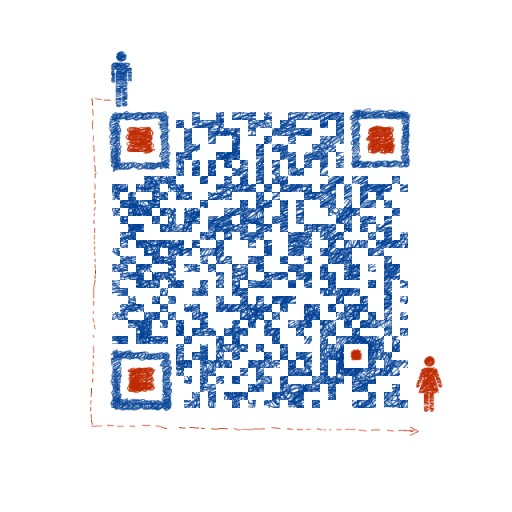

# json：你或许还不知道的使用的坑（三）续


<!--more-->
# 一、前言
其实本篇应该写的是json的反序列化，所以花了几个晚上看了下该部分源码，每次看都想睡觉。为什么呢？因为确实是太无聊了，我打赌这是我看过go源码中最无聊的逻辑，全篇都是一些状态的切换，要么是 ```if ... else ... ```，要么就是``` switch ... case ... case ...```,头大。我也尝试画过流程图，但是这么多状态的切换，也不知道是什么力量支撑我画了2天时间，最后我放弃了-画出来没有丝毫意义。所以本篇我就源码层面顺着[json：你或许还不知道的使用的坑（一）](https://blog.csdn.net/u010927340/article/details/111110430)续写下反序列化可能会遇到的一些坑或者未知的使用方法。

## tips:
- 我在看的过程中也留了些注释，看兴趣的话可以去[GitHub](https://github.com/funnycode-org/go-sourcecode)上去看看，也欢迎你的加入。
- 所有代码在 `The Go Playground`都能看到。
# 二、内容
## 1.反序列化科学计数法
假如你有这么个json字符串，如何序列化呢？
```shell
{
	"Name": "zhangSan",
 	"Age": -0e+10000
}
```
注意`Age`字段的值并没有被双引号包围，所以go提供了一种类型`json.Number`专门用来装数字，包括科学计数法和普通数字。下面是我的结构体：
```go
type User struct {
	Name string
	Age  json.Number
}
```
运行我的[示例代码](https://play.studygolang.com/p/3R8hwAwmsBH)能得到正确结果：
```bash
{zhangSan -0e+10000}
```
## 2.value是null的注意
假如我有这么个json字符串：
```bash
	{
		"Name": null,
 		"Age": null
	}
```
且我的结构体是这样的：
```go
    type User struct {
      Name string
      Age  map[string]string
    }
```
我的[序列化代码](https://play.studygolang.com/p/-ZJEvbTTrZe)如下:
```go
	var san = User{
		Name: "aaa",
		Age:  map[string]string{"1": "1"},
	}
	err := json.Unmarshal(bytes, &san)
	if err != nil {
		fmt.Println("error:", err)
	} else {
		fmt.Println(san)
	}
```
你觉得打印结果会是神马样子的呢？
```bash
{aaa map[]}
```
会有点不可思议是吧？为什么`Name`的值没有改变，但是`Age`确被重新初始化了呢？
go的官方序列化代码如下:
```go
	case 'n': // null
		// The main parser checks that only true and false can reach here,
		// but if this was a quoted string input, it could be anything.
		if fromQuoted && string(item) != "null" { // 字段有',string'标签，以n开头，必须是null
			d.saveError(fmt.Errorf("json: invalid use of ,string struct tag, trying to unmarshal %q into %v", item, v.Type()))
			break
		}
		switch v.Kind() {
		case reflect.Interface, reflect.Ptr, reflect.Map, reflect.Slice: // 设置给interface{},指针,map,切片一个初始化的值
			v.Set(reflect.Zero(v.Type()))
			// otherwise, ignore null for primitives/string
		}
```
ok,能看到10~12行把该字段重新设置为0值了,不仅`map`,还有`interface`,`指针`,`slice`都会发生这种情况，除了这种情况，其他的值都不会被改变。
## 3.反序列到接口，必须是空接口
常理任何json字段都可以序列化到接口的，但是需要注意下，go只允许空接口 `interface{}`，如果你的接口有方法的话是不被允许的。例如你有如下结构体：
```go
type User struct {
	Name string
	Age  interface {
		GetAge() int
	}
}
```
可以看到 `Age`字段是一个非空接口，当我反序列化该json字符串的时候：
```bash
	{
		"Name": null,
 		"Age": 19
	}
```
会发生异常,[示例代码](https://play.studygolang.com/p/ic4nx76yhog)：
```bash
error: json: cannot unmarshal number into Go struct field User.Age of type interface { GetAge() int }
```
go的代码在这里:
```go
		case reflect.Interface:
			if v.NumMethod() == 0 { // 空接口
				v.Set(reflect.ValueOf(value))
			} else { // 非空接口
				d.saveError(&UnmarshalTypeError{Value: "bool", Type: v.Type(), Offset: int64(d.readIndex())}) // 接口
			}
```
`v.NumMethod() == 0`表示必须是个空接口。
## 4.不要把数组当做反序列化的字段类型
### 4.1 虽然说一般来说我们都是用切片，但是也还是拎出来讲一讲下，可能会导致少反序列化些数组值。
假如我有这么个结构体：
```go
type User struct {
	Name string
	Age  [1]int
}
```
而我的json字符串长这样:
```bash
	{
		"Name": "zhangSan",
 		"Age": [20,21]
	}
```
[反序列化代码](https://play.studygolang.com/p/vgTwZSDjMMr)的结果如下:
```bash
{zhangSan [20]}
```
可以看到只序列化了数组的长度个数，其他都被抛弃了，而且没有任何错误提示。
go的源码在这里:
```go
		if i < v.Len() {
			// Decode into element.
			if err := d.value(v.Index(i)); err != nil {
				return err
			}
		} else {
			// Ran out of fixed array: skip.
			if err := d.value(reflect.Value{}); err != nil {
				return err
			}
		}
```
`i`表示json字符串里面的数组的长度，因为 `i`大于 `v.Len()`（数组的长度)的时候，就表示结构体的数组太短了，在第8行简单的忽略了。
### 4.2 当数组被初始化过非0值，反序列化会被置为0
结构体如下：
```go
type User struct {
	Name string
	Age  [2]int
}
```
[反序列化代码](https://play.studygolang.com/p/Rztzzfx0QqB)如下：
```go
	var data = []byte (`
	{
		"Name": "zhangSan",
 		"Age": [20]
	}
 	`)
	var san = User{
		Age: [2]int{1, 2},
	}
	err := json.Unmarshal(data, &san)
	if err != nil {
		fmt.Println("error:", err)
	} else {
		fmt.Println(san)
	}
```
在第8行被初始化之后，反序列化之后结果就是为0值了，结果如下:
```bash
{zhangSan [20 0]}
```
go得源码在这里:
```go
	if i < v.Len() {
		if v.Kind() == reflect.Array {
			// Array. Zero the rest.
			z := reflect.Zero(v.Type().Elem())
			for ; i < v.Len(); i++ {
				v.Index(i).Set(z)
			}
		} else {
			v.SetLen(i)
		}
	}
```
`i`表示的是json字符串的数组的长度，当 `i`小于`v.Len()`(数组的长度)的时候，会把元素设置为`reflect.Zero(v.Type().Elem())`。
## 5.map的key不是int或者string，怎么操作？
一招解决：实现接口`encoding.TextUnmarshaler`。这个我就不举列子了。
go的源码在这：
```go
	switch v.Kind() {
	case reflect.Map:
		// Map key must either have string kind, have an integer kind,
		// or be an encoding.TextUnmarshaler.
		switch t.Key().Kind() {
		case reflect.String,
			reflect.Int, reflect.Int8, reflect.Int16, reflect.Int32, reflect.Int64,
			reflect.Uint, reflect.Uint8, reflect.Uint16, reflect.Uint32, reflect.Uint64, reflect.Uintptr:
		default:
			if !reflect.PtrTo(t.Key()).Implements(textUnmarshalerType) {
				d.saveError(&UnmarshalTypeError{Value: "object", Type: t, Offset: int64(d.off)})
				d.skip()
				return nil
			}
		}
		if v.IsNil() {
			v.Set(reflect.MakeMap(t))
		}
```
当时`map`类型的时候，key不是`string`或者integer,那么如果实现了`textUnmarshalerType`也是可以的。
# 三、另外一种装逼的反序列方式
你可知除了`json.Unmarshal()`这种方式，还有[另外一种反序列](https://play.studygolang.com/p/mWfjh3yqsS0)的编码方式:
```go
	var data = []byte (`
	{
		"Name": "zhangSan",
 		"Age": 19
	}
 	`)
	var san = User{
	}
	decoder := json.NewDecoder(bytes.NewReader(data))
	decoder.Decode(&san)
	if err != nil {
		fmt.Println("error:", err)
	} else {
		fmt.Println(san)
	}
```
当然装逼不是目的，目的是我们能做更多的反序列化的行为控制.
## 1.把数字当做`json.Number`类型反序列化到接口里面去
这样有什么意义呢？因为go的做法是默认把数字反序列化成`float64`类型，但是当该数字很大的时候，`float64`是表示不了的，所以此时就要用`json.Number`，但是用`json.Unmarshal()`是做不到的，此时用`json.NewDecoder()`就可以的。
下面是错误的[示例代码]()：
```go
type User struct {
	Name string
	Age  interface{}
}

func main() {
	var data = []byte (`
	{
		"Name": "zhangSan",
 		"Age": 2e+1000
	}
 	`)
	var san = User{
	}
	decoder := json.NewDecoder(bytes.NewReader(data))
	//decoder.UseNumber()
	err := decoder.Decode(&san)
	if err != nil {
		fmt.Println("error:", err)
	} else {
		fmt.Println(san)
	}
}
```
错误结果如下：
```bash
error: json: cannot unmarshal number 2e+1000 into Go struct field User.Age of type float64
```
只需要把第16行的代码取消注释即可达到目的。
让我们看看go的源码说明:
```go
// UseNumber causes the Decoder to unmarshal a number into an interface{} as a
// Number instead of as a float64.
func (dec *Decoder) UseNumber() { dec.d.useNumber = true }
```
注释已经讲的很明白了。
再看看具体怎么使用`useNumber`这个参数的：
```go
// convertNumber converts the number literal s to a float64 or a Number
// depending on the setting of d.useNumber.
func (d *decodeState) convertNumber(s string) (interface{}, error) {
	if d.useNumber {
		return Number(s), nil
	}
	f, err := strconv.ParseFloat(s, 64)
	if err != nil {
		return nil, &UnmarshalTypeError{Value: "number " + s, Type: reflect.TypeOf(0.0), Offset: int64(d.off)}
	}
	return f, nil
}
```
第4~5行也说明了使用`json.Number`类型获得结果。
## 2.当json字符串某个字段没有在结构体中对应的时候
默认情况下`json`是允许这种情况下的，那如何禁止这种情况呢？
这是我的结构体：
```go
type User struct {
	Name string
	Age  interface{}
}
```
我的json字符串：
```bash
	{
		"Name": "zhangSan",
 		"Age": 2e+1000,
		"Head": "http://head.jpg"
	}
```
我的[反序列化代码](https://play.studygolang.com/p/-VXeNgCMMHo):
```go
	var san = User{
	}
	decoder := json.NewDecoder(bytes.NewReader(data))
	decoder.UseNumber()
	decoder.DisallowUnknownFields()
	err := decoder.Decode(&san)
	if err != nil {
		fmt.Println("error:", err)
	} else {
		fmt.Println(san)
	}
```
结果会报错，提示找不到`Head`字段：
```bash
error: json: unknown field "Head"
```
`json`的源码在这里：
```go
	if d.disallowUnknownFields { // 判断是否允许没有字段可序列化的情况
		d.saveError(fmt.Errorf("json: unknown field %q", key))
	}
```
# 四、写到最后
上面总结了反序列化的注意一点，由于我的水平有限，并且我也是根据源码倒推过来的，可能还有更深层次的技巧或坑我还没有发现。如果你在工作过程中遇到序列化或者反序列化的问题，欢迎和我交流。可以加我微信，或者微信公众号，我会长期输出原创文章。
- 我的微信：

- 我的微信公众号:

