# 闲聊 canal | 入门篇


<!--more-->

## 一、前言

介绍下今天的猪脚 [canal](https://github.com/alibaba/canal/) 

- 官方定位

**基于数据库增量日志解析，提供增量数据订阅&消费，目前主要支持了mysql**

- 业务场景

基于日志增量订阅&消费支持的业务：

1. 数据库镜像
2. 数据库实时备份
3. 多级索引 (卖家和买家各自分库索引)
4. search build
5. 业务cache刷新
6. 价格变化等重要业务消息

## 二、原理介绍

### 2.1 MySQL 主备复制


从上层来看，复制分成三步：

1. master 将改变记录到**二进制日志(binary log)**中（这些记录叫做二进制日志事件，binary log events，可以通过 `show binlog events` 进行查看）；
2. slave 将 master 的 binary log events 拷贝到它的**中继日志(relay log)**；
3. slave **重做**中继日志中的事件，将改变反映它自己的数据。

### 2.2 canal 的工作原理


原理相对比较简单：

1. canal 模拟 mysql slave 的交互协议，**伪装自己为 mysql slave**，向 mysql master 发送 dump 协议
2. mysql master 收到 dump 请求，开始**推送** binary log 给 slave(也就是canal)
3. canal 解析 binary log 对象(原始为 **byte 流**)

### 2.3 canal 架构


说明：

- server 代表一个 canal 运行实例，对应于一个 jvm
- instance 对应于一个数据队列 （1个 server 对应 1..n 个 instance)

instance 模块：

- eventParser (数据源接入，模拟slave协议和master进行交互，协议解析)
- eventSink (Parser和Store链接器，进行数据过滤，加工，分发的工作)
- eventStore (数据存储)
- metaManager (增量订阅&消费信息管理器)

> 概念还是建议都看看，会方便看源码

对应的源码结构


目录结构把每个模块都很清晰的展示出来了，肉眼直接识别（顾名思义）。

## 三、准备 MySQL

> 默认已经安装好 MySQL

### 3.1 检查 MySQL 是否满足要求

> Mac 系统

**启动**

```bash
$ sudo support-files/mysql.server start
Starting MySQL
 SUCCESS! 
```

**连接**

```bash
$ mysql -u root 
Enter password: 
Welcome to the MySQL monitor.  Commands end with ; or \g.
Your MySQL connection id is 4
Server version: 5.7.22-log MySQL Community Server (GPL)

Copyright (c) 2000, 2018, Oracle and/or its affiliates. All rights reserved.

Oracle is a registered trademark of Oracle Corporation and/or its
affiliates. Other names may be trademarks of their respective
owners.

Type 'help;' or '\h' for help. Type '\c' to clear the current input statement.

mysql>
```

**查看**

```mysql
mysql> show variables like '%log_bin%';
+---------------------------------+---------------------------------------+
| Variable_name                   | Value                                 |
+---------------------------------+---------------------------------------+
| log_bin                         | ON                                    |
| log_bin_basename                | /usr/local/mysql/data/mysql-bin       |
| log_bin_index                   | /usr/local/mysql/data/mysql-bin.index |
| log_bin_trust_function_creators | OFF                                   |
| log_bin_use_v1_row_events       | OFF                                   |
| sql_log_bin                     | ON                                    |
+---------------------------------+---------------------------------------+
6 rows in set (0.01 sec)		
```

- log_bin 必须是 ON，如果是 OFF 则需要编辑配置文件 `my.cnf`

### 3.2 配置 MySQL

```bash
$ cat /etc/my.cnf 
[mysqld]
log-bin=mysql-bin # 开启 binlog
binlog-format=ROW # 选择 ROW 模式
server_id=1 # 配置 MySQL replaction 需要定义，不要和 canal 的 slaveId 重复
```

- 配置了后需要重启 mysql 服务
- 目前 canal 支持所有模式的增量订阅(但配合同步时，因为 statement 只有sql，没有数据，无法获取原始的变更日志，所以一般建议为ROW模式)

### 3.3 设置账号

```mysql
-- 创建账号，可以使用已有账号
CREATE USER canal IDENTIFIED BY 'canal';  
-- 授权
GRANT SELECT, REPLICATION SLAVE, REPLICATION CLIENT ON *.* TO 'canal'@'%';
-- GRANT ALL PRIVILEGES ON *.* TO 'canal'@'%' ;
FLUSH PRIVILEGES;
```

-  MySQL slave 的权限需要 `SELECT, REPLICATION SLAVE, REPLICATION CLIENT`
- 因为 canal 账号后续 admin 模块使用，需要删除和编辑权限，直接用`GRANT ALL PRIVILEGES ON *.* TO 'canal'@'%' ;` 更方便。

## 四、运行单机例子

### 4.1 使用下载包

[参考官方文档](https://github.com/alibaba/canal/wiki/QuickStart#%E5%90%AF%E5%8A%A8)

默认配置只需要改 instance 的配置，我这里没有主从的配置，就一台 MySQL，关注下面配置项：

```properties
# 主库的地址
canal.instance.master.address=127.0.0.1:3306
# 数据库账号密码（有 slave 权限）
canal.instance.dbUsername=canal
canal.instance.dbPassword=canal

# 这个你可以自指定，不过大于 v1.0.26+ 会自动创建
# canal.instance.mysql.slaveId=0
```

不过如果你的运行环境是单核的，需要将 `canal.properties` 下的 ` canal.instance.parser.parallel` 设置为 false。

instance 的名称对应的是文件夹，如下 `example`

```bash
$ ls -l
total 48
-rwxrwxrwx@ 1 tc  staff  5794 12 28 15:57 canal.properties
-rwxrwxrwx@ 1 tc  staff   291  8 31  2019 canal_local.properties
drwxrwxrwx@ 5 tc  staff   160 12 28 15:14 example
-rwxrwxrwx@ 1 tc  staff  3437  2 28  2020 logback.xml
drwxrwxrwx@ 3 tc  staff    96 11 27  2018 metrics
drwxrwxrwx@ 8 tc  staff   256  8 22 13:14 spring
-rwxrwxrwx@ 1 tc  staff  2124 12 28 16:24 sync_dev.properties
```

运行起来后默认是文件模式，会创建文件：

```bash
$ ls -l
total 1912
-rw-r--r--@ 1 tc  staff  913408 12 30 13:37 h2.mv.db
-rwxrwxrwx@ 1 tc  staff    2106  8 22 13:14 instance.properties
-rw-r--r--@ 1 tc  staff     338 12 30 13:37 meta.dat
```

### 4.2 镜像

[参考官方文档](https://github.com/alibaba/canal/wiki/QuickStart)

下载脚本执行：

```bash
sh run.sh -e canal.auto.scan=false -e canal.destinations=base_test -e canal.instance.master.address=127.0.0.1:3306 -e  canal.instance.dbUsername=canal -e canal.instance.dbPassword=canal -e canal.instance.connectionCharset=UTF-8 -e canal.instance.tsdb.enable=true -e canal.instance.gtidon=false;
```

查看镜像的运行情况：

```bash
$ docker ps
CONTAINER ID   IMAGE                COMMAND                  CREATED              STATUS              PORTS                                                          NAMES
6b022c5f435f   canal/canal-server   "/alidata/bin/main.s…"   About a minute ago   Up About a minute   0.0.0.0:9100->9100/tcp, 0.0.0.0:11110-11112->11110-11112/tcp   canal-server
```

查看镜像日志：

```bash
$ docker logs 6b022c5f435f
DOCKER_DEPLOY_TYPE=VM
==> INIT /alidata/init/02init-sshd.sh
==> EXIT CODE: 0
==> INIT /alidata/init/fix-hosts.py
==> EXIT CODE: 0
==> INIT DEFAULT
Generating SSH1 RSA host key:                              [  OK  ]
Starting sshd:                                             [  OK  ]
Starting crond:                                            [  OK  ]
==> INIT DONE
==> RUN /home/admin/app.sh
==> START ...
start canal ...
start canal successful
==> START SUCCESSFUL ...
```

`START SUCCESSFUL ...` 表示成功

<u>按手册镜像启动报数据库连接错误</u> （https://github.com/alibaba/canal/issues/1339）

### 4.3 Intellij 启动

把 `canal/deployer/src/main/resources/logback.xml` 文件的日志路径改下：

```xml
<File>../logs/${destination}/${destination}.log</File>

<File>/Users/tc/Documents/workspace_2020/canal/logs/${destination}/${destination}.log</File>
```

找到 `com.alibaba.otter.canal.deployer.CanalLauncher#main` 然后直接运行即可。

运行后控制台也没啥日志，可以在 `canal/logs` 下看到日志。

正常启动日志：

```bash
2020-12-30 11:14:01.111 [main] INFO  com.alibaba.otter.canal.deployer.CanalLauncher - ## set default uncaught exception handler
2020-12-30 11:14:01.159 [main] INFO  com.alibaba.otter.canal.deployer.CanalLauncher - ## load canal configurations
2020-12-30 11:14:02.266 [main] INFO  com.alibaba.otter.canal.deployer.CanalStarter - ## start the canal server.
2020-12-30 11:14:02.360 [main] INFO  com.alibaba.otter.canal.deployer.CanalController - ## start the canal server[30.11.176.115(30.11.176.115):11111]
2020-12-30 11:14:02.497 [main] INFO  com.alibaba.otter.canal.deployer.CanalStarter - ## the canal server is running now ......
```

## 五、运行 admin

### 5.1 创建数据库表

先要把 admin 项目依赖的数据库创建好

- 找到SQL

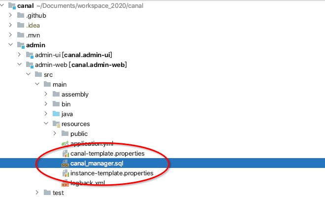

- 初始化SQL

命令操作

```sql
# 连接到数据库
mysql -u root -p

# 导入初始化SQL
> source conf/canal_manager.sql
```

>  一般用 Navicat 操作，直接通过有权限的账号连接上去，然后执行SQL内容即可。

### 5.2 Intellij 启动

- 运行

直接启动会报错：

```bash
Caused by: io.ebean.config.BeanNotEnhancedException: Bean class com.alibaba.otter.canal.admin.model.CanalConfig is not enhanced? Check packages specified in ebean.mf. If you are running in IDEA or Eclipse check that the enhancement plugin is installed. See https://ebean.io/docs/trouble-shooting#not-enhanced
	at io.ebeaninternal.server.deploy.BeanDescriptorManager.setEntityBeanClass(BeanDescriptorManager.java:1580)
	at io.ebeaninternal.server.deploy.BeanDescriptorManager.createByteCode(BeanDescriptorManager.java:1445)
	at io.ebeaninternal.server.deploy.BeanDescriptorManager.readDeployAssociations(BeanDescriptorManager.java:1354)
	at io.ebeaninternal.server.deploy.BeanDescriptorManager.readEntityDeploymentAssociations(BeanDescriptorManager.java:770)
	at io.ebeaninternal.server.deploy.BeanDescriptorManager.deploy(BeanDescriptorManager.java:374)
	at io.ebeaninternal.server.core.InternalConfiguration.<init>(InternalConfiguration.java:197)
	at io.ebeaninternal.server.core.DefaultContainer.createServer(DefaultContainer.java:124)
	at io.ebeaninternal.server.core.DefaultContainer.createServer(DefaultContainer.java:35)
	at io.ebean.EbeanServerFactory.createInternal(EbeanServerFactory.java:109)
	at io.ebean.EbeanServerFactory.create(EbeanServerFactory.java:70)
	at com.alibaba.otter.canal.admin.config.EbeanConfig.ebeanServer(EbeanConfig.java:38)
	at com.alibaba.otter.canal.admin.config.EbeanConfig$$EnhancerBySpringCGLIB$$1b6fbe49.CGLIB$ebeanServer$0(<generated>)
	at com.alibaba.otter.canal.admin.config.EbeanConfig$$EnhancerBySpringCGLIB$$1b6fbe49$$FastClassBySpringCGLIB$$3981d1d4.invoke(<generated>)
	at org.springframework.cglib.proxy.MethodProxy.invokeSuper(MethodProxy.java:228)
	at org.springframework.context.annotation.ConfigurationClassEnhancer$BeanMethodInterceptor.intercept(ConfigurationClassEnhancer.java:361)
	at com.alibaba.otter.canal.admin.config.EbeanConfig$$EnhancerBySpringCGLIB$$1b6fbe49.ebeanServer(<generated>)
	at java.base/jdk.internal.reflect.NativeMethodAccessorImpl.invoke0(Native Method)
	at java.base/jdk.internal.reflect.NativeMethodAccessorImpl.invoke(NativeMethodAccessorImpl.java:62)
	at java.base/jdk.internal.reflect.DelegatingMethodAccessorImpl.invoke(DelegatingMethodAccessorImpl.java:43)
	at java.base/java.lang.reflect.Method.invoke(Method.java:566)
	at org.springframework.beans.factory.support.SimpleInstantiationStrategy.instantiate(SimpleInstantiationStrategy.java:154)
	... 17 common frames omitted
```

> 新知识点 ebean

首先需要安装插件：

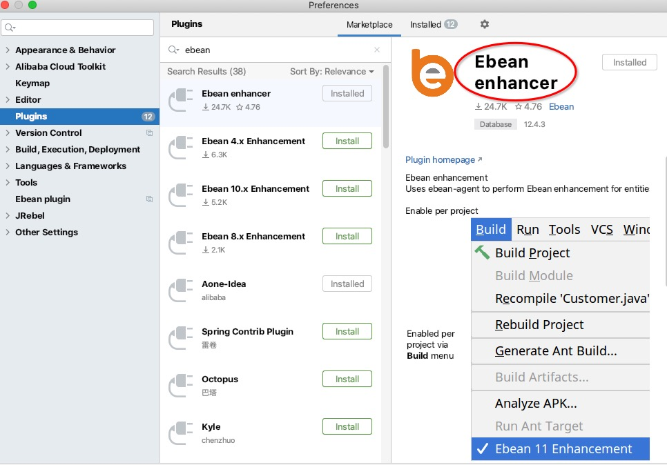

在 `Build`  下开启 `Ebean enhancement`

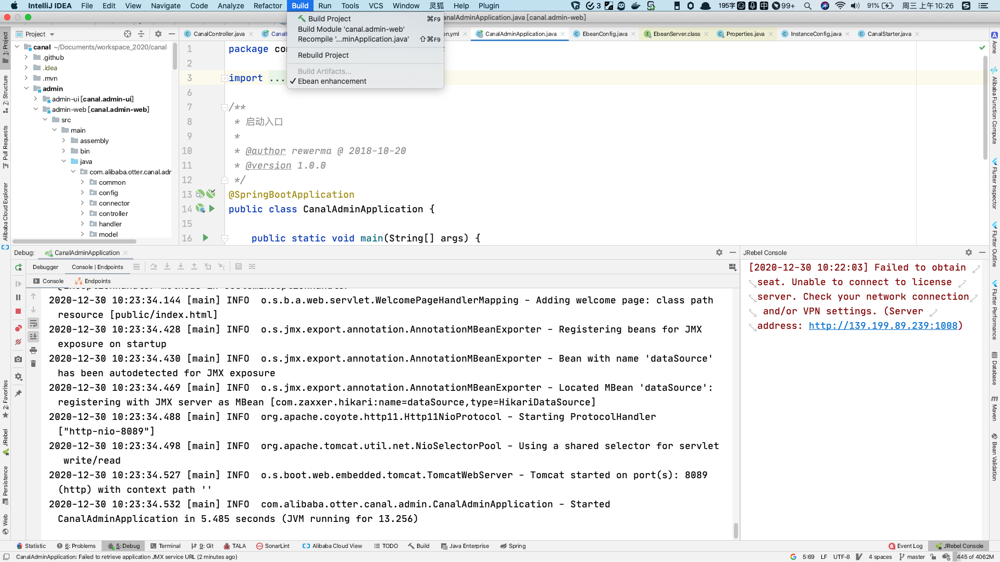

正常启动就是熟悉的 springboot 项目的启动日志。

- 验证

> 输入地址 127.0.0.1:8089

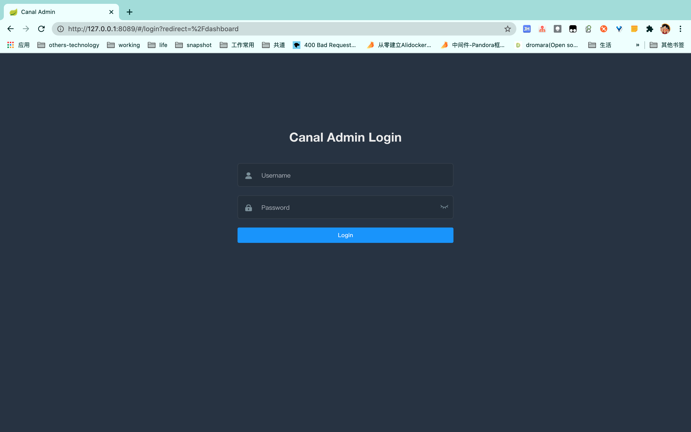

默认密码：admin/123456

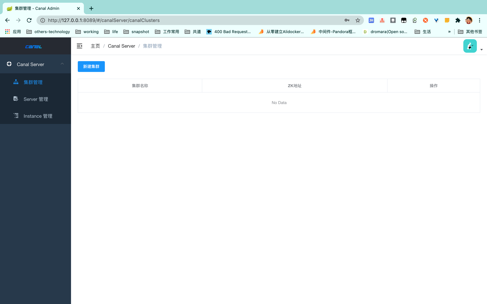

### 5.3 镜像启动

[参照官方文档](https://github.com/alibaba/canal/wiki/Canal-Admin-Docker)

正常使用一个开源中间件，不可能拿来跑个镜像就完事了，肯定要本地的 IDE 启动查看整个代码流程，所以镜像这块就跳过了。

### 5.4 控制台

控制页面可以看到：

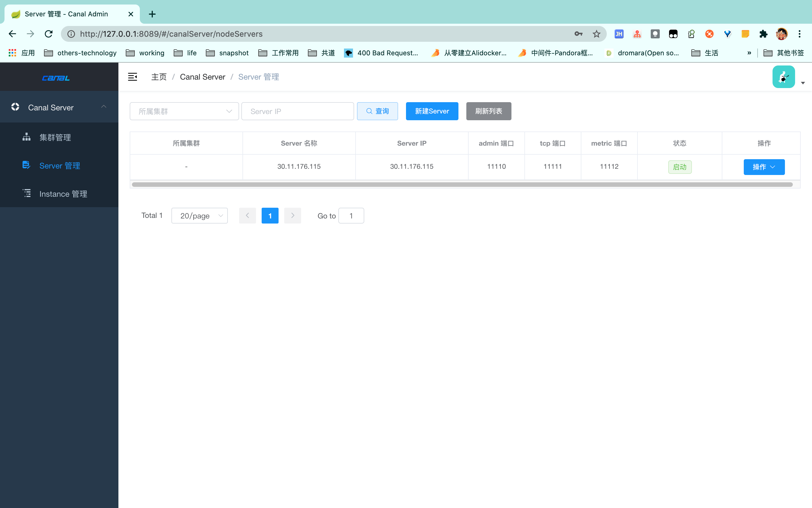

可以看到启动了一个单节点的 server，它的状态是启动。

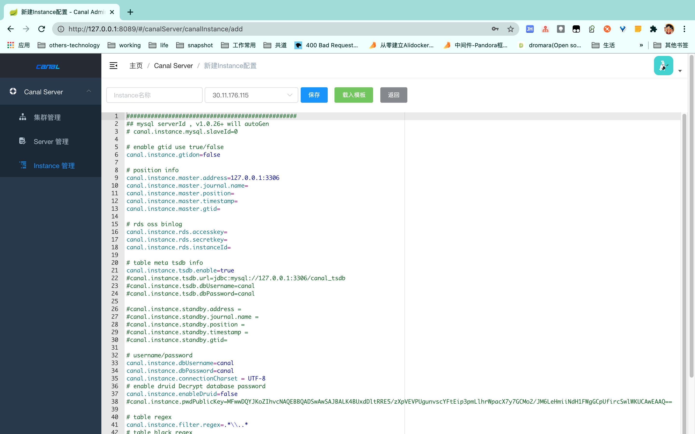

刚开始的时候 instance 列表会是停止状态，<u>正常情况下过会会自动的变成启动</u>

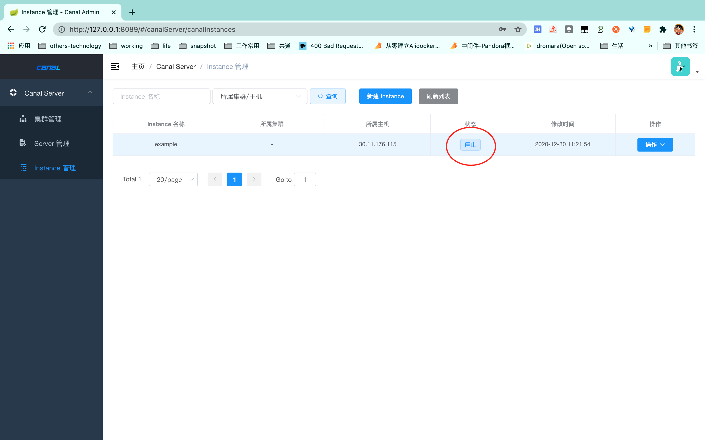

## 六、运行集群例子

### 6.1 canal 的 HA

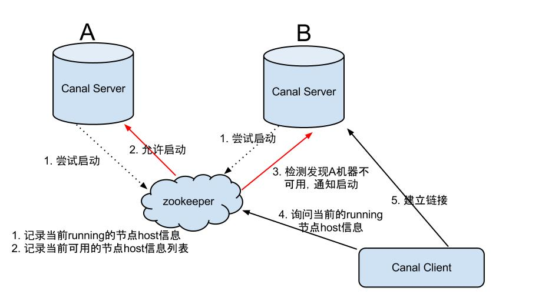

分 server 和 client 的 HA 

- canal server: 为了减少对 mysql dump 的请求，不同 server 上的 instance 要求同一时间只能有一个处于running，其他的处于 standby 状态.
- canal client: 为了保证有序性，一份 instance 同一时间只能由一个 canal client 进行 get/ack/rollback 操作，否则客户端接收无法保证有序。

> 也就是说数据库实例的 binglog 是单线程操作的

大致步骤：

1. canal server 要启动某个 canal instance 时都先向zookeeper进行一次尝试启动判断 (实现：创建EPHEMERAL节点，谁创建成功就允许谁启动)
2. 创建 zookeeper 节点成功后，对应的canal server就启动对应的 canal instance，没有创建成功的 canal instance 就会处于standby状态
3. 一旦 zookeeper 发现 canal server A 创建的节点消失后，立即通知其他的 canal server 再次进行步骤1的操作，重新选出一个 canal server 启动 instance.
4. canal client 每次进行 connect 时，会首先向 zookeeper 询问当前是谁启动了 canal instance，然后和其建立链接，一旦链接不可用，会重新尝试 connect.

canal client 的方式和 canal server 方式类似，也是利用 zookeeper 的抢占 EPHEMERAL 节点的方式进行控制。

### 6.2 通过 admin 配置

**新建集群**

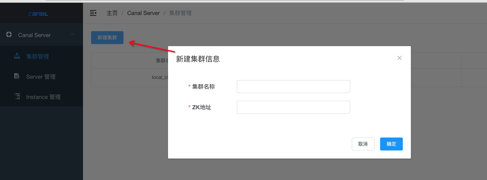

- 只需要关心 Zookeeper 的地址和集群的名称

新建后会在列表页面看到

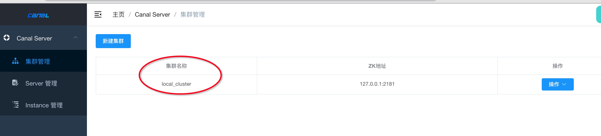

**server启动**

> **面向容器无状态的运维**
>
> server 的信息维护除了在 canal-admin 上基于 WebUI 的操作以外，还有更加方便的 auto register 机制，主要针对面向容器化之后可以通过扩容节点，自动完成集群配置的维护和 instance 分流

```properties
# 是否开启自动注册模式
canal.admin.register.auto = true
# 可以指定默认注册的集群名，如果不指定，默认注册为单机模式
canal.admin.register.cluster = 
```

我的配置 `canal_local.properties`

```properties
canal.admin.register.auto = true
canal.admin.register.cluster = local_cluster
```

## 七、小结

- admin模块启动配置好 cluster、server 和 instance 后，就算宕机也不影响 server 和 client 的交互，因为他们是直接建立的 TCP 连接。

`canal.serverMode = tcp`

- 如果没有 admin 模块，无法最简配置启动 server，并且需要有集群配置才能启动 server。

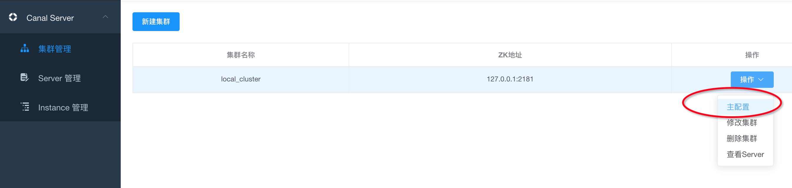

- 权限配置别漏了

server 启动，连接上 admin 的时候，需要插入数据，如果授权的时候就用了 `GRANT SELECT, REPLICATION SLAVE, REPLICATION CLIENT ON *.* TO 'canal'@'%';`  那么默认权限是不够的，启动后日志文件会出现如下错误：

```bash
2020-12-30 10:59:36.573 [main] INFO  com.alibaba.otter.canal.deployer.CanalLauncher - ## set default uncaught exception handler
2020-12-30 10:59:36.609 [main] INFO  com.alibaba.otter.canal.deployer.CanalLauncher - ## load canal configurations
2020-12-30 10:59:37.316 [main] ERROR com.alibaba.otter.canal.deployer.CanalLauncher - ## Something goes wrong when starting up the canal Server:
com.alibaba.otter.canal.common.CanalException: load manager config failed.
Caused by: com.alibaba.otter.canal.common.CanalException: requestGet for canal config error: Error[INSERT command denied to user 'canal'@'localhost' for table 'canal_node_server']
```

admin 默认配置是 `canal` 和 `canal`

```yml
spring.datasource:
  address: 127.0.0.1:3306
  database: canal_manager
  username: canal
  password: canal
```

## 八、参考

[https://github.com/alibaba/canal/wiki/%E7%AE%80%E4%BB%8B](https://github.com/alibaba/canal/wiki/%E7%AE%80%E4%BB%8B)

[http://dev.mysql.com/doc/refman/5.5/en/binary-log.html](http://dev.mysql.com/doc/refman/5.5/en/binary-log.html)

[http://www.taobaodba.com/html/474_mysqls-binary-log_details.html](http://www.taobaodba.com/html/474_mysqls-binary-log_details.html)


