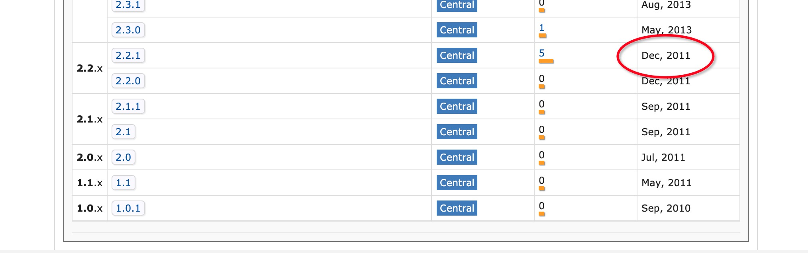

# 闲聊 canal | filter 模块


<!--more-->

## 一、前言

filter 模块是一个比较简单的模块，主要用于过滤 binlog 过来的表和字段数据。使用 canal 的时候，可以在服务端或客户端进行配置。

## 二、内容

### 2.1 结构


- `CanalEventFilter` 接口，定义了一个 `filter` 方法，返回 `true | false`
- aviater 下面是实现类
  - AviaterELFilter EL表达式匹配
  - AviaterRegexFilter 正则匹配
  - AviaterSimpleFilter 简单匹配

### 2.2 依赖

```xml
<dependency>
   <groupId>com.googlecode.aviator</groupId>
   <artifactId>aviator</artifactId>
</dependency>
```

- aviator 2.2.1

如果看到这个版本的发布日期，一定让人非常震惊



但是这个 aviator  不是没有更新，相反我发现它一直在稳定的发展，并且最近一年也发布了不少版本。


可怕，canal 这么多年都没有更新过这个库了。

### 2.3 代码分析

#### 2.3.1 简单匹配

**字段**

```java
public class AviaterSimpleFilter implements CanalEventFilter<String> {

    private static final String SPLIT             = ",";

    private static final String FILTER_EXPRESSION = "include(list,target)";

    private final Expression    exp               = AviatorEvaluator.compile(FILTER_EXPRESSION, true);
  
      private final List<String>  list;
  
}
```

- exp 匹配的表达式 `include(list,target)` 表示字符串 list 里面找一个字符串是否存在

**构造方法**

```java
    public AviaterSimpleFilter(String filterExpression){
        if (StringUtils.isEmpty(filterExpression)) {
            list = new ArrayList<>();
        } else {
            String[] ss = filterExpression.toLowerCase().split(SPLIT);
            list = Arrays.asList(ss);
        }
    }
```

- 全部转换成小写
- 根据`,`分隔，配置多个就 `s1.t1,s2.t2`，会变成 `list [s1.t1, s2.t2]`

**匹配方法**

```java
    public boolean filter(String filtered) throws CanalFilterException {
        if (list.isEmpty()) {
            return true;
        }
        if (StringUtils.isEmpty(filtered)) {
            return true;
        }
        Map<String, Object> env = new HashMap<>();
        env.put("list", list);
        env.put("target", filtered.toLowerCase());
        return (Boolean) exp.execute(env);
    }
```

- 空字符串直接是 true
- 会转小写去比较

#### 2.3.2 正则匹配

**字段**

```java
public class AviaterRegexFilter implements CanalEventFilter<String> {

    private static final String             SPLIT             = ",";
    private static final String             PATTERN_SPLIT     = "|";
    private static final String             FILTER_EXPRESSION = "regex(pattern,target)";
    private static final RegexFunction      regexFunction     = new RegexFunction();
    private final Expression                exp               = AviatorEvaluator.compile(FILTER_EXPRESSION, true);
    static {
        AviatorEvaluator.addFunction(regexFunction);
    }

    private static final Comparator<String> COMPARATOR        = new StringComparator();

    final private String                    pattern;
    final private boolean                   defaultEmptyValue;
  
}
```

- exp 匹配的表达式 `regex(pattern,target)` 表示字符串 list 里面找一个字符串是否存在
- regexFunction 在静态方法设置了默认的正则函数
- defaultEmptyValue 空值匹配条件
- pattern 正则的表达式

**构造方法**

```java
    public AviaterRegexFilter(String pattern){
        this(pattern, true);
    }

    public AviaterRegexFilter(String pattern, boolean defaultEmptyValue){
        this.defaultEmptyValue = defaultEmptyValue;
        List<String> list = null;
        if (StringUtils.isEmpty(pattern)) {
            list = new ArrayList<>();
        } else {
            String[] ss = StringUtils.split(pattern, SPLIT);
            list = Arrays.asList(ss);
        }

        // 对pattern按照从长到短的排序
        // 因为 foo|foot 匹配 foot 会出错，原因是 foot 匹配了 foo 之后，会返回 foo，但是 foo 的长度和 foot
        // 的长度不一样
        list.sort(COMPARATOR);
        // 对pattern进行头尾完全匹配
        list = completionPattern(list);
        this.pattern = StringUtils.join(list, PATTERN_SPLIT);
    }
```

- 默认空值匹配
- 会对分隔后的匹配表达式进行排序 `list.sort(COMPARATOR)` 和头尾匹配 `completionPattern`，如果传入 `foooo,f.*t`  即变成 `^foooo$` 和 `^f.*t$`
- 每部分会通过 | 组合在一起，即 `^foooo$|^f.*t$`

**匹配方法**

```java
public boolean filter(String filtered) throws CanalFilterException {
    if (StringUtils.isEmpty(pattern)) {
        return defaultEmptyValue;
    }

    if (StringUtils.isEmpty(filtered)) {
        return defaultEmptyValue;
    }

    Map<String, Object> env = new HashMap<>();
    env.put("pattern", pattern);
    env.put("target", filtered.toLowerCase());
    return (Boolean) exp.execute(env);
}
```

- 空字符串返回的是 defaultEmptyValue
- 会转小写去比较

**执行逻辑**

```java
public class RegexFunction extends AbstractFunction {

    public AviatorObject call(Map<String, Object> env, AviatorObject arg1, AviatorObject arg2) {
        String pattern = FunctionUtils.getStringValue(arg1, env);
        String text = FunctionUtils.getStringValue(arg2, env);
        Perl5Matcher matcher = new Perl5Matcher();
        boolean isMatch = matcher.matches(text, PatternUtils.getPattern(pattern));
        return AviatorBoolean.valueOf(isMatch);
    }

    public String getName() {
        return "regex";
    }

}
```

- name 是和 FILTER_EXPRESSION `regex(pattern,target)` 中的前面部分匹配，这样在执行的时候会调用到 call 方法
- env 内容是包含 key pattern 和 target 的一个 map，这个就是在 filter 方法中设置进去的
- arg1 是 pattern，arg2 是 target，和表达式一致

#### 2.3.3 EL表达式匹配

**字段**

```java
public class AviaterELFilter implements CanalEventFilter<CanalEntry.Entry> {

    public static final String ROOT_KEY = "entry";
    private String             expression;
  
}
```

- ROOT_KEY 默认是 entry，对应类型 CanalEntry.Entry
- expression 表达式，比如 `str(entry.entryType) == 'ROWDATA'`

**构造方法**

```java
    public AviaterELFilter(String expression){
        this.expression = expression;
    }
```

**匹配方法**

```java
    public boolean filter(CanalEntry.Entry entry) throws CanalFilterException {
        if (StringUtils.isEmpty(expression)) {
            return true;
        }

        Map<String, Object> env = new HashMap<>();
        env.put(ROOT_KEY, entry);
        return (Boolean) AviatorEvaluator.execute(expression, env);
    }
```

会走到执行方法，缓存是 false

```java
    public static Object execute(String expression, Map<String, Object> env, boolean cached) {
        Expression compiledExpression = compile(expression, cached);
        if (compiledExpression != null) {
            return compiledExpression.execute(env);
        }
        else {
            throw new ExpressionRuntimeException("Null compiled expression for " + expression);
        }
    }
```

- compile 和 另两个例子的 AviatorEvaluator.compile() 是同一个方法
- 实际也是 exp.execute(env)

按照测试例子的表达式就会走到 `str(entry.entryType) == 'ROWDATA'`

```java
public class StrFunction extends AbstractFunction {

    @Override
    public AviatorObject call(Map<String, Object> env, AviatorObject arg1) {
        final Object value = arg1.getValue(env);
        return new AviatorString(value == null ? "null" : value.toString());
    }


    public String getName() {
        return "str";
    }

}
```

>  有兴趣的同学可以自己断点跟进去。

#### 2.3.4 自定义 Function

Function 缓存在 `com.googlecode.aviator.AviatorEvaluator#FUNC_MAP` 中，然后根据表达式的名字去匹配

`com.googlecode.aviator.AviatorEvaluator#getFunction`

```java
    public static AviatorFunction getFunction(String name) {
        final AviatorFunction function = (AviatorFunction) FUNC_MAP.get(name);
        if (function == null) {
            throw new ExpressionRuntimeException("Could not find function named '" + name + "'");
        }
        return function;
    }
```

>  注意：里面有 ASM 字节码增强

比如之前默认的实现中，表达式是 `include(list,target)`，对应的是

```java
public class SeqIncludeFunction extends AbstractFunction {
  	
   // ... 实现有兴趣的可以自行去看
  
    public String getName() {
        return "include";
    }  
}
```

#### 2.3.5 其它模块使用

- parse 模块
- sink 模块


> 在 IDE 按关联关系只有 `AviaterRegexFilter` 才被使用了

```java
public class LogEventConvert extends AbstractCanalLifeCycle implements BinlogParser<LogEvent> {

    private volatile AviaterRegexFilter nameFilter;                                                          // 运行时引用可能会有变化，比如规则发生变化时
    private volatile AviaterRegexFilter nameBlackFilter;
  
}
```

下面是部分的使用代码：

```java
                // check name filter
                String name = schemaName + "." + tableName;
                if (nameFilter != null && !nameFilter.filter(name)) {
                    if (result.getType() == EventType.RENAME) {
                        // rename校验只要源和目标满足一个就进行操作
                        if (nameFilter != null
                            && !nameFilter.filter(result.getOriSchemaName() + "." + result.getOriTableName())) {
                            return true;
                        }
                    } else {
                        // 其他情况返回null
                        return true;
                    }
                }

                if (nameBlackFilter != null && nameBlackFilter.filter(name)) {
                    if (result.getType() == EventType.RENAME) {
                        // rename校验只要源和目标满足一个就进行操作
                        if (nameBlackFilter != null
                            && nameBlackFilter.filter(result.getOriSchemaName() + "." + result.getOriTableName())) {
                            return true;
                        }
                    } else {
                        // 其他情况返回null
                        return true;
                    }
                }
```

- 库名+表名，比如：`base_test.tc_king`
- 就是用了 `CanalEventFilter.filter`  方法

### 2.4 配置说明

#### 2.4.1 服务端配置

**在 canal 里面的使用的例子**

- 监听的库和表

```properties
# table regex
canal.instance.filter.regex=.*\\..*
# table black regex
canal.instance.filter.black.regex=canal_manager\\..*
```

监听所有的内容，然后去掉库 canal_manager 下的所有表

- 监听的字段

```properties
# 只监听 tc_king 这个表的五个字段，其它字段都会忽略
canal.instance.filter.field=base_test.tc_king:id/name/career/remark/way
# 会忽略 tc_king 这个表的 id,name 字段
canal.instance.filter.black.field=base_test.tc_king:id/name
```

> 这个场景应对某个字段可以在不同的区域是可以改的，比如有一个规则表，100条规则，从A集群的数据库同步到其它集群的数据库，其它数据库里面这100条规则的状态是自己维护的，新增后也需要手动去操作开启，那么就不需要监听这个字段了。

可以看到加了 black 的是黑名单，不加的就是白名单了。

#### 2.4.2 客户端配置

> 这个我第一时间想到的是：如果监听某个库有20张表，A集群只需要关心其中的5张表，B集群只关心另外的8张表，那么就需要不同的client端配置了。
>
> 然后现实很残酷，由于目前一个 canal instance 只允许一个 client 订阅，因此目前还达不到这种效果。

```java
    /**
     * 客户端订阅，重复订阅时会更新对应的filter信息
     * 
     * <pre>
     * 说明：
     * a. 如果本次订阅中filter信息为空，则直接使用canal server服务端配置的filter信息
     * b. 如果本次订阅中filter信息不为空，目前会直接替换canal server服务端配置的filter信息，以本次提交的为准
     * 
     * TODO: 后续可以考虑，如果本次提交的filter不为空，在执行过滤时，是对canal server filter + 本次filter的交集处理，达到只取1份binlog数据，多个客户端消费不同的表
     * </pre>
     * 
     * @throws CanalClientException
     */
    void subscribe(String filter) throws CanalClientException;

    /**
     * 客户端订阅，不提交客户端filter，以服务端的filter为准
     * 
     * @throws CanalClientException
     */
    void subscribe() throws CanalClientException;
```

我们公司的业务场景，目前就是需要给不同的 client 同步不同的库和不同的表内容，我们在中间做了一层数据工单，后续补充。

## 三、参考

[https://github.com/killme2008/aviatorscript](https://github.com/killme2008/aviatorscript)

[https://www.yuque.com/boyan-avfmj/aviatorscript]https://www.yuque.com/boyan-avfmj/aviatorscript 

<u>这个aviator的文档居然在语雀个人账号下的，无奈</u>


