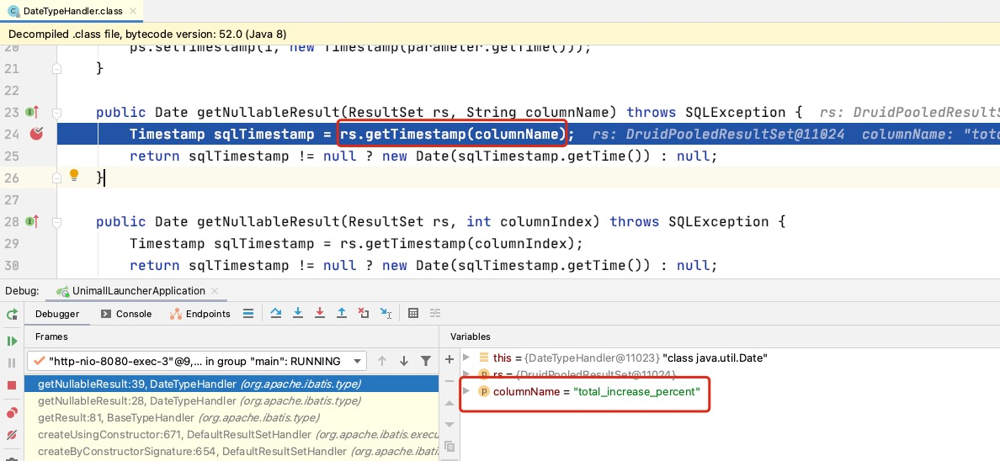
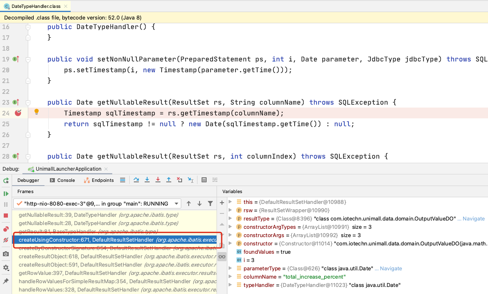
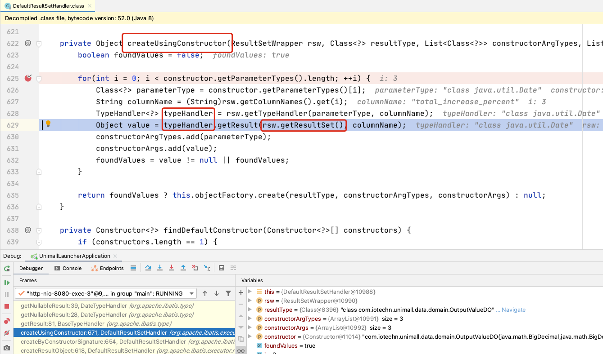
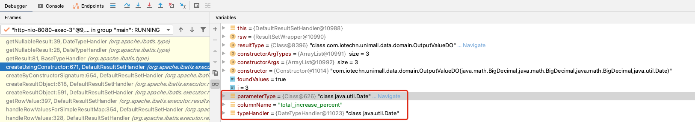
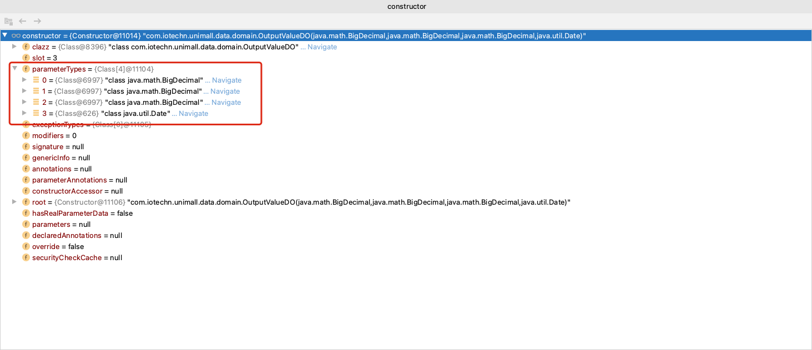
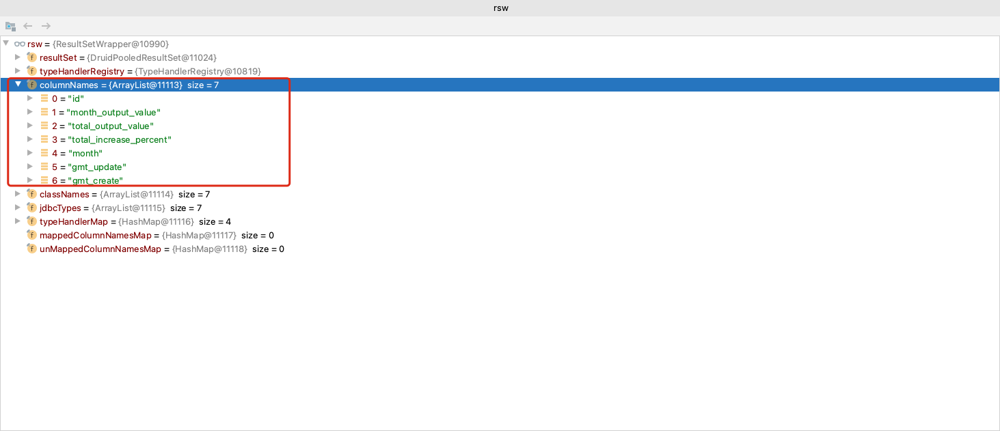
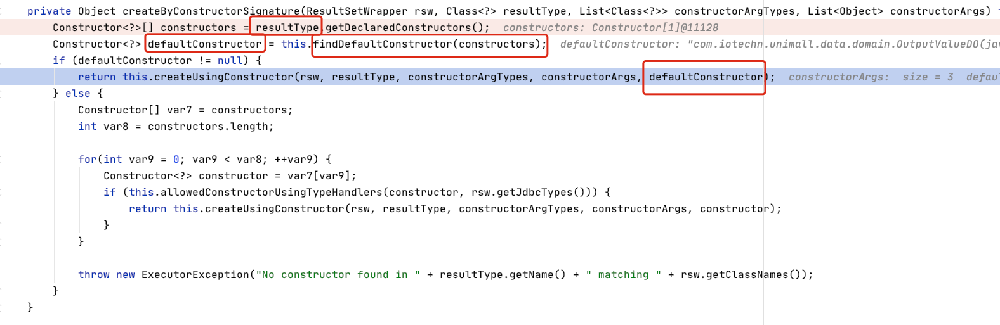
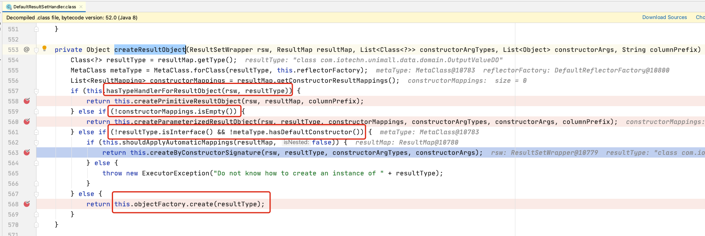

# Mybatis反序列化sql查询结果异常


<!--more-->

## 一、前言
今天调试分页查询代码的时候遇到一个奇葩的问题，该问题后来排查下来跟`lombok`的使用有关。我们在使用`mybatis`或者`mybatis-plus`的时候一般会定义一个类对应表的每个字段，一个成熟的java程序员喜欢使用`lombok`把代码简洁点。这是大前提，我直接说结论吧：

*实体类最好都加上`@Data`,`@AllArgsConstructor`,`@NoArgsConstructor`才能避免我现在遇到的问题*

## 二、我的问题
我的表:
```sql
create table unimall.industry_output_value
(
	id bigint auto_increment
		primary key,
	month_output_value decimal(20,10) null,
	total_output_value decimal(20,10) null,
	total_increase_percent decimal(20,10) null,
	gmt_create datetime null,
	gmt_update datetime null,
	month datetime null
);
```
我的实体类:
```java
@Data
@TableName("industry_output_value")
@Builder
public class OutputValueDO extends SuperDO {
    private BigDecimal monthOutputValue;
    private BigDecimal totalOutputValue;
    private BigDecimal totalIncreasePercent;
    @TableField("`month`")
    private Date month;
}
@Data
public class SuperDO {

    private Long id;

    @TableField("gmt_update")
    private Date gmtUpdate;

    @TableField("gmt_create")
    private Date gmtCreate;

}
```
然后一个普通的`select`查询的时候报了下面这个错误:
```shell
Caused by: org.springframework.dao.DataIntegrityViolationException: Error attempting to get column 'total_increase_percent' from result set.  Cause: java.sql.SQLDataException: Unsupported conversion from DECIMAL to java.sql.Timestamp
; Unsupported conversion from DECIMAL to java.sql.Timestamp; nested exception is java.sql.SQLDataException: Unsupported conversion from DECIMAL to java.sql.Timestamp
	at org.springframework.jdbc.support.SQLExceptionSubclassTranslator.doTranslate(SQLExceptionSubclassTranslator.java:84) ~[spring-jdbc-5.2.4.RELEASE.jar:5.2.4.RELEASE]
	at org.springframework.jdbc.support.AbstractFallbackSQLExceptionTranslator.translate(AbstractFallbackSQLExceptionTranslator.java:72) ~[spring-jdbc-5.2.4.RELEASE.jar:5.2.4.RELEASE]
	at org.springframework.jdbc.support.AbstractFallbackSQLExceptionTranslator.translate(AbstractFallbackSQLExceptionTranslator.java:81) ~[spring-jdbc-5.2.4.RELEASE.jar:5.2.4.RELEASE]
	at org.mybatis.spring.MyBatisExceptionTranslator.translateExceptionIfPossible(MyBatisExceptionTranslator.java:88) ~[mybatis-spring-2.0.3.jar:2.0.3]
	at org.mybatis.spring.SqlSessionTemplate$SqlSessionInterceptor.invoke(SqlSessionTemplate.java:440) ~[mybatis-spring-2.0.3.jar:2.0.3]
	at com.sun.proxy.$Proxy84.selectList(Unknown Source) ~[na:na]
  ...
Caused by: java.sql.SQLDataException: Unsupported conversion from DECIMAL to java.sql.Timestamp
	...
	at org.apache.ibatis.type.DateTypeHandler.getNullableResult(DateTypeHandler.java:39) ~[mybatis-3.5.3.jar:3.5.3]
	at org.apache.ibatis.type.DateTypeHandler.getNullableResult(DateTypeHandler.java:28) ~[mybatis-3.5.3.jar:3.5.3]
	at org.apache.ibatis.type.BaseTypeHandler.getResult(BaseTypeHandler.java:81) ~[mybatis-3.5.3.jar:3.5.3]
  ...
Caused by: com.mysql.cj.exceptions.DataConversionException: Unsupported conversion from DECIMAL to java.sql.Timestamp
	at com.mysql.cj.result.DefaultValueFactory.unsupported(DefaultValueFactory.java:47) ~[mysql-connector-java-8.0.15.jar:8.0.15]
	...
```
可以看到异常很奇怪，我的`total_increase_percent`明明是`BigDecimal`，为何要被反序列化为`java.util.Date`呢？\
后面修改为如下代码就正常了:
```java
@Data
@TableName("industry_output_value")
@Builder
@AllArgsConstructor
@NoArgsConstructor
public class OutputValueDO extends SuperDO {
    private BigDecimal monthOutputValue;
    private BigDecimal totalOutputValue;
    private BigDecimal totalIncreasePercent;
    @TableField("`month`")
    private Date month;
}
```
## 二、问题排查
  1. ### 首先定位到问题出现在哪里
      
    由于 `columnName`是`total_increase_percent`，该列不是`timestamp`，类型不一致，所以报异常。所以要看卡`rs`是如何获取到的以及为何使用了`org.apache.ibatis.type.DateTypeHandler`转换该字段。
  2. ### `org.apache.ibatis.type.DateTypeHandler`的获取
      
    点击调用栈的红框出，跳转到`rs`和`org.apache.ibatis.type.DateTypeHandler`的获取处。
    
    在`createUsingConstructor`方法这里既取到了`typeHandler`，又获取到了`rs`。
    我们可以推断出，应该是通过`columnName`和`parameterType`获取`typeHandler`出错了。\
    我们看看这里的代码:
      ```java
      for(int i = 0; i < constructor.getParameterTypes().length; ++i) {
        Class<?> parameterType = constructor.getParameterTypes()[i];
        String columnName = (String)rsw.getColumnNames().get(i);
        TypeHandler<?> typeHandler = rsw.getTypeHandler(parameterType, columnName);
        Object value = typeHandler.getResult(rsw.getResultSet(), columnName);
        ...
      }
      ```
      看看`parameterType`,`columnName`,`typeHandler`三个值的类型：
      
    ok,这几个值都吻合了，根据代码`1-3行`我们看出`parameterType`和`columnName`没对上导致的。这里可以推断出`constructor`出现了问题，为啥不怀疑是`columnName`出现了问题了呢？因为`rsw`是获取到sql返回结果构造的，是`mybatis`的代码，大概率不会出现问题。
  3. ### `constructor`分析
      这是`constructor`的`parameterTypes`:
      
      这里出现了4个字段，但是没有`id`, `gmtUpdate`,`gmtCreate`这几个字段，而看看`rsw`的`columnNames`的值：
      
      这里却多了`id`, `gmtUpdate`,`gmtCreate`这几列，问题有进一步定位到了，原来是构造器的字段和`rsw`的`columnNames`不一一对应导致的。可以从上面代码`for`循环得知，都是根据索引一一获取，这里个数都对不上，肯定有问题了。\
      在这里基本上已经定位到问题了，就是构造器只接受了3个参数导致的。
  4. ### 如何获取到的`constructor`
      把方法栈在往上移一个，就能找到`constructor`的具体获取处：
    
    `resultType`就是我的实体类，`defaultConstructor`通过`findDefaultConstructor`获取到，这个方法就不细看了，里面逻辑就是：如果只有一个构造器，那就使用该构造器，获取寻找被标记了`AutomapConstructor`注解的构造器。由于`@Data`注解只能生成一个构造器`OutputValueDO(java.math.BigDecimal,java.math.BigDecimal,java.math.BigDecimal,java.util.Date)`，没有`id`, `gmtUpdate`,`gmtCreate`。 \
    此时就有一个解决方案了，去掉`@Data`，自己写一个完整的构造器，包括继承的所有字段，但是这样是不太好的，从上面`for`循环代码可知，要数据库的表的列的顺序要和实体类的构造器的参数的顺序一致，不然还是出现问题。那就在往上个方法栈看看为什么使用了该处理逻辑，印象中的`mybatis`没这么坑。
   5. ### 更优雅的解决方案
      再往上到上一个方法栈，   `createResultObject`方法就找到了正主。
      
      由于`!resultType.isInterface() && !metaType.hasDefaultConstructor()`判断为真就走到了通过构造器反射得到结果的逻辑。接下来分别分析这个 `if...else...`
      - `hasTypeHandlerForResultObject`明显我们没有定义自己的`typeHandler`，故忽略
      - `constructorMappings`表示在`mapper.xml`中定义了实体类的字段和表字段的映射关系，但是我们没有定义，忽略
      - 我的实体类`OutputValueDO`不是接口，并且没有无参构造器，我的代码正好适合这个判断，所以我要想办法是这个判断为假。
      - 最后一个就是默认的，我要改成走到这个方法来。
    
      解决方案方向：加个默认构造器。加`@NoArgsConstructor`即可解决，该注解就能生成无参构造器，由于我加了`@Builder`，所以我还必须加`@AllArgsConstructor`，稳了，解决了。
    
## 三、总结
我一般使用`lombok`最好加上这几个注解：
```java
@Data
@Builder
@AllArgsConstructor
@NoArgsConstructor
```
但是这个代码一开始不是我写的，而且该实体类没有继承的话也不会出问题，巧了。以前也看过`mybatis`的代码，但是没有翻过映射这块。今天再一次体味到了`mybatis`的代码：真正牛的代码不需要注释。很容易就找到了问题。


