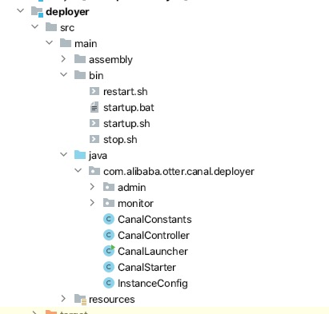
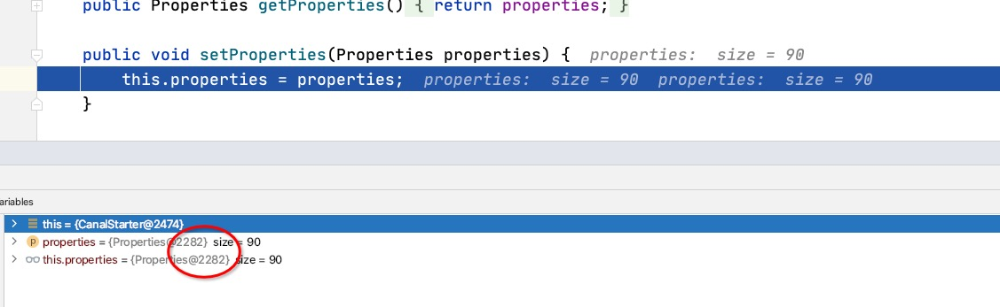
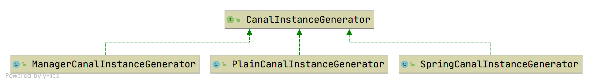
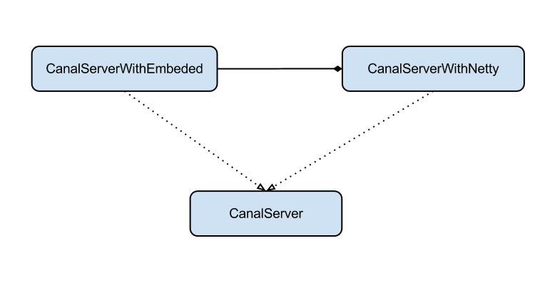
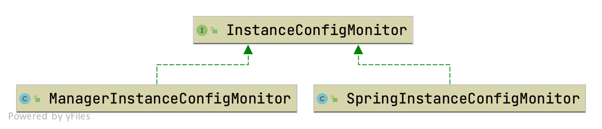

# 闲聊 canal | deployer 模块


<!--more-->

## 一、前言

canal 有两种使用方式：1、独立部署 2、内嵌到应用中（比如 otter 里面使用 canal）。 deployer模块主要用于独立部署canal server。

## 二、基本内容

### 2.1 结构



- `CanalLauncher` deployer 源码的切入点，是项目的启动入口。
- `CanalController` 真正执行逻辑的部分，核心。

### 2.2 依赖和功能

#### 2.2.1 依赖

```xml
        <dependency>
            <groupId>com.alibaba.otter</groupId>
            <artifactId>canal.server</artifactId>
            <version>${project.version}</version>
        </dependency>

        <!-- 这里指定runtime的metrics provider-->
        <dependency>
            <groupId>com.alibaba.otter</groupId>
            <artifactId>canal.prometheus</artifactId>
            <version>${project.version}</version>
            <scope>runtime</scope>
        </dependency>
```

- 就是对 server 的包装，让它能够稳定的使用
- prometheus 是当下和流行的监控体系，后续对接篇幅里面展开。

#### 2.2.2 功能

1、读取canal,properties配置文件

2、启动canal server，监听canal client的请求

3、启动canal instance，连接mysql数据库，伪装成slave，解析binlog

4、在canal的运行过程中，监听配置文件的变化

## 三、代码分析

### 2.3.1 入口 CanalLauncher

#### 2.3.1.1 代码

```java
public class CanalLauncher {
  
    public static void main(String[] args) {
        try {
            // ... -- 指定本地配置
            String conf = System.getProperty("canal.conf", "classpath:canal.properties");
            Properties properties = new Properties();
            if (conf.startsWith(CLASSPATH_URL_PREFIX)) {
                conf = StringUtils.substringAfter(conf, CLASSPATH_URL_PREFIX);
                properties.load(CanalLauncher.class.getClassLoader().getResourceAsStream(conf));
            } else {
                properties.load(new FileInputStream(conf));
            }
          	// -- 加载配置文件
            final CanalStarter canalStater = new CanalStarter(properties);                    	
            String managerAddress = CanalController.getProperty(properties, CanalConstants.CANAL_ADMIN_MANAGER);
            if (StringUtils.isNotEmpty(managerAddress)) {
								// ...              
            } else {
                canalStater.setProperties(properties);              
            }
          
            canalStater.start();
          	// -- JVM 钩子
            runningLatch.await();
            executor.shutdownNow();          
          	// ...
        }
      // ...
}
```

#### 2.3.1.2 分析

##### 2.3.1.2.1 指定本地配置

- 配置文件 `canal.properties`
- 可以通过 `anal.conf` 去指定自己的名称，比如指定官方提供的 `canal_local.properties`

##### 2.3.1.2.2 加载配置文件

- 如果是远程管理的，那么就和远程交互
  - 请求远端地址拉取配置，和本地配置合并
  - 会创建一个定时的线程池拉取 admin 配置上的配置，如果变化了就停止 `canalStater`，重新设置属性后再启动。
- 不是远程管理的，那么就把属性设置进去。不过这里 else 下的属性设置是不需要的，重复设置了



##### 2.3.1.2.3 JVM 钩子

- 当 JVM 关闭会停止 canal，在 `com.alibaba.otter.canal.deployer.CanalStarter#start` 的 `controller.stop()` 里面

```java
shutdownThread = new Thread(() -> {
    try {
        logger.info("## stop the canal server");
        controller.stop();
        CanalLauncher.runningLatch.countDown();
    } catch (Throwable e) {
        logger.warn("##something goes wrong when stopping canal Server:", e);
    } finally {
        logger.info("## canal server is down.");
    }
});
Runtime.getRuntime().addShutdownHook(shutdownThread);
```

> 通过 CanalStarter 启动，实际上是交给 CanalController 去控制，它是核心，CanalStarter 不再展开。

### 2.3.2 核心 CanalController#构造方法

> 把 CanalLauncher 里面的 properties 加载到了这里

#### 2.3.2.1 整体代码

```java
public CanalController(final Properties properties){
  			// ...
  
        // 初始化全局参数设置 -- 全局配置代码部分详解
        globalInstanceConfig = initGlobalConfig(properties);
        instanceConfigs = new MapMaker().makeMap();
        // 初始化instance config
        initInstanceConfig(properties);
  
  			// ...
  			// 准备canal server -- 准备Server
  			// ...
        String canalWithoutNetty = getProperty(properties, CanalConstants.CANAL_WITHOUT_NETTY);
        if (canalWithoutNetty == null || "false".equals(canalWithoutNetty)) {
            canalServer = CanalServerWithNetty.instance();
            canalServer.setIp(ip);
            canalServer.setPort(port);
        }  
  
 				// ... -- 借助Zookeeper
        final String zkServers = getProperty(properties, CanalConstants.CANAL_ZKSERVERS);
        if (StringUtils.isNotEmpty(zkServers)) {
            zkclientx = ZkClientx.getZkClient(zkServers);
            // 初始化系统目录
            zkclientx.createPersistent(ZookeeperPathUtils.DESTINATION_ROOT_NODE, true);
            zkclientx.createPersistent(ZookeeperPathUtils.CANAL_CLUSTER_ROOT_NODE, true);
        }  
  			
  			// -- 监听机制
        final ServerRunningData serverData = new ServerRunningData(registerIp + ":" + port);
        ServerRunningMonitors.setServerData(serverData);
        ServerRunningMonitors.setRunningMonitors(MigrateMap.makeComputingMap((Function<String, ServerRunningMonitor>) destination -> {
          	// ...
        }
                                                                             
        // 初始化monitor机制 -- 自动扫描机制
        autoScan = BooleanUtils.toBoolean(getProperty(properties, CanalConstants.CANAL_AUTO_SCAN));
        if (autoScan) {
            // ...
        }                                                                             
}
```

#### 2.3.2.2 全局配置代码

##### 2.3.2.1.1 代码

```java
    private InstanceConfig initGlobalConfig(Properties properties) {
        String adminManagerAddress = getProperty(properties, CanalConstants.CANAL_ADMIN_MANAGER);
        InstanceConfig globalConfig = new InstanceConfig();
        String modeStr = getProperty(properties, CanalConstants.getInstanceModeKey(CanalConstants.GLOBAL_NAME));
        if (StringUtils.isNotEmpty(adminManagerAddress)) {
            // 如果指定了manager地址,则强制适用manager
            globalConfig.setMode(InstanceMode.MANAGER);
        } else if (StringUtils.isNotEmpty(modeStr)) {
            globalConfig.setMode(InstanceMode.valueOf(StringUtils.upperCase(modeStr)));
        }

        String lazyStr = getProperty(properties, CanalConstants.getInstancLazyKey(CanalConstants.GLOBAL_NAME));
        if (StringUtils.isNotEmpty(lazyStr)) {
            globalConfig.setLazy(Boolean.valueOf(lazyStr));
        }

        String managerAddress = getProperty(properties,
            CanalConstants.getInstanceManagerAddressKey(CanalConstants.GLOBAL_NAME));
        if (StringUtils.isNotEmpty(managerAddress)) {
            if (StringUtils.equals(managerAddress, "${canal.admin.manager}")) {
                managerAddress = adminManagerAddress;
            }

            globalConfig.setManagerAddress(managerAddress);
        }

        String springXml = getProperty(properties, CanalConstants.getInstancSpringXmlKey(CanalConstants.GLOBAL_NAME));
        if (StringUtils.isNotEmpty(springXml)) {
            globalConfig.setSpringXml(springXml);
        }
      
        instanceGenerator = destination -> {
          	// ...
        };
      	
        return globalConfig;      
    }
```

##### 2.3.2.1.2 globalInstanceConfig 字段

> 全局配置，实际上也是一个 `InstanceConfig` 对象。并且每一个 destination  对应的 InstanceConfig 配置里面都有全局引用的 InstanceConfig。

涉及的配置内容：

```properties
#canal.admin.manager = 127.0.0.1:8089
canal.instance.global.mode = spring
canal.instance.global.lazy = false
canal.instance.global.manager.address = ${canal.admin.manager}
#canal.instance.global.spring.xml = classpath:spring/memory-instance.xml
canal.instance.global.spring.xml = classpath:spring/file-instance.xml
#canal.instance.global.spring.xml = classpath:spring/default-instance.xml
```

- canal.instance.global.mode

每个 instance 都有各自的配置。instance 的配置也可以放在本地，也可以放在远程配置中心里。如果每个 instance 配置都是一样的，就直接配置这个全局的模式。特别是启用了 admin 的话，强制是 `MANAGER`；默认的配置启动 server，是 `SPRING` 模式。目前枚举类 `InstanceMode` 就这两种选择。你在配置文件的模式如 `spring` 会自动给你转大写。

- canal.instance.global.lazy

是否需要延时加载。

- canal.instance.global.manager.address 

配置中心地址，默认会使用 canal.admin.manager 的值，如果有远端的配置必须要有值。

- canal.instance.global.spring.xml

spring配置文件路径。如果 `canal.instance.global.mode=spring`，需要提供此配置项。

补充知识 -- instance 使用 Spring 配置方式：

> canal/deployer/src/main/resources/spring/base-instance.xml

```xml
<!-- properties -->
<bean class="com.alibaba.otter.canal.instance.spring.support.PropertyPlaceholderConfigurer" lazy-init="false">
   <property name="ignoreResourceNotFound" value="true" />
   <property name="systemPropertiesModeName" value="SYSTEM_PROPERTIES_MODE_OVERRIDE"/><!-- 允许system覆盖 -->
   <property name="locationNames">
      <list>
         <value>classpath:canal.properties</value>
         <value>classpath:${canal.instance.destination:}/instance.properties</value>
      </list>
   </property>
</bean>
```

- 这里 instance.properties 的文件完整路径是 `${canal.instance.destination:}/instance.properties`，所以配置文件需要根据文件夹去区分。配置项例子： `canal.destinations = example,example2`，那么在 conf 下创建 example/instance.properties 和 example2/instance.properties

##### 2.3.2.1.3 instanceGenerator 字段

>  类型为 `CanalInstanceGenerator`。在 `initGlobalConfig` 方法中，除了创建了上面的 `globalInstanceConfig` 实例，同时还为字段 `instanceGenerator` 字段进行了赋值。

接口定义：

```java
public interface CanalInstanceGenerator {

    /**
     * 通过 destination 产生特定的 {@link CanalInstance}
     * 
     * @param destination
     * @return
     */
    CanalInstance generate(String destination);
}
```

非常明显，这个字段用于创建 `CanalInstance` 实例。这是 instance 模块中的类，其作用就是为 canal.properties 文件中 `canal.destinations` 配置项列出的每个 destination ，创建一个 `CanalInstance` 实例。



- PlainCanalInstanceGenerator 在旧版本是不存在的，替代了 ManagerCanalInstanceGenerator，你会发现 ManagerCanalInstanceGenerator 已经没有引用在使用了。

分析 instanceGenerator 逻辑：

```java
        instanceGenerator = destination -> {
            InstanceConfig config = instanceConfigs.get(destination);
            if (config == null) {
                throw new CanalServerException("can't find destination:" + destination);
            }

            if (config.getMode().isManager()) {
                PlainCanalInstanceGenerator instanceGenerator = new PlainCanalInstanceGenerator(properties);
                instanceGenerator.setCanalConfigClient(managerClients.get(config.getManagerAddress()));
                instanceGenerator.setSpringXml(config.getSpringXml());
                return instanceGenerator.generate(destination);
            } else if (config.getMode().isSpring()) {
                SpringCanalInstanceGenerator instanceGenerator = new SpringCanalInstanceGenerator();
                instanceGenerator.setSpringXml(config.getSpringXml());
                return instanceGenerator.generate(destination);
            } else {
                throw new UnsupportedOperationException("unknow mode :" + config.getMode());
            }

        };
```

- 找 instance 的配置

instanceConfigs 是一个 Map，Key 是 destination 的名称，Value 是 destination 对应的配置，它是在其它阶段设置进去，后面会提到，这里就是去获取。

- 创建 instanceGenerator （正常都会设置 spring 模式下的 XML 配置）
  - 如果是 `MANAGER`，则会创建 `PlainCanalInstanceGenerator`，并设置和管理端的连接客户端
  - 如果是 `SPRING`，则会创建 `SpringCanalInstanceGenerator`
  - 如果都不是，直接报错。

**SpringCanalInstanceGenerator：**

代码：

```java
public class SpringCanalInstanceGenerator implements CanalInstanceGenerator {
  
  	// ...	
  
		public CanalInstance generate(String destination) {
        synchronized (CanalInstanceGenerator.class) {
            try {
                // 设置当前正在加载的通道，加载spring查找文件时会用到该变量
                System.setProperty("canal.instance.destination", destination);
                this.beanFactory = getBeanFactory(springXml);
                String beanName = destination;
                if (!beanFactory.containsBean(beanName)) {
                    beanName = defaultName;
                }

                return (CanalInstance) beanFactory.getBean(beanName);
            } catch (Throwable e) {
                logger.error("generator instance failed.", e);
                throw new CanalException(e);
            } finally {
                System.setProperty("canal.instance.destination", "");
            }
        }
    }

    private BeanFactory getBeanFactory(String springXml) {
        ApplicationContext applicationContext = new ClassPathXmlApplicationContext(springXml);
        return applicationContext;
    }
  
  	// ...
  
}
```

- 加载 spring 容器

直接用了 `ClassPathXmlApplicationContext` 创建

- 获取 CanalIntance
  - 根据 destination 来查询是否存在这个 bean，比如 example，默认是名称叫 instance 这个 Bean，不过 canal 里面默认的配置都叫 instance。如下：

```xml
<bean id="instance" class="com.alibaba.otter.canal.instance.spring.CanalInstanceWithSpring">
   <property name="destination" value="${canal.instance.destination}" />
   <property name="eventParser">
      <ref bean="eventParser" />
   </property>
   <property name="eventSink">
      <ref bean="eventSink" />
   </property>
   <property name="eventStore">
      <ref bean="eventStore" />
   </property>
   <property name="metaManager">
      <ref bean="metaManager" />
   </property>
   <property name="alarmHandler">
      <ref bean="alarmHandler" />
   </property>
       <property name="mqConfig">
           <ref bean="mqConfig" />
       </property>
</bean>
```

这个就是 `CanalInstance` 的实现类，在 instance 篇幅展开。

**PlainCanalInstanceGenerator：**

代码：

```java
public class PlainCanalInstanceGenerator implements CanalInstanceGenerator {
		
  	// ...
		
    private Properties             canalConfig;

    public PlainCanalInstanceGenerator(Properties canalConfig){
        this.canalConfig = canalConfig;
    }

    public CanalInstance generate(String destination) {
        synchronized (CanalInstanceGenerator.class) {
            try {
                PlainCanal canal = canalConfigClient.findInstance(destination, null);
                if (canal == null) {
                    throw new CanalException("instance : " + destination + " config is not found");
                }
                Properties properties = canal.getProperties();
                // merge local
                properties.putAll(canalConfig);

                // 设置动态properties,替换掉本地properties
                com.alibaba.otter.canal.instance.spring.support.PropertyPlaceholderConfigurer.propertiesLocal.set(properties);
                // 设置当前正在加载的通道，加载spring查找文件时会用到该变量
                System.setProperty("canal.instance.destination", destination);
                this.beanFactory = getBeanFactory(springXml);
                String beanName = destination;
                if (!beanFactory.containsBean(beanName)) {
                    beanName = defaultName;
                }

                return (CanalInstance) beanFactory.getBean(beanName);
            } catch (Throwable e) {
                logger.error("generator instance failed.", e);
                throw new CanalException(e);
            } finally {
                System.setProperty("canal.instance.destination", "");
            }
        }
    }
  
    private BeanFactory getBeanFactory(String springXml) {
        ApplicationContext applicationContext = new ClassPathXmlApplicationContext(springXml);
        return applicationContext;
    }
  
}
```

- 和 `SpringCanalInstanceGenerator` 一样加载 spring 容器。
- `PlainCanal canal = canalConfigClient.findInstance(destination, null);` 来查询远端的配置，比如来自 admin 的配置。加载到配置处理后设置到 ThreadLocal 的线程专属的配置里面。

##### 2.3.2.1.4 instanceConfigs 字段

代码：

```java
private void initInstanceConfig(Properties properties) {
    String destinationStr = getProperty(properties, CanalConstants.CANAL_DESTINATIONS);
    String[] destinations = StringUtils.split(destinationStr, CanalConstants.CANAL_DESTINATION_SPLIT);

    for (String destination : destinations) {
        InstanceConfig config = parseInstanceConfig(properties, destination);
        InstanceConfig oldConfig = instanceConfigs.put(destination, config);

        if (oldConfig != null) {
            logger.warn("destination:{} old config:{} has replace by new config:{}", destination, oldConfig, config);
        }
    }
}
```

- 获取 `canal.destinations` 配置，用 `,` 分隔
- 针对每一个 destinations 解析成每一个 instance 的配置，然后设置到字段 `instanceConfigs`

涉及到的配置：

> e.g: canal.destinations = example

```properties
canal.instance.example.mode = 
canal.instance.example.lazy = 
canal.instance.example.manager.address = 
canal.instance.example.spring.xml = 
```

- 这份配置是针对单个 instance 的，如果存在会覆盖全局的配置

**parseInstanceConfig 方法**

代码：

```java
    private InstanceConfig parseInstanceConfig(Properties properties, String destination) {
        String adminManagerAddress = getProperty(properties, CanalConstants.CANAL_ADMIN_MANAGER);
        InstanceConfig config = new InstanceConfig(globalInstanceConfig);
        String modeStr = getProperty(properties, CanalConstants.getInstanceModeKey(destination));
        if (StringUtils.isNotEmpty(adminManagerAddress)) {
            // 如果指定了manager地址,则强制适用manager
            config.setMode(InstanceMode.MANAGER);
        } else if (StringUtils.isNotEmpty(modeStr)) {
            config.setMode(InstanceMode.valueOf(StringUtils.upperCase(modeStr)));
        }

        String lazyStr = getProperty(properties, CanalConstants.getInstancLazyKey(destination));
        if (!StringUtils.isEmpty(lazyStr)) {
            config.setLazy(Boolean.valueOf(lazyStr));
        }

        if (config.getMode().isManager()) {
            String managerAddress = getProperty(properties, CanalConstants.getInstanceManagerAddressKey(destination));
            if (StringUtils.isNotEmpty(managerAddress)) {
                if (StringUtils.equals(managerAddress, "${canal.admin.manager}")) {
                    managerAddress = adminManagerAddress;
                }
                config.setManagerAddress(managerAddress);
            }
        }

        String springXml = getProperty(properties, CanalConstants.getInstancSpringXmlKey(destination));
        if (StringUtils.isNotEmpty(springXml)) {
            config.setSpringXml(springXml);
        }

        return config;
    }
```

- 装配单个 instance 的配置，如果是 `MANAGER` 模式就设置连接的地址信息。

**InstanceConfig 类**

代码：

```java
obalConfig.getMode();
        } else {
            return mode;
        }
    }

    public void setMode(InstanceMode mode) {
        this.mode = mode;
    }

    public String getManagerAddress() {
        if (managerAddress == null && globalConfig != null) {
            return globalConfig.getManagerAddress();
        } else {
            return managerAddress;
        }
    }

    public void setManagerAddress(String managerAddress) {
        this.managerAddress = managerAddress;
    }

    public String getSpringXml() {
        if (springXml == null && globalConfig != null) {
            return globalConfig.getSpringXml();
        } else {
            return springXml;
        }
    }

    public void setSpringXml(String springXml) {
        this.springXml = springXml;
    }

    public String toString() {
        return ToStringBuilder.reflectionToString(this, CanalToStringStyle.DEFAULT_STYLE);
    }

}
```

- Get 方法都是会先拿 instance 的，如果没有会拿全局的配置

#### 2.3.2.3 准备 Server

##### 2.3.2.3.1 代码

```java
        // 准备canal server
        ip = getProperty(properties, CanalConstants.CANAL_IP);
        registerIp = getProperty(properties, CanalConstants.CANAL_REGISTER_IP);
        port = Integer.valueOf(getProperty(properties, CanalConstants.CANAL_PORT, "11111"));
        adminPort = Integer.valueOf(getProperty(properties, CanalConstants.CANAL_ADMIN_PORT, "11110"));
        embededCanalServer = CanalServerWithEmbedded.instance();
        embededCanalServer.setCanalInstanceGenerator(instanceGenerator);// 设置自定义的instanceGenerator
        int metricsPort = Integer.valueOf(getProperty(properties, CanalConstants.CANAL_METRICS_PULL_PORT, "11112"));
        embededCanalServer.setMetricsPort(metricsPort);

        this.adminUser = getProperty(properties, CanalConstants.CANAL_ADMIN_USER);
        this.adminPasswd = getProperty(properties, CanalConstants.CANAL_ADMIN_PASSWD);
        embededCanalServer.setUser(getProperty(properties, CanalConstants.CANAL_USER));
        embededCanalServer.setPasswd(getProperty(properties, CanalConstants.CANAL_PASSWD));

        String canalWithoutNetty = getProperty(properties, CanalConstants.CANAL_WITHOUT_NETTY);
        if (canalWithoutNetty == null || "false".equals(canalWithoutNetty)) {
            canalServer = CanalServerWithNetty.instance();
            canalServer.setIp(ip);
            canalServer.setPort(port);
        }
```

- 这里开始用到了 server，属于 server 模块。

涉及的配置：

```properties
# tcp bind ip
canal.ip =
# register ip to zookeeper
canal.register.ip =
canal.port = 11111
canal.metrics.pull.port = 11112
# canal instance user/passwd
# canal.user = canal
# canal.passwd = E3619321C1A937C46A0D8BD1DAC39F93B27D4458

# canal admin config
#canal.admin.manager = 127.0.0.1:8089
canal.admin.port = 11110
canal.admin.user = admin
canal.admin.passwd = 4ACFE3202A5FF5CF467898FC58AAB1D615029441
```

- canal.ip（canal 监听的 IP） 和 canal.register.ip 都会自动识别
- canal.admin.* 配置是用来和 manager 连接的时候身份认证的

##### 2.3.2.3.2 server 概览



官方说法：

server代表了一个canal的运行实例，为了方便组件化使用，特意抽象了Embeded(嵌入式) / Netty(网络访问)的两种实现

- Embeded : 对latency和可用性都有比较高的要求，自己又能hold住分布式的相关技术(比如failover)
- Netty : 基于netty封装了一层网络协议，由canal server保证其可用性，采用的pull模型，当然latency会稍微打点折扣，不过这个也视情况而定。(阿里系的notify和metaq，典型的push/pull模型，目前也逐步的在向pull模型靠拢，push在数据量大的时候会有一些问题)

> 此处引用来自[田守枝](http://www.tianshouzhi.com/)： 说白了，就是我们可以不必独立部署canal server。在应用直接使用CanalServerWithEmbedded直连mysql数据库。如果觉得自己的技术hold不住相关代码，就独立部署一个canal server，使用canal提供的客户端，连接canal server获取binlog解析后数据。而CanalServerWithNetty是在CanalServerWithEmbedded的基础上做的一层封装，用于与客户端通信。  
>
> 在独立部署canal server时，Canal客户端发送的所有请求都交给CanalServerWithNetty处理解析，解析完成之后委派给了交给CanalServerWithEmbedded进行处理。因此CanalServerWithNetty就是一个马甲而已。CanalServerWithEmbedded才是核心。

CanalController 拥有下面两个字段：

```java
private CanalServerWithEmbedded                  embededCanalServer;
private CanalServerWithNetty                     canalServer;
```

只有 ip 和 port 被设置到了 canalServer，详细内容会在  server 章节展开。

#### 2.3.2.4 借助 Zookeeper

##### 2.3.2.4.1 代码

```java
final String zkServers = getProperty(properties, CanalConstants.CANAL_ZKSERVERS);
if (StringUtils.isNotEmpty(zkServers)) {
    zkclientx = ZkClientx.getZkClient(zkServers);
    // 初始化系统目录
    zkclientx.createPersistent(ZookeeperPathUtils.DESTINATION_ROOT_NODE, true);
    zkclientx.createPersistent(ZookeeperPathUtils.CANAL_CLUSTER_ROOT_NODE, true);
}
```

- canal 利用 zookeeper 来做高可用和存储偏移量等信息，利用了 zookeeper 的分布式特性。canal 里面 `ZkClientx` 就是对 zookeeper 操作的封装，继承自 ZkClient，这个包现在用的也比较少了。

- 如果你配置了 zk 的地址，那么会创建如下的永久地址
  - /otter/canal/destinations
  - /otter/canal/cluster

#### 2.3.2.5 监听机制

##### 2.3.2.5.1 代码

```java
        final ServerRunningData serverData = new ServerRunningData(registerIp + ":" + port);
        ServerRunningMonitors.setServerData(serverData);
        ServerRunningMonitors.setRunningMonitors(MigrateMap.makeComputingMap((Function<String, ServerRunningMonitor>) destination -> {
            runningMonitor.setDestination(destination);
            runningMonitor.setListener(new ServerRunningListener() {
              	// ...
            };
            if (zkclientx != null) {
                runningMonitor.setZkClient(zkclientx);
            }
            // 触发创建一下cid节点
            runningMonitor.init();
            return runningMonitor;                                       
        }));
```

首先看清楚几个对象，`ServerRunningMonitors`，`ServerRunningMonitor`，`ServerRunningData`，其中 `ServerRunningMonitors` 是来管理一堆的 `ServerRunningMonitor` 的， 而 `ServerRunningMonitor` 是对 `CanalInstance` 监控的。`ServerRunningData` 对应服务端的数据，和 ZK 存储的一致 。

##### 2.3.2.5.2 ServerRunningMonitors

代码：

```java
public class ServerRunningMonitors {

    private static ServerRunningData serverData;
    private static Map               runningMonitors; // <String,
                                                      // ServerRunningMonitor>

    public static ServerRunningData getServerData() {
        return serverData;
    }

    public static Map<String, ServerRunningMonitor> getRunningMonitors() {
        return runningMonitors;
    }

    public static ServerRunningMonitor getRunningMonitor(String destination) {
        return (ServerRunningMonitor) runningMonitors.get(destination);
    }

    public static void setServerData(ServerRunningData serverData) {
        ServerRunningMonitors.serverData = serverData;
    }

    public static void setRunningMonitors(Map runningMonitors) {
        ServerRunningMonitors.runningMonitors = runningMonitors;
    }

}
```

setRunningMonitors 方法：

设置一个 Map，Key 是 destination，比如 example，Value 是 instance 对应的 `ServerRunningMonitor`。代码里面使用到了 `MigrateMap.makeComputingMap`，这个是依赖 `guava` 实现。

测试 `MigrateMap.makeComputingMap`：

```java
    class King {
        private String name;

        public King(String name) {
            this.name = name;
        }

        public String getName() {
            return name;
        }

        public void setName(String name) {
            this.name = name;
        }
    }

    @Test
    public void testBase() {
        Map<String, King> map = MigrateMap.makeComputingMap(input -> new King(input));
        King k = map.get("李白");
        Assert.assertNotNull(k);
        Assert.assertEquals(k, map.get("李白"));
    }
```

如果第一次对象不存在，会创建对象，但是如果对象已经存在了，则直接获取。这个逻辑和 go 语言中的 `pool` 用法一样。

底下调用的核心类： `com.google.common.cache.LocalCache.Segment#lockedGetOrLoad`，看名字的意思就是获取或者加载，有兴趣的同学自行阅读。

回到代码，这里的意思就是如果 destination 对应的 ServerRunningMonitor 不存在，则创建一个 `ServerRunningMonitor`，创建逻辑就是那一堆未贴出来的代码。

##### 2.3.2.5.3 CanalController 中创建 ServerRunningMonitor

代码：

```java
            ServerRunningMonitor runningMonitor = new ServerRunningMonitor(serverData);
            runningMonitor.setDestination(destination);
            runningMonitor.setListener(new ServerRunningListener() {
								// ...
            });
            if (zkclientx != null) {
                runningMonitor.setZkClient(zkclientx);
            }
            // 触发创建一下cid节点
            runningMonitor.init();
            return runningMonitor;
```

- 根据 serverData 创建 `ServerRunningMonitor`
- 设置 destination 
- 设置 listener
- 如果 ZK 配置不为空，就设置  zkClient
- 最后初始化

ServerRunningListener分析：

- processActiveEnter 方法，触发现在轮到自己做为active，需要载入上一个active的上下文数据

```java
                public void processActiveEnter() {
                    try {
                        MDC.put(CanalConstants.MDC_DESTINATION, String.valueOf(destination));
                        embededCanalServer.start(destination);
                        if (canalMQStarter != null) {
                            canalMQStarter.startDestination(destination);
                        }
                    } finally {
                        MDC.remove(CanalConstants.MDC_DESTINATION);
                    }
                }
```

每个 destination 对应的 CanalInstance 是通过 embededCanalServer 的 start 方法启动的

- processActiveExit 方法，触发一下当前active模式失败

```java
                public void processActiveExit() {
                    try {
                        MDC.put(CanalConstants.MDC_DESTINATION, String.valueOf(destination));
                        if (canalMQStarter != null) {
                            canalMQStarter.stopDestination(destination);
                        }
                        embededCanalServer.stop(destination);
                    } finally {
                        MDC.remove(CanalConstants.MDC_DESTINATION);
                    }
                }
```

通过 embededCanalServer 的 stop 方法来暂停 instance

- processStart 方法，启动时回调做点事情

```java
                public void processStart() {
                    try {
                        if (zkclientx != null) {
                            final String path = ZookeeperPathUtils.getDestinationClusterNode(destination,
                                registerIp + ":" + port);
                            initCid(path);
                            zkclientx.subscribeStateChanges(new IZkStateListener() {

                                public void handleStateChanged(KeeperState state) throws Exception {

                                }

                                public void handleNewSession() throws Exception {
                                    initCid(path);
                                }

                                @Override
                                public void handleSessionEstablishmentError(Throwable error) throws Exception {
                                    logger.error("failed to connect to zookeeper", error);
                                }
                            });
                        }
                    } finally {
                        MDC.remove(CanalConstants.MDC_DESTINATION);
                    }
                }
```

如果有 zkclientx，那么会去创建 `/otter/canal/destinations/{0}/cluster/{1}`，其0会被destination替换，1会被ip:port替换。

比如：

```bash
ls /otter/canal/destinations/localhost/cluster 
[30.11.176.130:11111]
```

- processStop 方法，关闭时回调做点事情

```java
                public void processStop() {
                    try {
                        MDC.put(CanalConstants.MDC_DESTINATION, String.valueOf(destination));
                        if (zkclientx != null) {
                            final String path = ZookeeperPathUtils.getDestinationClusterNode(destination,
                                registerIp + ":" + port);
                            releaseCid(path);
                        }
                    } finally {
                        MDC.remove(CanalConstants.MDC_DESTINATION);
                    }
                }
```

路径和 processStart 中一致，只是这个是 server 停止的时候删除。

init 方法：

```java
public void init() {
    processStart();
}
```

就是调用了  listener 的 processStart 方法。

##### 2.3.2.5.4 ServerRunningMonitor#start

上一节创建的时候 listener  有四个方法，那么它们是在哪里调用到的？

代码：

```java
public class ServerRunningMonitor extends AbstractCanalLifeCycle {

		// ...

    public synchronized void start() {
        super.start();
        try {
            processStart();
            if (zkClient != null) {
                // 如果需要尽可能释放instance资源，不需要监听running节点，不然即使stop了这台机器，另一台机器立马会start
                String path = ZookeeperPathUtils.getDestinationServerRunning(destination);
                zkClient.subscribeDataChanges(path, dataListener);

                initRunning();
            } else {
                processActiveEnter();// 没有zk，直接启动
            }
        } catch (Exception e) {
            logger.error("start failed", e);
            // 没有正常启动，重置一下状态，避免干扰下一次start
            stop();
        }
      
    }
}
```

- 调用 listener 的 processStart，即前面提到的如果有 zk 配置会创建 zk 地址

- zkClient 存在

  - 则找 zookeeper 路径 `/otter/canal/destinations/{0}/running`，其中 0 会被 destination 替换

  - watch 数据变化（在集群模式下，可能会有多个 canal server 共同处理同一个 destination，

    在某一时刻，只能由一个 canal server 进行处理，处理这个 destination 的 canal server 进入 running 状态，其他 canal server 进入 standby 状态。）

  - HA模式初始化运行

运行起来的例子：

```bash
[zk: localhost:2181(CONNECTED) 19] get /otter/canal/destinations/localhost/running
{"active":true,"address":"30.11.176.130:11111"}
cZxid = 0x1a27
ctime = Mon Jan 04 15:44:01 CST 2021
mZxid = 0x1a27
mtime = Mon Jan 04 15:44:01 CST 2021
pZxid = 0x1a27
cversion = 0
dataVersion = 0
aclVersion = 0
ephemeralOwner = 0x100008084260006
dataLength = 47
numChildren = 0
```

- zkClient 不存在，则直接触发 listener 的 processActiveEnter，即去启动 CanalInstance。

HA模式初始化运行：

```java
private void initRunning() {
    if (!isStart()) {
        return;
    }

    String path = ZookeeperPathUtils.getDestinationServerRunning(destination);
    // 序列化
    byte[] bytes = JsonUtils.marshalToByte(serverData);
    try {
        mutex.set(false);
        zkClient.create(path, bytes, CreateMode.EPHEMERAL);
        activeData = serverData;
        processActiveEnter();// 触发一下事件
        mutex.set(true);
        release = false;
    } catch (ZkNodeExistsException e) {
        bytes = zkClient.readData(path, true);
        if (bytes == null) {// 如果不存在节点，立即尝试一次
            initRunning();
        } else {
            activeData = JsonUtils.unmarshalFromByte(bytes, ServerRunningData.class);
        }
    } catch (ZkNoNodeException e) {
        zkClient.createPersistent(ZookeeperPathUtils.getDestinationPath(destination), true); // 尝试创建父节点
        initRunning();
    }
}
```

- 会把当前节点的数据序列化后直接向 /otter/canal/destinations/{0}/running（其中 0 会被 destination 替换）创建数据，抢占
- 抢占失败，捕获 ZkNodeExistsException 
  - 根据 path 从 zk 中获取当前是哪一个 canal server 创建了当前 canal instance 的相关信息。第二个参数true，表示的是，如果这个path不存在，则返回null。
  - 如果不存在，则立刻再尝试一次
  - 如果存在，则把激活的 instance 存入 activeData
- 如果是节点不存在，则创建父节点后继续抢占

> initRunning 方法内部只有在尝试在 zk 中创建节点成功后，才会去调用 listener 的 processActiveEnter 方法来真正启动 destination 对应的 canal instance，这是 canal HA 方式启动的核心。

[可以查看之前的准备篇-高可用]()

官方高可用的三个点里面其中前面两个点上面部分已经能够满足，另外一个点：如果另一个 server 挂了，当前 server 的 instance 是如何从 standBy 变到 running 的？会在下面的构造方法部分会讲到。

大家可能会有疑问，目前提到的 `ServerRunningMonitor#start` 方法它是哪里被调用到的呢？可以翻阅后面 `CanalController#start` 部分。

##### 2.3.2.5.5 ServerRunningMonitor 构造方法

首先回顾下前面 start 方法里面有这么两行代码：

```java
String path = ZookeeperPathUtils.getDestinationServerRunning(destination);
zkClient.subscribeDataChanges(path, dataListener);
```

其中 dataListener 类型是 `IZkDataListener`，这是 zkclient 客户端提供的接口，定义如下：

```java
public interface IZkDataListener {

    public void handleDataChange(String dataPath, Object data) throws Exception;

    public void handleDataDeleted(String dataPath) throws Exception;
}
```

根据名称也能猜到，这两个方法用来监听 zookeeper 节点的变动，一个是数据变化，一个是数据删除。在 zkclient  包里面，有个 `ConcurrentHashMap` 给每一个 path 存储了 Set 集合的 `IZkDataListener` 。

而这个 dataListener 是在构造方法中创建的：

```java
public ServerRunningMonitor(){
    // 创建父节点
    dataListener = new IZkDataListener() {

        public void handleDataChange(String dataPath, Object data) throws Exception {
            MDC.put("destination", destination);
            ServerRunningData runningData = JsonUtils.unmarshalFromByte((byte[]) data, ServerRunningData.class);
            if (!isMine(runningData.getAddress())) {
                mutex.set(false);
            }

            if (!runningData.isActive() && isMine(runningData.getAddress())) { // 说明出现了主动释放的操作，并且本机之前是active
                releaseRunning();// 彻底释放mainstem
            }

            activeData = (ServerRunningData) runningData;
        }

        public void handleDataDeleted(String dataPath) throws Exception {
            MDC.put("destination", destination);
            mutex.set(false);
            if (!release && activeData != null && isMine(activeData.getAddress())) {
                // 如果上一次active的状态就是本机，则即时触发一下active抢占
                initRunning();
            } else {
                // 否则就是等待delayTime，避免因网络瞬端或者zk异常，导致出现频繁的切换操作
                delayExector.schedule(() -> initRunning(), delayTime, TimeUnit.SECONDS);
            }
        }

    };

}
```

- 数据变化，会把拿到的数据设置为激活数据
  - 如果之前本机是激活状态，则会释放 `releaseRunning`
  - 如果之前本机不是激活状态，设置 `mutex = false`
- 数据删除
  - 如果上一次是本机激活状态，删除了那么本机还是会去抢占的
  - 如果上一次本机不是激活状态，那么会延时去抢占（默认5秒），这个设计是因为网络或zk异常的时候，防止切换过于频繁

#### 2.3.2.6 自动扫描机制

官方的说明：

| 参数名字                 | 参数说明                                                     | 默认值 |
| ------------------------ | ------------------------------------------------------------ | ------ |
| canal.auto.scan          | 开启instance自动扫描 如果配置为true，canal.conf.dir目录下的instance配置变化会自动触发： a. instance目录新增： 触发instance配置载入，lazy为true时则自动启动 b. instance目录删除：卸载对应instance配置，如已启动则进行关闭 c. instance.properties文件变化：reload instance配置，如已启动自动进行重启操作 | true   |
| canal.auto.scan.interval | instance自动扫描的间隔时间，单位秒                           | 5      |

回归到代码：

```java
				// 初始化monitor机制
        autoScan = BooleanUtils.toBoolean(getProperty(properties, CanalConstants.CANAL_AUTO_SCAN));
        if (autoScan) {
            defaultAction = new InstanceAction() {
								// ...
            };

            instanceConfigMonitors = MigrateMap.makeComputingMap(...)          
    		}
```

`canal.auto.scan = true` 才会开启，开启后会创建 defaultAction 和 instanceConfigMonitors。

##### 2.3.2.6.1 defaultAction 

代码：

```java
            defaultAction = new InstanceAction() {

                public void start(String destination) {
                    InstanceConfig config = instanceConfigs.get(destination);
                    if (config == null) {
                        // 重新读取一下instance config
                        config = parseInstanceConfig(properties, destination);
                        instanceConfigs.put(destination, config);
                    }

                    if (!embededCanalServer.isStart(destination)) {
                        // HA机制启动
                        ServerRunningMonitor runningMonitor = ServerRunningMonitors.getRunningMonitor(destination);
                        if (!config.getLazy() && !runningMonitor.isStart()) {
                            runningMonitor.start();
                        }
                    }

                    logger.info("auto notify start {} successful.", destination);
                }

                public void stop(String destination) {
                    // 此处的stop，代表强制退出，非HA机制，所以需要退出HA的monitor和配置信息
                    InstanceConfig config = instanceConfigs.remove(destination);
                    if (config != null) {
                        embededCanalServer.stop(destination);
                        ServerRunningMonitor runningMonitor = ServerRunningMonitors.getRunningMonitor(destination);
                        if (runningMonitor.isStart()) {
                            runningMonitor.stop();
                        }
                    }

                    logger.info("auto notify stop {} successful.", destination);
                }

                public void reload(String destination) {
                    // 目前任何配置变化，直接重启，简单处理
                    stop(destination);
                    start(destination);

                    logger.info("auto notify reload {} successful.", destination);
                }

                @Override
                public void release(String destination) {
                    // 此处的release，代表强制释放，主要针对HA机制释放运行，让给其他机器抢占
                    InstanceConfig config = instanceConfigs.get(destination);
                    if (config != null) {
                        ServerRunningMonitor runningMonitor = ServerRunningMonitors.getRunningMonitor(destination);
                        if (runningMonitor.isStart()) {
                            boolean release = runningMonitor.release();
                            if (!release) {
                                // 如果是单机模式,则直接清除配置
                                instanceConfigs.remove(destination);
                                // 停掉服务
                                runningMonitor.stop();
                                if (instanceConfigMonitors.containsKey(InstanceConfig.InstanceMode.MANAGER)) {
                                    ManagerInstanceConfigMonitor monitor = (ManagerInstanceConfigMonitor) instanceConfigMonitors.get(InstanceConfig.InstanceMode.MANAGER);
                                    Map<String, InstanceAction> instanceActions = monitor.getActions();
                                    if (instanceActions.containsKey(destination)) {
                                        // 清除内存中的autoScan cache
                                        monitor.release(destination);
                                    }
                                }
                            }
                        }
                    }

                    logger.info("auto notify release {} successful.", destination);
                }
            };
```

- start 方法：
  - 先从缓存加载下配置，如果不存在加载一次配置文件
  - 判断 `embededCanalServer` 是否启动，未启动的话会进行 HA 机制的监听启动，这里就调用到了 `ServerRunningMonitor#start` 方法
- stop 方法：
  - instanceConfigs 移除 instance 配置
  - 如果存在的话，调用 `embededCanalServer#stop` 停止 CanalInstance。
  - 停止运行中的 `ServerRunningMonitor`，实际也是停止服务。
- reload 方法：
  - 就是调用停止，启动方法
- release 方法：
  - 如果这个 instance 配置是在的并且监听运行中，那么尝试释放
  - 如果发现没有 zkClient，释放结果是 false，会移除 instanceConfigs 中 instance 配置，暂停监听即停止服务。
  - 清除 ManagerInstanceConfigMonitor 中的缓存。

##### 2.3.2.6.2 instanceConfigMonitors

代码：

```java
            instanceConfigMonitors = MigrateMap.makeComputingMap(mode -> {
                int scanInterval = Integer.valueOf(getProperty(properties,
                    CanalConstants.CANAL_AUTO_SCAN_INTERVAL,
                    "5"));

                if (mode.isSpring()) {
                    SpringInstanceConfigMonitor monitor = new SpringInstanceConfigMonitor();
                    monitor.setScanIntervalInSecond(scanInterval);
                    monitor.setDefaultAction(defaultAction);
                    // 设置conf目录，默认是user.dir + conf目录组成
                    String rootDir = getProperty(properties, CanalConstants.CANAL_CONF_DIR);
                    if (StringUtils.isEmpty(rootDir)) {
                        rootDir = "../conf";
                    }

                    if (StringUtils.equals("otter-canal", System.getProperty("appName"))) {
                        monitor.setRootConf(rootDir);
                    } else {
                        // eclipse debug模式
                        monitor.setRootConf("src/main/resources/");
                    }
                    return monitor;
                } else if (mode.isManager()) {
                    ManagerInstanceConfigMonitor monitor = new ManagerInstanceConfigMonitor();
                    monitor.setScanIntervalInSecond(scanInterval);
                    monitor.setDefaultAction(defaultAction);
                    String managerAddress = getProperty(properties, CanalConstants.CANAL_ADMIN_MANAGER);
                    monitor.setConfigClient(getManagerClient(managerAddress));
                    return monitor;
                } else {
                    throw new UnsupportedOperationException("unknow mode :" + mode + " for monitor");
                }
            });
```

配置内容：

```properties
canal.auto.scan = true
canal.auto.scan.interval = 5

# 扫描的路径
canal.conf.dir = ../conf
```

- 默认是5秒扫描一次
- 根据之前提到过的模式有关
  - SPRING 模式： `SpringInstanceConfigMonitor`
  - MANAGER 模式：`ManagerInstanceConfigMonitor`



监听模式都是实现了接口 `InstanceConfigMonitor`

```java
public interface InstanceConfigMonitor extends CanalLifeCycle {

    void register(String destination, InstanceAction action);

    void unregister(String destination);
}
```

它有两个方法，一个注册，一个取消注册，不过我看了下 `unregister` 压根就没有调用的地方，所以是无法停止的，你只要删除掉不需要的目录即可。而 `register` 也就一处引用，就在下面的 `CanalController#start` 方法中，如果是自动扫描的话会用到。

两个实现类的逻辑相差不大，不再展开分析，它们都是缓存了配置，然后在 `start` 方法里面有监听的逻辑，`SPRING` 模式在一个扫描指定路径下的文件，`MANAGER` 模式通过HTTP请求和 admin 交互，请求是 `/api/v1/config/instances_polling?md5=&ip=&port=`，它也是在下面 `CanalController#start` 被触发。

### 2.3.2 核心 CanalController#start 方法

> 等了好久终于到这个启动方法了，从 com.alibaba.otter.canal.deployer.CanalLauncher#main -- com.alibaba.otter.canal.deployer.CanalStarter#start -- com.alibaba.otter.canal.deployer.CanalController#start

#### 2.3.2.1 代码

```java
    public void start() throws Throwable {
        logger.info("## start the canal server[{}({}):{}]", ip, registerIp, port);
        // 创建整个canal的工作节点
        final String path = ZookeeperPathUtils.getCanalClusterNode(registerIp + ":" + port);
        initCid(path);
        if (zkclientx != null) {
            this.zkclientx.subscribeStateChanges(new IZkStateListener() {

                public void handleStateChanged(KeeperState state) throws Exception {

                }

                public void handleNewSession() throws Exception {
                    initCid(path);
                }

                @Override
                public void handleSessionEstablishmentError(Throwable error) throws Exception {
                    logger.error("failed to connect to zookeeper", error);
                }
            });
        }
        // 优先启动embeded服务
        embededCanalServer.start();
        // 尝试启动一下非lazy状态的通道
        for (Map.Entry<String, InstanceConfig> entry : instanceConfigs.entrySet()) {
            final String destination = entry.getKey();
            InstanceConfig config = entry.getValue();
            // 创建destination的工作节点
            if (!embededCanalServer.isStart(destination)) {
                // HA机制启动
                ServerRunningMonitor runningMonitor = ServerRunningMonitors.getRunningMonitor(destination);
                if (!config.getLazy() && !runningMonitor.isStart()) {
                    runningMonitor.start();
                }
            }

            if (autoScan) {
                instanceConfigMonitors.get(config.getMode()).register(destination, defaultAction);
            }
        }

        if (autoScan) {
            instanceConfigMonitors.get(globalInstanceConfig.getMode()).start();
            for (InstanceConfigMonitor monitor : instanceConfigMonitors.values()) {
                if (!monitor.isStart()) {
                    monitor.start();
                }
            }
        }

        // 启动网络接口
        if (canalServer != null) {
            canalServer.start();
        }
    }
```

- 跳过 canalMQProducer 
- zk 交互，路径是 /otter/canal/cluster/{0}，其中 {0} 是 IP ＋ 端口，会有多次的 `initCid` 去创建这个路径

```bash
[zk: localhost:2181(CONNECTED) 92] ls /otter/canal/cluster
[30.11.176.127:11111]
```

- 启动 embededCanalServer，里面会创建 `canalInstance`，在 server 篇幅展开。
- 如果没启动，HA 机制监听逻辑会再触发一遍（重复代码，可以提成一个方法）

- 如果自动扫描，就会注册变化监听，并且会启动整个配置的监听以及每一个 instance 的监听。
- `CanalServerWithNetty` 模式启动，监听客户端的请求，让客户端能获取到 binlog 的变化。

## 三、总结

- deployer 做了配置的读取，instance 的配置读取方式
- deployer 做了配置的变化监听，做了完整的启动|停止，新增|删除操作
- deployer 确认 server 启动是单机还是集群，集群的话依赖 Zookeeper
- deployer 把 server 拉起来，去监听客户端请求

## 四、参考

[http://www.tianshouzhi.com/api/tutorials/canal/381](http://www.tianshouzhi.com/api/tutorials/canal/381)

[https://github.com/alibaba/canal/wiki/AdminGuide](https://github.com/alibaba/canal/wiki/AdminGuide)

[https://github.com/alibaba/canal/wiki/canal%E4%BB%8B%E7%BB%8D](https://github.com/alibaba/canal/wiki/canal%E4%BB%8B%E7%BB%8D)
