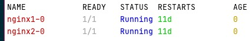

# Go名库欣赏-uitable：终端数据表格展示工具


<!--more-->

## 一、前言
最近发现go用作一个运维工具是真的很好用，我觉得比python好用多了，python的依赖太麻烦了，而go作为运维工具可以直接打包成二进制包，可移植性极好，而且go天生对linux亲和性极强。像k8s的一个强大的运维命令-`kubectl`，打印的数据都是以表格的形式展示，表达能力很强，像实现这种终端表格展示有一个好用的工具-[`uitable`](https://github.com/gosuri/uitable)
## 二、内容
这是我用`kubectl get pods`打印的一个终端界面：
```shell
NAME       READY   STATUS    RESTARTS   AGE
nginx1-0   1/1     Running   0          11d
nginx2-0   1/1     Running   0          11d
```
那么用该该库怎么实现呢？
```go
type pod struct {
	NAME, READY, STATUS, AGE string
	RESTARTS                 int
}

var pods = []pod{
	{"nginx1-0 ", "1/1", "Running", "11d", 0},
	{"nginx2-0", "1/1", "Running", "11d", 0},
}

func main() {
	table := uitable.New()
	table.MaxColWidth = 50

	table.AddRow("NAME", "READY", "STATUS", "RESTARTS", "AGE")
	for _, pod := range pods {
		table.AddRow(pod.NAME, pod.READY, pod.STATUS, pod.AGE, pod.RESTARTS)
	}
	fmt.Println(table)
}
```
执行代码的结果如下:
```shell
NAME            READY   STATUS  RESTARTS        AGE
nginx1-0        1/1     Running 11d             0  
nginx2-0        1/1     Running 11d             0  
```
可以发现基本和k8s的输出一模一样。到这里或许有人会说：就这？

下面给大家展示另外一个功能：改变字体颜色输出。如果你的工具用上这么一个功能，还不能显示出你的逼格吗？当然这里会使用到另外一个库，配合使用才行`github.com/fatih/color`。
修改如下代码：
```go
type pod struct {
	NAME, READY, STATUS, AGE string
	RESTARTS                 int
}

var pods = []pod{
	{"nginx1-0 ", "1/1", "Running", "11d", 0},
	{"nginx2-0", "1/1", "Running", "11d", 0},
}

func main() {
	table := uitable.New()
	table.MaxColWidth = 100
	table.RightAlign(10)

	table.AddRow("NAME", "READY", "STATUS", "RESTARTS", "AGE")
	for _, pod := range pods {
		table.AddRow(color.RedString(pod.NAME), color.WhiteString(pod.READY), color.BlueString(pod.STATUS), color.GreenString(pod.AGE), color.YellowString("%d", pod.RESTARTS))
	}
	fmt.Println(table)
}
```
打印的效果如下：


## 三、总结
经测试，该包可以在`mac`，`linux`和`windows`上都能使用，包括上面演示的不同颜色的字体的包也能跨平台使用。

- 我的微信公众号:


