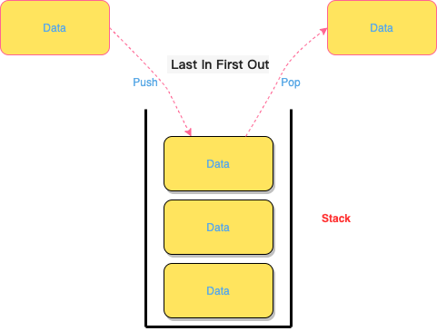
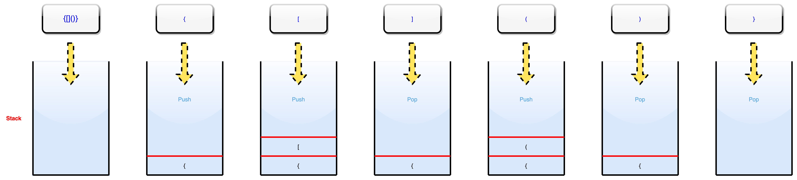

# LeetCode20题笔记


<!--more-->

## 一、题目

- 题目地址 

[https://leetcode-cn.com/problems/valid-parentheses/](https://leetcode-cn.com/problems/valid-parentheses/)

- 题目知识点介绍

这道题目主要是考核[堆栈](https://zh.wikiredia.com/wiki/%E5%A0%86%E6%A0%88)这个数据结构，它是一个先进先出、操作受限的线性表，也称为 **栈**。



- 栈的两种基本的操作

  - 入栈 push： 往栈中最顶端插入数据
  - 出栈 pop： 从栈中删除最顶端的数据

- 栈的实现方式

  - 数组实现，称为顺序栈
  - 链表实现，称为链式栈

## 二、题解

### 2.1 栈实现

第一个版本：

```go
func isValid(s string) bool {
	var stack []byte
	pairs := map[byte]byte{
		')': '(',
		']': '[',
		'}': '{',
	}
	for i := range s {
		if pairs[s[i]] > 0 { // 这里如果没匹配到，是 byte 默认值 0
			if len(stack) == 0 || stack[len(stack)-1] != pairs[s[i]] { // 栈顶 Top() 匹配期望值
				return false
			}
			stack = stack[:len(stack)-1] // 移除栈顶 Pop()
		} else {
			stack = append(stack, s[i])
		}
	}

	return len(stack) == 0
}
```

- 时间复杂度 `O(n)` n 是字符串长度

- 空间复杂度 `O(n+6)` 因为这个题目中就 6 种扩展，空间就和栈中存放的数据有关，也就是和字符串长度有关

小优化：

```go
func isValid(s string) bool {
	if len(s)&1 == 1 {
		return false
	}
	var stack []byte
	pairs := map[byte]byte{
		')': '(',
		']': '[',
		'}': '{',
	}
	for i := range s {
		if pairs[s[i]] > 0 { // 这里如果没匹配到，是 byte 默认值 0
			if len(stack) == 0 || stack[len(stack)-1] != pairs[s[i]] { // 栈顶 Top() 匹配期望值
				return false
			}
			stack = stack[:len(stack)-1] // 移除栈顶 Pop()
		} else {
			stack = append(stack, s[i])
		}
	}

	return len(stack) == 0
}
```

- 如果是奇数肯定不可能是 true

> 执行用时：0 ms, 在所有 Go 提交中击败了100.00%的用户
>
> 内存消耗：2 MB, 在所有 Go 提交中击败了91.93%的用户

栈的操作图：



### 2.2 非栈实现

```go
func isValid(s string) bool {
   var l int
   for ok := true; ok; ok = l != len(s) {
      l = len(s)
      s = strings.ReplaceAll(strings.ReplaceAll(strings.ReplaceAll(s, "()", ""), "{}", ""), "[]", "")
   }
   return len(s) == 0
}
```

- 平均时间复杂度是 $ O^2/2 $，字符串替换是 n，for 循环是 n，所以是 n 平方
- 虽然代码很精简，但是时间和空间复杂度的表现都不是很好

> 执行用时：8 ms, 在所有 Go 提交中击败了7.18%的用户
>
> 内存消耗：7.1 MB, 在所有 Go 提交中击败了5.07%的用户
