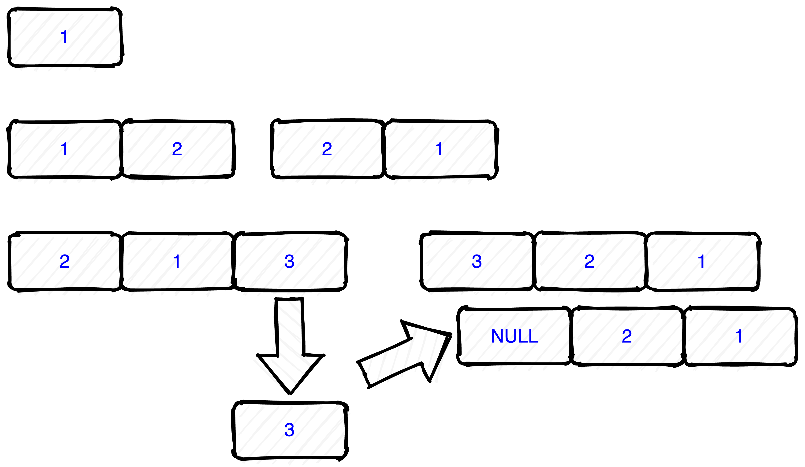

# LeetCode225题笔记


<!--more-->

## 一、题目

### 1.1 题目说明

使用队列实现栈的下列操作：

- push(x) -- 元素 x 入栈
- pop() -- 移除栈顶元素
- top() -- 获取栈顶元素

- empty() -- 返回栈是否为空

注意:

- 你只能使用队列的基本操作-- 也就是 push to back, peek/pop from front, size, 和 is empty 这些操作是合法的。
- 你所使用的语言也许不支持队列。 你可以使用 list 或者 deque（双端队列）来模拟一个队列 , 只要是标准的队列操作即可。
- 你可以假设所有操作都是有效的（例如, 对一个空的栈不会调用 pop 或者 top 操作）。

[leetcode地址](https://leetcode-cn.com/problems/implement-stack-using-queues)

### 1.2 审题

[栈]() 参考之前的笔记。

- 什么是[队列](https://zh.wikipedia.org/wiki/%E9%98%9F%E5%88%97)？

队列是一个 FIFO 先进先出的数据结构。


基本操作和栈类似，称为 出队和入队。

- go 的队列？

直接就用数组去表示。

## 二、题解

### 2.1 两个队列实现

操作图：


代码：

```go
type MyStack struct {
	q1 []int // 这里对应stack数据
	q2 []int // 辅助的
}

/** Initialize your data structure here. */
func Constructor() MyStack {
	return MyStack{
		q1: []int{},
		q2: []int{},
	}
}

/** Push element x onto stack. */
func (this *MyStack) Push(x int) {
	this.q2 = append(this.q2, x)
	for i := 0; i < len(this.q1); i++ {
		this.q2 = append(this.q2, this.q1[i])
	}
	this.q1, this.q2 = this.q2, []int{}
}

/** Removes the element on top of the stack and returns that element. */
func (this *MyStack) Pop() int {
	r := this.Top()
	this.q1 = this.q1[1:]
	return r
}

/** Get the top element. */
func (this *MyStack) Top() int {
	return this.q1[0]
}

/** Returns whether the stack is empty. */
func (this *MyStack) Empty() bool {
	return len(this.q1) == 0
}
```

- 时间复杂度 -- 入栈：$ O(n) $ 出栈 $ O(1) $
- 空间复杂度 $ O(n) $

成绩：

> 执行用时：0 ms, 在所有 Go 提交中击败了100.00%的用户
>
> 内存消耗：1.9 MB, 在所有 Go 提交中击败了68.06%的用户

### 2.2 一个队列实现

操作图：



代码：

```go
type MyStack struct {
	element []int
}

/** Initialize your data structure here. */
func Constructor() MyStack {
	return MyStack{
		element: []int{},
	}
}

/** Push element x onto stack. */
func (this *MyStack) Push(x int) {
	this.element = append(this.element, x)
	if len(this.element) > 1 {
		// 拿出第一个，后面的往后移动
		front := this.element[len(this.element)-1]
		for i := len(this.element) - 1; i > 0; i-- {
			this.element[i] = this.element[i-1]
		}
		this.element[0] = front
	}
}

/** Removes the element on top of the stack and returns that element. */
func (this *MyStack) Pop() int {
	r := this.Top()
	this.element = this.element[1:]
	return r
}

/** Get the top element. */
func (this *MyStack) Top() int {
	return this.element[0]
}

/** Returns whether the stack is empty. */
func (this *MyStack) Empty() bool {
	return len(this.element) == 0
}
```

- 时间复杂度 -- 入栈：$ O(n) $ 出栈  $ O(1) $
- 空间复杂度 $ O(n) $，比双队列要省空间

成绩：

>执行用时：0 ms, 在所有 Go 提交中击败了100.00%的用户
>
>内存消耗：1.9 MB, 在所有 Go 提交中击败了100.00%的用户

### 2.3 发现 LeetCode 你不用队列也能通过

代码：

```go
type MyStack struct {
   element []int
}

/** Initialize your data structure here. */
func Constructor() MyStack {
   return MyStack{
      element: []int{},
   }
}

/** Push element x onto stack. */
func (this *MyStack) Push(x int) {
   this.element = append(this.element, x)
}

/** Removes the element on top of the stack and returns that element. */
func (this *MyStack) Pop() int {
   r := this.Top()
   this.element = this.element[:len(this.element)-1]
   return r
}

/** Get the top element. */
func (this *MyStack) Top() int {
   return this.element[len(this.element)-1]
}

/** Returns whether the stack is empty. */
func (this *MyStack) Empty() bool {
   if this.element != nil && len(this.element) > 0 {
      return false
   }

   return true
}
```

成绩：

> 执行用时：0 ms, 在所有 Go 提交中击败了100.00%的用户
>
> 内存消耗：1.9 MB, 在所有 Go 提交中击败了68.28%的用户

### 2.2 小结

- 题目和[232]()比较类似，未想到实际项目场景
- 建议看看就好

------

[本章的代码连接](https://github.com/cityiron/algorithms/tree/main/leetcode/225-implement-stack-using-queues)
