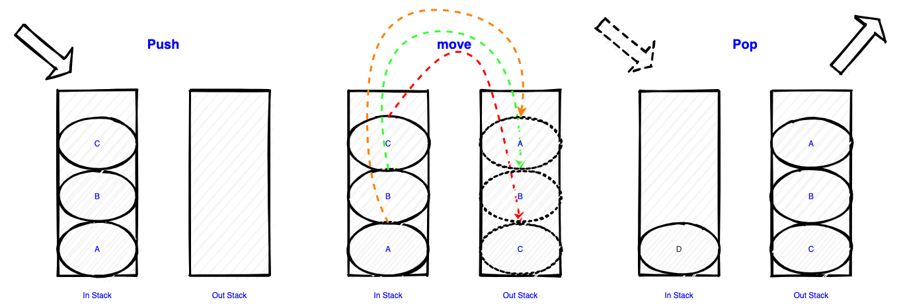

# LeetCode232题笔记


<!--more-->

## 一、题目

### 1.1 题目说明

请你仅使用两个栈实现先入先出队列。队列应当支持一般队列的支持的所有操作（push、pop、peek、empty）：

实现 MyQueue 类：

- void push(int x) 将元素 x 推到队列的末尾

- int pop() 从队列的开头移除并返回元素
- int peek() 返回队列开头的元素
- boolean empty() 如果队列为空，返回 true ；否则，返回 false


说明：

- 你只能使用标准的栈操作 —— 也就是只有 push to top, peek/pop from top, size, 和 is empty 操作是合法的。
- 你所使用的语言也许不支持栈。你可以使用 list 或者 deque（双端队列）来模拟一个栈，只要是标准的栈操作即可。


进阶：

- 你能否实现每个操作均摊时间复杂度为 O(1) 的队列？换句话说，执行 n 个操作的总时间复杂度为 O(n) ，即使其中一个操作可能花费较长时间。


示例：

```
输入：
["MyQueue", "push", "push", "peek", "pop", "empty"]
[[], [1], [2], [], [], []]
输出：
[null, null, null, 1, 1, false]

解释：
MyQueue myQueue = new MyQueue();
myQueue.push(1); // queue is: [1]
myQueue.push(2); // queue is: [1, 2] (leftmost is front of the queue)
myQueue.peek(); // return 1
myQueue.pop(); // return 1, queue is [2]
myQueue.empty(); // return false
```


提示：

- 1 <= x <= 9
- 最多调用 100 次 push、pop、peek 和 empty
- 假设所有操作都是有效的 （例如，一个空的队列不会调用 pop 或者 peek 操作）

[leetcode地址](https://leetcode-cn.com/problems/implement-queue-using-stacks)

### 1.2 审题

概率可以查看之前的笔记 [队列]() [栈]()

两个栈是关键，栈是先入后出，队列是先入先出，那么使用负负得正的思路去做，把元素在两个栈之间捣腾，图解如下：



使用栈来实现的队列，在出栈的时候如果发现输出栈的栈是空，那么需要有一步 `move` 的操作来把输入栈的内容出栈并向输出栈入栈。

## 2、题解

### 2.1 实现

代码：

```go
type MyQueue struct {
	in  []int // 输入栈
	out []int // 输出栈
}

/** Initialize your data structure here. */
func Constructor() MyQueue {
	return MyQueue{
		in:  []int{},
		out: []int{},
	}
}

/** Push element x to the back of queue. */
func (this *MyQueue) Push(x int) {
	this.in = append(this.in, x)
}

/** Removes the element from in front of queue and returns that element. */
func (this *MyQueue) Pop() int {
	r := this.Peek()
	this.out = this.out[:len(this.out)-1]
	return r
}

/** Get the front element. */
func (this *MyQueue) Peek() int {
	if len(this.out) > 0 {
		return this.out[len(this.out)-1]
	}

	if len(this.out) == 0 && len(this.in) > 0 {
		this.move()
	}

	return this.Peek()
}

/** Returns whether the queue is empty. */
func (this *MyQueue) Empty() bool {
	return len(this.in)+len(this.out) == 0
}

// 相当于从 in 出栈，到 out 入栈
func (this *MyQueue) move() {
	for i := len(this.in) - 1; i >= 0; i-- {
		this.out = append(this.out, this.in[i])
	}
	this.in = []int{}
}
```

- 时间复杂度 -- 入队：$ O(1) $ 出队：$ O(1) $，均摊的时间复杂度（最坏情况下的操作一旦发生了一次，那么在未来很长一段时间都不会再次发生，这样就会均摊每次操作的代价），简单的讲一个元素经历了（入栈，出栈，入栈，出栈），所以是稳定的时间复杂度。
- 空间复杂度 -- 入队：$ O(n) $ 出队：$ O(1) $

成绩：

> 执行用时：0 ms, 在所有 Go 提交中击败了100.00%的用户
>
> 内存消耗：1.9 MB, 在所有 Go 提交中击败了91.91%的用户

另一个写法：

其它的一种做法是在入队列的时候先捣腾好顺序，出队的时候就直接出就行了，这个会明显增加捣腾的次数，比如：

输入 1，2，3，4。s1，s2 分别是2个stack，比较简单也不画图了，直接看下面的抽象演变过程：

>  1|NULL ==》NULL|1 -- 2|1 -- 1/2|NULL ==> NULL|2/1 -- 3|2/1 -- 1/2/3|NULL ==> NULL|3/2/1 -- 4|3/2/1 -- 1/2/3/4|NULL

- step1 1入队s1
- step2 1出队s1 1入队s2 2入队s1 1出队s2 1 入队s1
- step3 1出队s1 1入队s2 2出队s1 2入队s2 3入队s1 2出队s2 2入队s1 1出队s2 1入队s1
- step4 1出队s1 1入队s2 2出队s1 2入队s2 3出队s1 3入队s2 4入队s1 3出队s2 3入队s1 2出队s2 2入队s1 1出队s2 1入队s1

n越大，次数就越多，2n的移动数，所以时间复杂度会是 $ O(n) $。

### 2.2 小结

- 题目比较简单，未想到实际项目场景
- 建议看看就好

------

[本章的代码连接](https://github.com/cityiron/algorithms/tree/main/leetcode/232-implement-queue-using-stacks)


