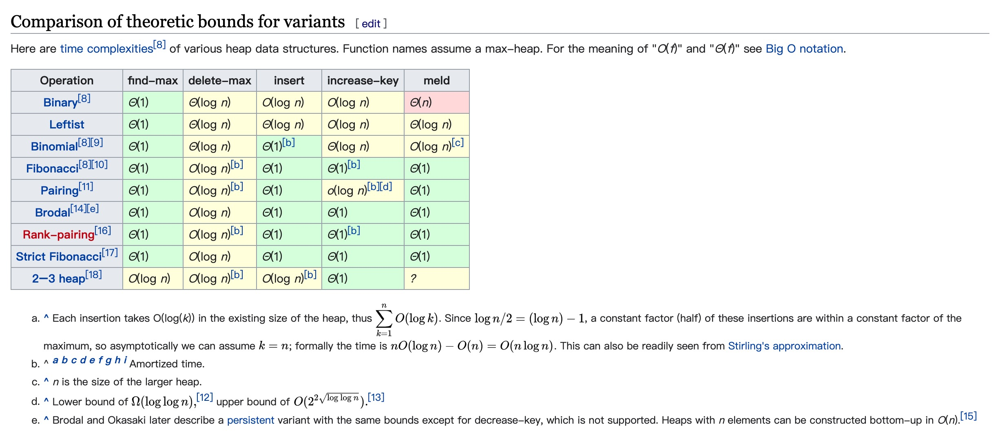

# LeetCode703题笔记


<!--more-->

## 一、题目

### 1.1 题目说明

设计一个找到数据流中第 k 大元素的类（class）。注意是排序后的第 k 大元素，不是第 k 个不同的元素。

请实现 KthLargest 类：

- KthLargest(int k, int[] nums) 使用整数 k 和整数流 nums 初始化对象。
- int add(int val) 将 val 插入数据流 nums 后，返回当前数据流中第 k 大的元素。

示例：

```bash
输入：
["KthLargest", "add", "add", "add", "add", "add"]
[[3, [4, 5, 8, 2]], [3], [5], [10], [9], [4]]
输出：
[null, 4, 5, 5, 8, 8]

解释：
KthLargest kthLargest = new KthLargest(3, [4, 5, 8, 2]);
kthLargest.add(3);   // return 4
kthLargest.add(5);   // return 5
kthLargest.add(10);  // return 5
kthLargest.add(9);   // return 8
kthLargest.add(4);   // return 8
```

- 1 <= k <= 104
- 0 <= nums.length <= 104
- -104 <= nums[i] <= 104
- -104 <= val <= 104
- 最多调用 add 方法 104 次
- 题目数据保证，在查找第 k 大元素时，数组中至少有 k 个元素

[leetcode地址](https://leetcode-cn.com/problems/kth-largest-element-in-a-stream)

### 1.2 审题

优先级队列的实现方式：

- [堆](https://en.wikipedia.org/wiki/Heap_(data_structure))（二叉堆，二项式堆，斐波拉契堆）
- 二叉搜索树

堆的比较：



（严格）斐波拉契堆是性能比较好

## 二、题解

### 2.1 排序大法

排序的思路：


- 先找到当前插入元素的位置
- 如果K大小数组没满，那么比当前值大的值往后
- 如果K大小数组满了，那么比当前值大的值之前往前移动，即挤掉最小值

代码：

```go
type KthLargest_Sort struct {
	// k 个元素的数组
	array []int
	size  int
	full  bool
}

func Constructor_Sort(k int, nums []int) KthLargest_Sort {
	re := KthLargest_Sort{array: []int{}, size: k}
	if len(nums) == 0 {
		return re
	}
	// 排序
	sort.Ints(nums)
	// 符合要求的元素设置到 array
	s := len(nums) - k
	if s < 0 {
		s = 0
	}
	for i := s; i < len(nums); i++ {
		re.array = append(re.array, nums[i])
	}
	re.setFull()

	return re
}

func (this *KthLargest_Sort) Add(val int) int {
	// 没满
	if !this.full {
		this.array = append(this.array, val)
		sort.Ints(this.array)
		this.setFull()
		return this.array[0]
	}

	// 满了，就考虑是否替换

	// 如果最小值都比新值大或等于新值，那么不用处理
	min := this.array[0]
	if min >= val {
		return this.array[0]
	}

	// 如果是最大值，就直接移动，省去遍历
	max := this.array[len(this.array)-1]
	if val > max {
		this.array = this.array[1:]
		this.array = append(this.array, val)
		return this.array[0]
	}

	big := -1
	for i, v := range this.array {
		if v >= val {
			big = i
			break
		}
	}

  // 前移
	for i := 0; i < big-1; i++ {
		this.array[i], this.array[i+1] = this.array[i+1], this.array[i+2]
	}

	this.array[big-1] = val
	return this.array[0]
}

func (this *KthLargest_Sort) setFull() {
	if len(this.array) >= this.size {
		this.full = true
	}
}
```

- 时间复杂度：忽略各种分支，关心移动部分的代码 ，$\frac{n*k}{2}$

成绩：

> 执行用时：92 ms, 在所有 Go 提交中击败了19.61%的用户
>
> 内存消耗：8.4 MB, 在所有 Go 提交中击败了8.61%的用户

### 2.2 排序大法（简化非有效版本）

代码：

```go
type KthLargest_Sort struct {
	// k 个元素的数组
	array []int
	size  int
}

func Constructor_Sort(k int, nums []int) KthLargest_Sort {
	re := KthLargest_Sort{array: []int{}, size: k}
	if len(nums) == 0 {
		return re
	}
	// 排序
	sort.Ints(nums)
	// 符合要求的元素设置到 array
	s := len(nums) - k
	if s < 0 {
		s = 0
	}
	for i := s; i < len(nums); i++ {
		re.array = append(re.array, nums[i])
	}

	return re
}

func (this *KthLargest_Sort) Add(val int) int {
	// 把新元素加到缓存的数组中，然后对数组元素进行排序
	this.array = append(this.array, val)
	sort.Ints(this.array)
  // 如果新元素加上后超过了K个大小（即K+1），那么把第一个（最小值）去掉
	if len(this.array) > this.size {
		this.array = this.array[1:]
	}

	return this.array[0]
}
```

- 时间复杂度：每一次都是一次快排，一共加了 n 次，那么是 $n * k\log{k}$

结果：


### 2.3 排序大法（第一种思路重写）

```go
type KthLargest_SortPro struct {
	// k 个元素的数组
	array []int
	// 当前元素个数
	size int
}

func Constructor_SortPro(k int, nums []int) KthLargest_SortPro {
	re := KthLargest_SortPro{array: []int{}, size: k}
	if len(nums) == 0 {
		return re
	}

	for _, v := range nums {
		re.Add(v)
	}

	return re
}

func (this *KthLargest_SortPro) Add(val int) int {
	// 未满
	if len(this.array) < this.size {
		// 找到位置，第一个位置最小值不特意取出来比较了，因为循环第一个就匹配到了
		p := -1
		for i := 0; i < len(this.array); i++ {
			if this.array[i] >= val {
				p = i
				break
			}
		}

		// val 是最大值
		if p == -1 {
			this.array = append(this.array, val)
		} else {
			max := this.array[len(this.array)-1]
			for i := len(this.array) - 2; i >= p; i-- {
				this.array[i+1] = this.array[i]
			}
			this.array = append(this.array, max)
			this.array[p] = val
		}
	} else {
		p := -1
		for i := 0; i < len(this.array); i++ {
			if this.array[i] >= val {
				p = i
				break
			}
		}

		// val 是最大值，这个地方可以直接拿最大值比较
		if p == -1 {
			this.array = this.array[1:]
			this.array = append(this.array, val)
		} else if p == 0 {

		} else {
			for i := 0; i < p-1; i++ {
				this.array[i] = this.array[i+1]
			}
			this.array[p-1] = val
		}
	}

	return this.array[0]
}
```

- 时间复杂度和上面的应该一样，反正我已经算的晕了

成绩：

> 执行用时：96 ms, 在所有 Go 提交中击败了19.48%的用户
>
> 内存消耗：8.3 MB, 在所有 Go 提交中击败了28.29%的用户

这种代码的写法实际上在 go 里面是不符合规范的，go 是要尽可能避免 `if - else` 的嵌套，采用 `if ! condition - return` 的模式。

### 2.4 小顶堆实现

>  正规军出马了

代码：

```go
// 最小堆实现
type KthLargest struct {
	heap *IntHeap
	size int
}

func Constructor(k int, nums []int) KthLargest {
	ih := new(IntHeap)
	heap.Init(ih)
	for _, v := range nums {
		if ih.Len() < k {
			heap.Push(ih, v)
		} else {
			_, min := ih.Top()
			if v > min {
				heap.Pop(ih)
				heap.Push(ih, v)
			}
		}
	}

	return KthLargest{heap: ih, size: k}
}

func (this *KthLargest) Add(val int) int {
	b, min := this.heap.Top()
	if !b {
		heap.Push(this.heap, val)
		return val
	}

	if this.heap.Len() < this.size{
		heap.Push(this.heap, val)
		_, min = this.heap.Top()
		return min
	}

	if val > min {
		heap.Pop(this.heap)
		heap.Push(this.heap, val)
		_, min = this.heap.Top()
	}

	return min
}

// 这部分代码来自 golang SDK 的 heap 包
// 主要看 Less 的比较逻辑，这里 h[i] 小于 h[j] 的条件是小顶堆 
type IntHeap []int

func (h IntHeap) Len() int           { return len(h) }
func (h IntHeap) Less(i, j int) bool { return h[i] < h[j] }
func (h IntHeap) Swap(i, j int)      { h[i], h[j] = h[j], h[i] }

func (h *IntHeap) Push(x interface{}) {
	// Push and Pop use pointer receivers because they modify the slice's length,
	// not just its contents.
	*h = append(*h, x.(int))
}

func (h *IntHeap) Pop() interface{} {
	old := *h
	n := len(old)
	x := old[n-1]
	*h = old[0 : n-1]
	return x
}

func (h *IntHeap) Top() (bool, int) {
	if h.Len() == 0 {
		return false, 0
	}

	old := *h
	return true, old[0]
}
```

- 时间复杂度：$n\log{k}$ ，比排序的好 K 倍（每一次排序都是 $\log{k}$）

成绩：

> 执行用时：36 ms, 在所有 Go 提交中击败了70.13%的用户
>
> 内存消耗：8.3 MB, 在所有 Go 提交中击败了33.55%的用户

从成绩可以看出来，比排序的做法好很多，因为即使 n 个元素的加入都需要调整堆，每次调整 $\log{k}$ 。

### 2.5 小结

- 记住 TopK 问题可以用堆来解决

- 堆的话语言都已经有实现了，不建议自己手写了，go 和 java 的堆实现会在源码篇幅展开。

------

[本章的代码连接](https://github.com/cityiron/algorithms/tree/main/leetcode/703-kth-largest-element-in-a-stream)
